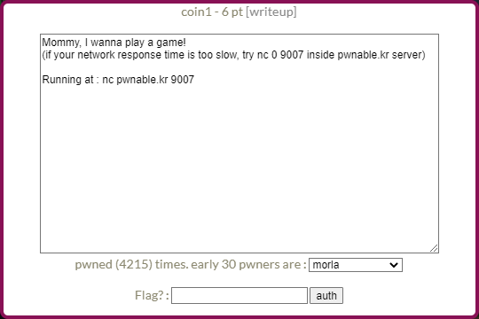
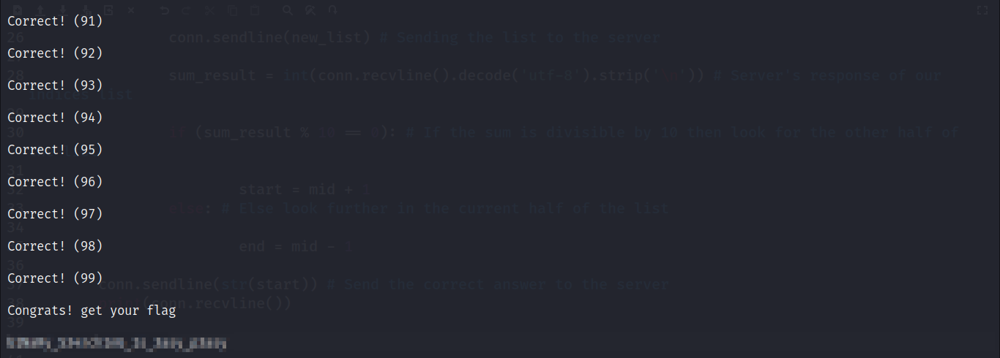

# Pwnable.kr - Toddler's Battle - [coin1]


<!--more-->

## Description

This post will focus on an easy pwn challenge *coin1* from Toddler's Bottle series of pwnable.kr.

Starting off we have the following description.



Connecting with nc we get the following description of the game.

```
        ---------------------------------------------------
        -              Shall we play a game?              -
        ---------------------------------------------------

        You have given some gold coins in your hand
        however, there is one counterfeit coin among them
        counterfeit coin looks exactly same as real coin
        however, its weight is different from real one
        real coin weighs 10, counterfeit coin weighes 9
        help me to find the counterfeit coin with a scale
        if you find 100 counterfeit coins, you will get reward :)
        FYI, you have 60 seconds.

        - How to play - 
        1. you get a number of coins (N) and number of chances (C)
        2. then you specify a set of index numbers of coins to be weighed
        3. you get the weight information
        4. 2~3 repeats C time, then you give the answer

        - Example -
        [Server] N=4 C=2        # find counterfeit among 4 coins with 2 trial
        [Client] 0 1            # weigh first and second coin
        [Server] 20                     # scale result : 20
        [Client] 3                      # weigh fourth coin
        [Server] 10                     # scale result : 10
        [Client] 2                      # counterfeit coin is third!
        [Server] Correct!

        - Ready? starting in 3 sec... -

N=78 C=7
```

On each turn we are given a set of gold coins in which one is a counterfeit i.e. fake coin with less weight than the original.

The server's going to give us two values ```N``` and ```C```.

Here ```N``` refers to the number of coins we have and ```C``` refers to the number of tries we get to guess all the counterfeit coins.

We can provide a list of indices and the server will return the sum of those coins. 

The real challenge here is that we need to guess the correct counterfeit coins ```100``` times in ```60``` seconds so we need an efficient way to find the counterfeit coins.

Finding an item from a list efficiently? ```Binary Search``` will save the day!


In computer science, binary search, also known as half-interval search, logarithmic search, or binary chop, is a search algorithm that finds the position of a target value within a sorted array. Binary search compares the target value to the middle element of the array. 


Source: https://en.wikipedia.org/wiki/Binary_search_algorithm

A general algorithm of binary search is shown below.

```
 binarySearch(arr, x, low, high)
        repeat till low = high
               mid = (low + high)/2
                   if (x == arr[mid])
                   return mid
   
                   else if (x > arr[mid]) // x is on the right side
                       low = mid + 1
   
                   else                  // x is on the left side
                       high = mid - 1                    
```

Source: https://www.geeksforgeeks.org/binary-search/

Now since we need to do ```100``` correct guesses in ```60``` seconds we'll write a python script to do it more efficiently.

We can make a remote connection to the server and run our exploit but the connection will be slow and the task won't be completed.

So we can ```ssh``` into any of the previous challenges and run the script locally there.

## Exploitation

```python
from pwn import *

conn = remote('localhost', 9007) # Establishing connection to the port 9007 locally for fast response
conn.recvuntil('Ready? starting in 3 sec')
conn.recvline()
conn.recvline()

for i in range(100): # Going over 100 iterations to cover all the questions.

	values = conn.recvline().decode('utf-8')
	
	N = int(values.split()[0][2:]) # Value of N for each iteration
	C = int(values.split()[1][2:]) # Value of C for each iteration
	
	start = 0 # Initial starting index for binary search
	end = N-1 # Initial ending index for binary search
	
	# Binary Search
	
	for i in range(C): 
	
		mid = (start + end) // 2
		
		new_list = " ".join([str(i) for i in range(start,mid+1)]) # Create a list of indices to send to the server
		
		conn.sendline(new_list) # Sending the list to the server
		
		sum_result = int(conn.recvline().decode('utf-8').strip('\n')) # Server's response of our indices list
		
		if (sum_result % 10 == 0): # If the sum is divisible by 10 then look for the other half of the list
		
			start = mid + 1
		else: # Else look further in the current half of the list
		
			end = mid - 1

	conn.sendline(str(start)) # Send the correct answer to the server
	print(conn.recvline()) 

# Print the flag
	
print(conn.recvline()) 
print(conn.recvline()) 

```



**Thanks for reading!**
