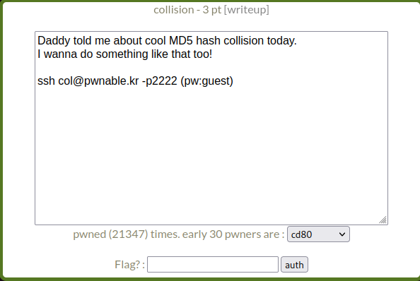
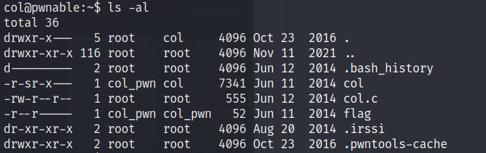
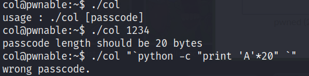
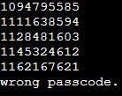
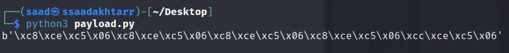

# Pwnable.kr - Toddler's Battle - [collision]


<!--more-->

## Description

This post will focus on an easy pwn challenge *collision* from Toddler's Bottle series of pwnable.kr.

Starting off we have the following description.



As the name and description suggests, we may have to perform a hash collision in this challenge.


In computer science, a hash collision or clash is when two pieces of data in a hash table share the same hash value. The hash value in this case is derived from a hash function which takes a data input and returns a fixed length of bits.


Source: https://en.wikipedia.org/wiki/Hash_collision

Let’s ssh into the machine.

We have the following files.



Upon running the binary, we have to provide a passcode as argument and the passcode must be of 20 bytes as shown below.



Now let's look at the C code.

```c
#include <stdio.h>
#include <string.h>
unsigned long hashcode = 0x21DD09EC;
unsigned long check_password(const char* p){
        int* ip = (int*)p;
        int i;
        int res=0;
        for(i=0; i<5; i++){
                res += ip[i];
        }
        return res;
}

int main(int argc, char* argv[]){
        if(argc<2){
                printf("usage : %s [passcode]\n", argv[0]);
                return 0;
        }
        if(strlen(argv[1]) != 20){
                printf("passcode length should be 20 bytes\n");
                return 0;
        }

        if(hashcode == check_password( argv[1] )){
                system("/bin/cat flag");
                return 0;
        }
        else
                printf("wrong passcode.\n");
        return 0;
}
```

In the above code, we can see there are several checks that validates if the passcode is provided as an argument and if the passcode length is of 20 bytes. 

In line 24, we have a comparison of ```hashcode``` value with the ```check_password()``` function.

The value of hashcode is defined above as ```unsigned long hashcode = 0x21DD09EC;```

Now looking at the ```check_password()``` function, it takes our argument value as character input. Then it converts the value of our ```char``` pointer ```p``` to ```int``` pointer ```ip``` by assigning the base address of our pointer variable ```p``` to the ```int``` pointer ```ip```.

With this step, it basically converting our ```char``` value to ```int``` value and our argument value of ```20``` bytes will now be interpreted as an integer.


Read [here](https://www.geeksforgeeks.org/difference-between-int-p-and-int-p/) for a better understanding of pointers.


We know that ```int``` is of ```4``` bytes, so entire ```20``` bytes will be stored in ```5``` blocks of ```4``` bytes.

After that it is looping through ```5``` times and adding the value of each block into the ```res``` variable.

Let's take an example. If we provide ```AAAABBBBCCCCDDDDEEEE``` as input to our program, then in each loop the res value will be as follows.



What the output shows is the memory representation of ```4``` bytes input in each loop i.e. In the first loop, it prints the memory representation of ```AAAA``` as ```1094795585```. For second loop it prints the memory representation of ```BBBB``` as ```1111638594``` and so on.

So what we have to do here is to give an input in such a way that each of the ```5``` blocks value will add up to the value of ```hashcode``` which is ```0x21DD09EC```.

## Exploitation

The value of ```hashcode``` is ```0x21DD09EC```. Converting it to decimal returns ```568134124```.

We have to divide this value into ```5``` equal parts which we'll provide as ```20``` bytes input. 

The division is as follows.

```python
from pwn import *

hashcode = 568134124

first_16_bytes = p32(hashcode//5)*4

last_4_bytes = p32(hashcode - (hashcode//5) * 4)

payload = first_16_bytes + last_4_bytes

print(payload)
```



Providing this payload to the binary we'll get the flag.


**Thanks for reading!**
