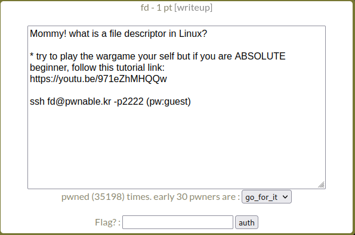
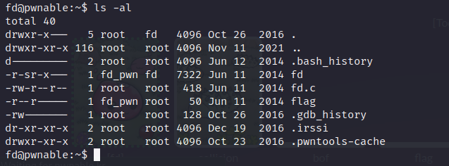
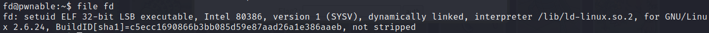
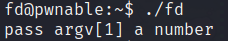
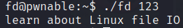
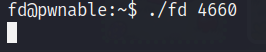
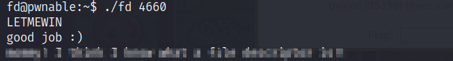

# Pwnable.kr - Toddler's Battle - [fd]


<!--more-->

## Description

This post will focus on an easy pwn challenge *fd* from pwnable.kr

Starting off we have the following description.



As the name and description suggests, this challenge has something to do with the file descriptors in linux.

Let's ssh into the machine.

We have the following files.



Checking the fd file.



Running the binary.



We have to provide a number as argument but whatever we write for now it returns *Learn about Linux file IO*



## Exploitation

Looking at the source code of the binary.

```c
#include <stdio.h>
#include <stdlib.h>
#include <string.h>
char buf[32];
int main(int argc, char* argv[], char* envp[]){
        if(argc<2){
                printf("pass argv[1] a number\n");
                return 0;
        }
        int fd = atoi( argv[1] ) - 0x1234;
        int len = 0;
        len = read(fd, buf, 32);
        if(!strcmp("LETMEWIN\n", buf)){
                printf("good job :)\n");
                system("/bin/cat flag");
                exit(0);
        }
        printf("learn about Linux file IO\n");
        return 0;

}
```

In line number 10, an int fd variable is declared which will be used as a *file descriptor*.


In simple words, when you open a file, the operating system creates an entry to represent that file and store the information about that opened file. So if there are 100 files opened in your OS then there will be 100 entries in OS (somewhere in kernel). These entries are represented by integers like (...100, 101, 102....). This entry number is the file descriptor. So it is just an integer number that uniquely represents an opened file for the process. If your process opens 10 files then your Process table will have 10 entries for file descriptors.


Source: https://stackoverflow.com/a/5256705

The 3 basic values for file descriptors are *0* for Standard Input *(stdin)*, *1* for Standard Output *(stdout)* and *2* for Standard Error *(stderr)*.

Back to our code, the value of our argument is getting subtracted by a hex value ```0x1234```. 

Converting to decimal it becomes, ```4660```.

Now if we provide ```4660``` in the argument the value of file descriptor will become ```0```.

Meaning we can then enter any value to the buffer.



From line 12 to 17, it simply reading standard input and saving it to the buffer. Then it's comparing the value of the buffer with the string ```LETMEWIN```.

So we simply write ```LETMEWIN``` and hit enter to get the flag.



**Thanks for reading!**
